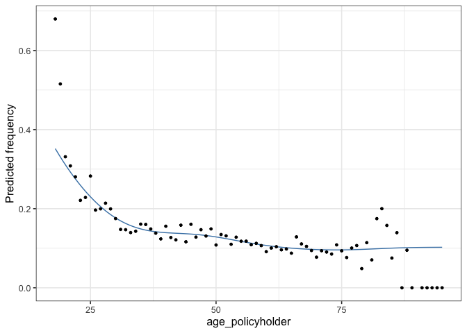
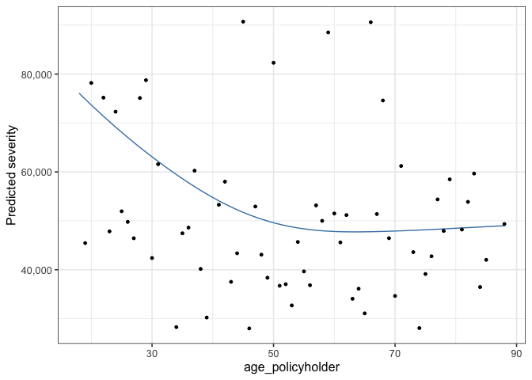
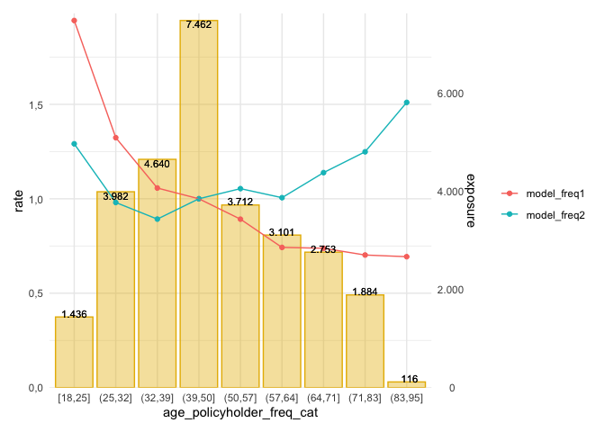
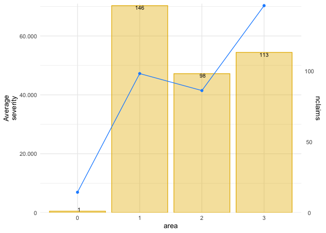
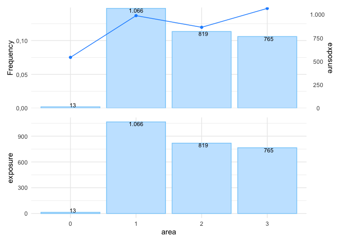
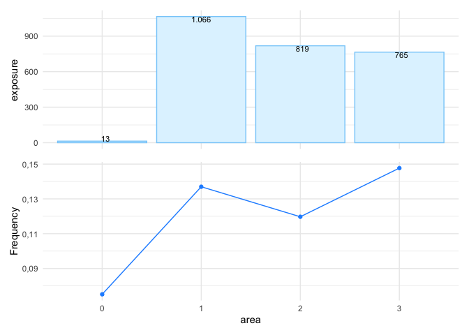
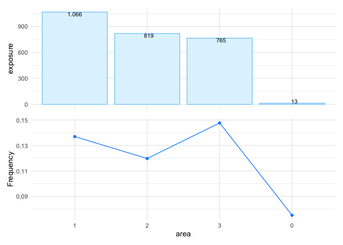
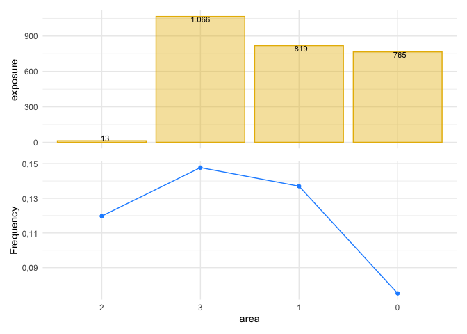
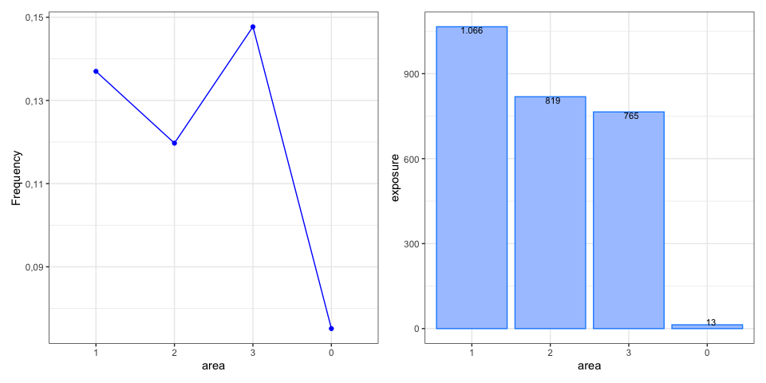
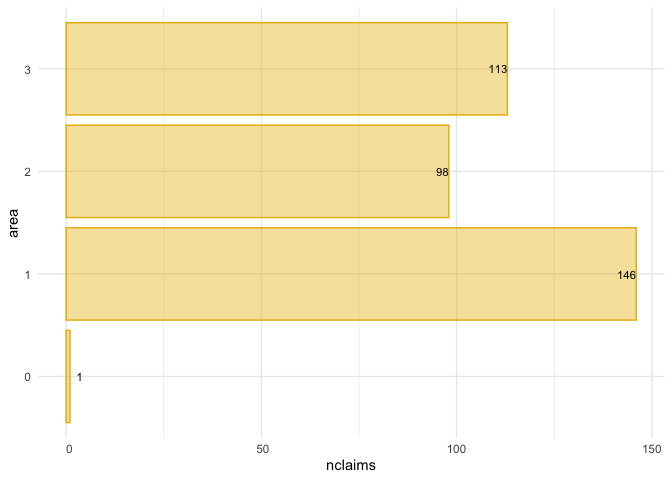

<!-- README.md is generated from README.Rmd. Please edit that file -->

# insurancerating

<!-- badges: start -->

[](https://cran.r-project.org/package=insurancerating)
[](https://cran.rstudio.com/package=insurancerating)
<!-- badges: end -->

The goal of `insurancerating` is to give analytic techniques that can be
used in insurance rating. It provides a data driven strategy for the
construction of tariff classes in P\&C insurance. The goal is to bin the
continuous factors such that categorical risk factors result which
capture the effect of the covariate on the response in an accurate way,
while being easy to use in a generalized linear model (GLM).

`insurancerating` also provides recipes on how to easily perform
univariate analyses on an insurance portfolio. In addition it adds
functionality to include reference categories in the levels of the
coefficients in the output of a generalized linear regression analysis.

## Installation

Install insurancerating from CRAN:

``` r
install.packages("insurancerating")
```

Or the development version from GitHub:

``` r
# install.packages("remotes")
remotes::install_github("MHaringa/insurancerating")
```

## Example 1

This is a basic example which shows the techniques provided in
insurancerating.

The first part shows how to fit a GAM for the variable
*age\_policyholder* in the MTPL dataset:

``` r
library(insurancerating)

# Claim frequency 
age_policyholder_frequency <- fit_gam(data = MTPL, 
                                      nclaims = nclaims, 
                                      x = age_policyholder, 
                                      exposure = exposure)

# Claim severity 
age_policyholder_severity <- fit_gam(data = MTPL, 
                                     nclaims = nclaims, 
                                     x = age_policyholder, 
                                     exposure = exposure, 
                                     amount = amount, 
                                     model = "severity")
```

Create plot:

``` r
autoplot(age_policyholder_frequency, show_observations = TRUE)
```

<!-- -->

Determine classes for the claim frequency (the points show the ratio
between the observed number of claims and exposure for each age):

``` r
clusters_freq <- construct_tariff_classes(age_policyholder_frequency)
clusters_sev <- construct_tariff_classes(age_policyholder_severity)

autoplot(clusters_freq, show_observations = TRUE)
```

<!-- -->

The figure shows that younger policyholders have a higher risk profile.
The fitted GAM is lower than might be expected from the observed claim
frequency for policyholders of age 19. This is because there are very
few young policyholders of age 19 present in the portfolio.

The GAM for the claim severity :

``` r
age_policyholder_severity %>%
  autoplot(., show_observations = TRUE, remove_outliers = 100000)
```

<!-- -->

The second part adds the constructed tariff classes for the variable
*age\_policyholder* to the dataset, and sets the base level of the
factor *age\_policyholder* to the level with the largest exposure. In
this example for claim frequency the class for ages (39,50\], which
contains the largest exposure.

``` r
library(dplyr)

dat <- MTPL %>%
  mutate(age_policyholder_freq_cat = clusters_freq$tariff_classes) %>%
  mutate_if(is.character, as.factor) %>%
  mutate_if(is.factor, list(~biggest_reference(., exposure)))

glimpse(dat)
```

    ## Observations: 32,731
    ## Variables: 5
    ## $ age_policyholder          <int> 43, 21, 54, 44, 20, 38, 68, 45, 76, 30, 28,…
    ## $ nclaims                   <int> 0, 0, 0, 1, 1, 0, 0, 1, 0, 0, 0, 0, 0, 0, 0…
    ## $ exposure                  <dbl> 1.0000000, 1.0000000, 1.0000000, 1.0000000,…
    ## $ amount                    <dbl> 0, 0, 0, 57540, 2057, 0, 0, 6510, 0, 0, 0, …
    ## $ age_policyholder_freq_cat <fct> "(39,50]", "[18,25]", "(50,57]", "(39,50]",…

The last part is to fit a *generalized linear model*. `rating_factors()`
prints the output including the reference
group.

``` r
model_freq1 <- glm(nclaims ~ age_policyholder_freq_cat, offset = log(exposure), 
                  family = "poisson", data = dat)

model_freq2 <- glm(nclaims ~ age_policyholder_freq_cat + age_policyholder, offset = log(exposure), 
                  family = "poisson", data = dat)

rating_factors(model_freq1, model_freq2, model_data = dat, exposure = exposure) 
```

    ##                  risk_factor            level est_model_freq1 est_model_freq2
    ## 1                (Intercept)      (Intercept)       0.1368181       0.3210287
    ## 2  age_policyholder_freq_cat          [18,25]       1.9438228       1.2909603
    ## 3  age_policyholder_freq_cat          (25,32]       1.3234995       0.9802830
    ## 4  age_policyholder_freq_cat          (32,39]       1.0568538       0.8923472
    ## 5  age_policyholder_freq_cat          (39,50]       1.0000000       1.0000000
    ## 6  age_policyholder_freq_cat          (50,57]       0.8919696       1.0535866
    ## 7  age_policyholder_freq_cat          (57,64]       0.7423998       1.0056607
    ## 8  age_policyholder_freq_cat          (64,71]       0.7379362       1.1383509
    ## 9  age_policyholder_freq_cat          (71,83]       0.7021348       1.2486752
    ## 10 age_policyholder_freq_cat          (83,95]       0.6933378       1.5100830
    ## 11          age_policyholder age_policyholder              NA       0.9811935
    ##     exposure
    ## 1         NA
    ## 2  1436.3589
    ## 3  3981.6932
    ## 4  4640.4904
    ## 5  7462.4603
    ## 6  3711.9699
    ## 7  3101.1945
    ## 8  2753.4822
    ## 9  1884.1452
    ## 10  115.9589
    ## 11        NA

`autoplot.riskfactor()` creates a
figure:

``` r
rating_factors(model_freq1, model_freq2, model_data = dat, exposure = exposure) %>%
  autoplot()
```

<!-- -->

## Example 2

This is a basic example which shows how to easily perform an univariate
analysis on a MTPL portfolio using `insurancerating`.

An univariate analysis consists in the evaluation of overall claim
frequency, severity and risk premium. Its main purpose lies in verifying
the experience data reasonableness using previous experience comparison
and professional judgement.

`univariate()` shows the basic risk indicators split by the levels of
the discrete risk factor:

``` r
library(insurancerating)
univariate(MTPL2, 
           x = area, # discrete risk factor
           nclaims = nclaims, # number of claims
           exposure = exposure, 
           premium = premium, 
           severity = amount) # loss
```

    ##   area  amount nclaims   exposure premium  frequency average_severity
    ## 1    2 4063270      98  818.53973   51896 0.11972540         41461.94
    ## 2    3 7945311     113  764.99178   49337 0.14771401         70312.49
    ## 3    1 6896187     146 1065.74795   65753 0.13699299         47234.16
    ## 4    0    6922       1   13.30685     902 0.07514927          6922.00
    ##   risk_premium loss_ratio average_premium
    ## 1    4964.0474  78.296400        63.40071
    ## 2   10386.1390 161.041632        64.49350
    ## 3    6470.7486 104.880188        61.69658
    ## 4     520.1832   7.674058        67.78464

The following indicators are calculated:

1.  frequency (i.e. frequency = number of claims / expsore)
2.  average\_severity (i.e. average severity = severity / number of
    claims)
3.  risk\_premium (i.e. risk premium = severity / exposure = frequency x
    average severity)
4.  loss\_ratio (i.e. loss ratio = severity / premium)
5.  average\_premium (i.e. average premium = premium / exposure)

The term risk premium is used here as an equivalent of pure premium and
burning cost.

`univariate()` ignores missing input arguments, for instance only the
claim frequency is calculated when `premium` and `severity` are unknown:

``` r
univariate(MTPL2, x = area, nclaims = nclaims, exposure = exposure) 
```

    ##   area nclaims   exposure  frequency
    ## 1    2      98  818.53973 0.11972540
    ## 2    3     113  764.99178 0.14771401
    ## 3    1     146 1065.74795 0.13699299
    ## 4    0       1   13.30685 0.07514927

However, the above table is small and easy to understand, the same
information might be presented more effectively with a graph, as shown
below.

``` r
univariate(MTPL2, x = area, nclaims = nclaims, exposure = exposure) %>%
  autoplot(.)
```

<!-- -->

In `autoplot.univariate()`, `show_plots` defines the plots to show and
also the order of the plots. The following plots are available:

1.  frequency
2.  average\_severity
3.  risk\_premium
4.  loss\_ratio
5.  average\_premium
6.  exposure
7.  severity
8.  nclaims
9.  premium

For example, to show the exposure and claim frequency plots:

``` r
univariate(MTPL2, x = area, nclaims = nclaims, exposure = exposure) %>%
  autoplot(., show_plots = c(6,1))
```

<!-- -->

To remove the bars from the plot with the line graph, add `background =
FALSE`:

``` r
univariate(MTPL2, x = area, nclaims = nclaims, exposure = exposure) %>%
  autoplot(., show_plots = c(6,1), background = FALSE)
```

<!-- -->

`sort` orders the levels of the risk factor into descending order by
exposure:

``` r
univariate(MTPL2, x = area, nclaims = nclaims, exposure = exposure) %>%
  autoplot(., show_plots = c(6,1), background = FALSE, sort = TRUE)
```

<!-- -->

`sort_manual` in `autoplot.univariate()` can be used to sort the levels
of the discrete risk factor into your own ordering. This makes sense
when the levels of the risk factor has a natural order, or when not all
levels of the risk factor are desired in the output.

``` r
univariate(MTPL2, x = area, nclaims = nclaims, exposure = exposure) %>%
  autoplot(., show_plots = c(6,1), background = FALSE, sort_manual = c("2", "3", "1", "0"))
```

<!-- -->

The following graph shows some more options:

``` r
univariate(MTPL2, x = area, nclaims = nclaims, exposure = exposure) %>%
  autoplot(., show_plots = c(6,1), background = FALSE, sort = TRUE, ncol = 2, 
           color_bg = "dodgerblue", color = "blue")
```

<!-- -->

Or create a bar graph for the number of claims:

``` r
univariate(MTPL2, x = area, nclaims = nclaims) %>%
  autoplot(., coord_flip = TRUE, sort = TRUE)
```

<!-- -->
