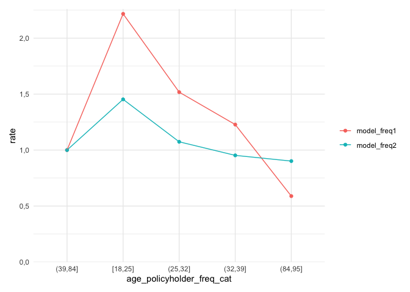
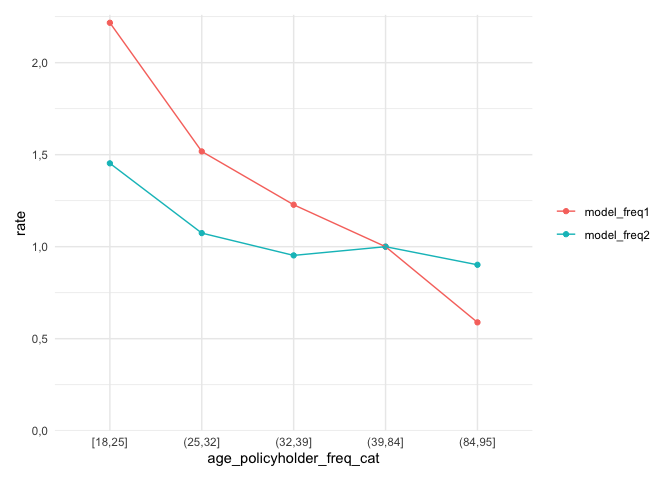
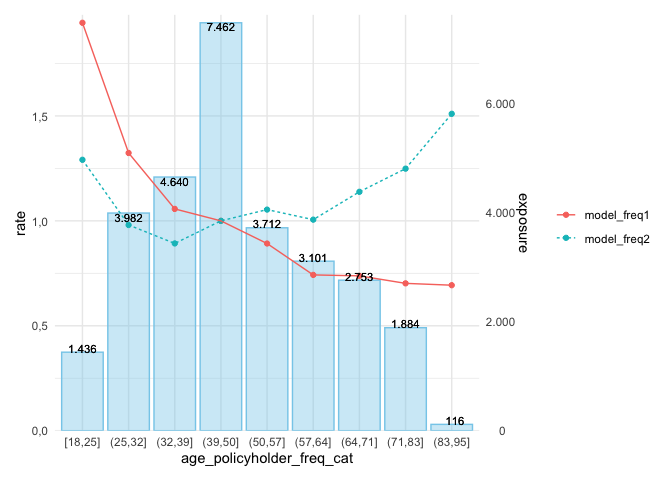
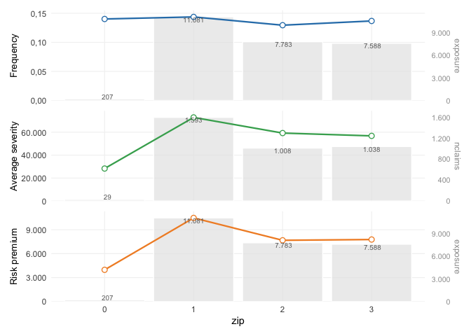
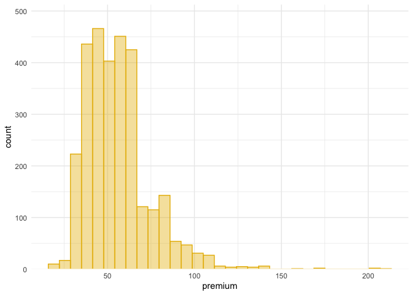
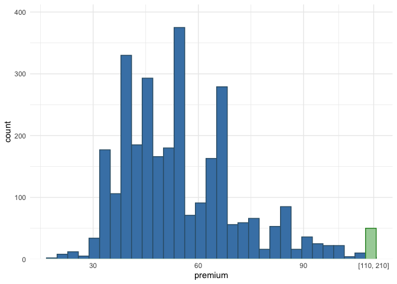
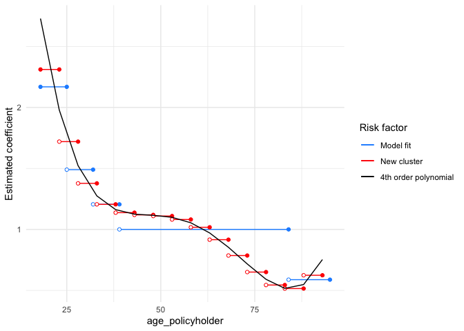
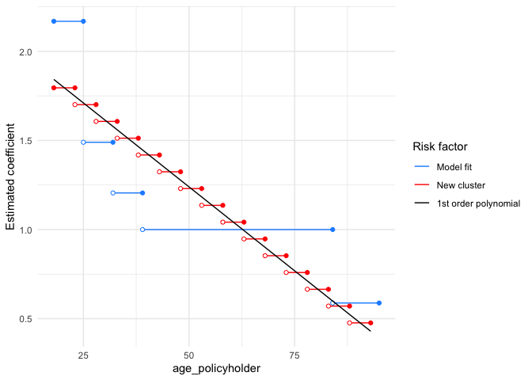
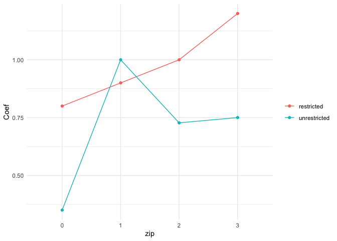

<!-- README.md is generated from README.Rmd. Please edit that file -->

# insurancerating 

<!-- badges: start -->

[](https://cran.r-project.org/package=insurancerating)
[](https://cran.rstudio.com/package=insurancerating)
<!-- badges: end -->

The goal of `insurancerating` is to give analytic techniques that can be
used in insurance rating. It helps actuaries to implement GLMs within
all relevant steps needed to construct a risk premium from raw data. It
provides a data driven strategy for the construction of tariff classes
in P&C insurance. The goal is to bin the continuous factors such that
categorical risk factors result which capture the effect of the
covariate on the response in an accurate way, while being easy to use in
a generalized linear model (GLM).

`insurancerating` also provides recipes on how to easily perform
univariate analyses on an insurance portfolio. In addition it adds
functionality to include reference categories in the levels of the
coefficients in the output of a generalized linear regression analysis.

## Installation

Install insurancerating from CRAN:

``` r
install.packages("insurancerating")
```

Or the development version from GitHub:

``` r
# install.packages("remotes")
remotes::install_github("MHaringa/insurancerating")
```

## Example 1

This is a basic example which shows the techniques provided in
insurancerating.

The first part shows how to fit a GAM for the variable
*age\_policyholder* in the MTPL dataset:

``` r
library(insurancerating)

# Claim frequency 
age_policyholder_frequency <- fit_gam(data = MTPL, 
                                      nclaims = nclaims, 
                                      x = age_policyholder, 
                                      exposure = exposure)

# Claim severity 
age_policyholder_severity <- fit_gam(data = MTPL, 
                                     nclaims = nclaims, 
                                     x = age_policyholder, 
                                     exposure = exposure, 
                                     amount = amount, 
                                     model = "severity")
```

Create plot:

``` r
autoplot(age_policyholder_frequency, show_observations = TRUE)
```

<!-- -->

Determine classes for the claim frequency (the points show the ratio
between the observed number of claims and exposure for each age):

``` r
clusters_freq <- construct_tariff_classes(age_policyholder_frequency)
clusters_sev <- construct_tariff_classes(age_policyholder_severity)

autoplot(clusters_freq, show_observations = TRUE)
```

<!-- -->

In this example the term *exposure* is a measure of what is being
insured. Here an insured vehicle is an exposure. If the vehicle is
insured as of July 1 for a certain year, then during that year, this
would represent an exposure of 0.5 to the insurance company.

The figure shows that younger policyholders have a higher risk profile.
The fitted GAM is lower than might be expected from the observed claim
frequency for policyholders of age 19. This is because there are very
few young policyholders of age 19 present in the portfolio.

The GAM for the claim severity :

``` r
age_policyholder_severity %>%
  autoplot(., show_observations = TRUE, remove_outliers = 100000)
```

<!-- -->

The second part adds the constructed tariff classes for the variable
`age_policyholder` to the dataset, and sets the base level of the factor
`age_policyholder` to the level with the largest exposure. In this
example for claim frequency the class for ages (39,50\], which contains
the largest exposure.

``` r
library(dplyr)

dat <- MTPL %>%
  mutate(age_policyholder_freq_cat = clusters_freq$tariff_classes) %>%
  mutate(across(where(is.character), as.factor)) %>%
  mutate(across(where(is.factor), ~biggest_reference(., exposure)))
  
glimpse(dat)
```

    ## Rows: 30,000
    ## Columns: 8
    ## $ age_policyholder          <int> 70, 40, 78, 49, 59, 71, 55, 52, 51, 47, 62, …
    ## $ nclaims                   <int> 0, 0, 0, 0, 0, 0, 1, 0, 0, 0, 0, 1, 0, 0, 0,…
    ## $ exposure                  <dbl> 1.0000000, 1.0000000, 1.0000000, 1.0000000, …
    ## $ amount                    <dbl> 0, 0, 0, 0, 0, 0, 2607, 0, 0, 0, 0, 2890, 0,…
    ## $ power                     <int> 106, 74, 65, 64, 29, 66, 43, 55, 100, 66, 44…
    ## $ bm                        <int> 5, 3, 8, 10, 1, 6, 2, 2, 1, 2, 1, 2, 2, 9, 5…
    ## $ zip                       <fct> 1, 1, 2, 1, 3, 3, 3, 3, 3, 3, 2, 1, 1, 2, 2,…
    ## $ age_policyholder_freq_cat <fct> "(39,84]", "(39,84]", "(39,84]", "(39,84]", …

The last part is to fit a *generalized linear model*. `rating_factors()`
prints the output including the reference group.

``` r
model_freq1 <- glm(nclaims ~ age_policyholder_freq_cat, offset = log(exposure), 
                  family = "poisson", data = dat)

model_freq2 <- glm(nclaims ~ age_policyholder_freq_cat + age_policyholder, offset = log(exposure), 
                  family = "poisson", data = dat)

x <- rating_factors(model_freq1, model_freq2) 
x
```

    ## Significance levels: *** p < 0.001; ** p < 0.01;  * p < 0.05; . p < 0.1                risk_factor            level est_model_freq1 est_model_freq2
    ## 1               (Intercept)      (Intercept)    0.117926 ***    0.245890 ***
    ## 2 age_policyholder_freq_cat          (39,84]    1.000000        1.000000    
    ## 3 age_policyholder_freq_cat          [18,25]    2.216848 ***    1.453099 ***
    ## 4 age_policyholder_freq_cat          (25,32]    1.517625 ***    1.073952    
    ## 5 age_policyholder_freq_cat          (32,39]    1.227861 ***    0.952683    
    ## 6 age_policyholder_freq_cat          (84,95]    0.588749        0.901689    
    ## 7          age_policyholder age_policyholder          NA        0.986728 ***

`autoplot.riskfactor()` creates a figure. The base level of the factor
`age_policyholder_freq_cat` is the group with the largest exposure and
is shown first.

``` r
autoplot(x)
```

<!-- -->

Include `model_data` to sort the clustering in the original order.
Ordering the factor `age_policyholder_freq_cat` only works when
`biggest_reference()` is used to set the base level of the factor to the
level with the largest exposure.

``` r
rating_factors(model_freq1, model_freq2, model_data = dat) %>%
  autoplot()
```

<!-- -->

The following graph includes the exposure as a bar graph and shows some
more options:

``` r
rating_factors(model_freq1, model_freq2, model_data = dat, exposure = exposure) %>%
  autoplot(., linetype = TRUE) 
```

<!-- -->

Add predictions to the data set:

``` r
dat_pred <- dat %>%
  add_prediction(model_freq1, model_freq2) 

glimpse(dat_pred)
```

    ## Rows: 30,000
    ## Columns: 10
    ## $ age_policyholder          <int> 70, 40, 78, 49, 59, 71, 55, 52, 51, 47, 62, …
    ## $ nclaims                   <int> 0, 0, 0, 0, 0, 0, 1, 0, 0, 0, 0, 1, 0, 0, 0,…
    ## $ exposure                  <dbl> 1.0000000, 1.0000000, 1.0000000, 1.0000000, …
    ## $ amount                    <dbl> 0, 0, 0, 0, 0, 0, 2607, 0, 0, 0, 0, 2890, 0,…
    ## $ power                     <int> 106, 74, 65, 64, 29, 66, 43, 55, 100, 66, 44…
    ## $ bm                        <int> 5, 3, 8, 10, 1, 6, 2, 2, 1, 2, 1, 2, 2, 9, 5…
    ## $ zip                       <fct> 1, 1, 2, 1, 3, 3, 3, 3, 3, 3, 2, 1, 1, 2, 2,…
    ## $ age_policyholder_freq_cat <fct> "(39,84]", "(39,84]", "(39,84]", "(39,84]", …
    ## $ pred_nclaims_model_freq1  <dbl> 0.11792558, 0.11792558, 0.11792558, 0.117925…
    ## $ pred_nclaims_model_freq2  <dbl> 0.09650865, 0.14409239, 0.08672539, 0.127766…

Compute indices of model performance for GLMs. The RMSE is the square
root of the average of squared differences between prediction and actual
observation and indicates the absolute fit of the model to the data. It
can be interpreted as the standard deviation of the unexplained
variance, and is in the same units as the response variable.

``` r
model_performance(model_freq1, model_freq2) 
```

    ## # Comparison of Model Performance Indices
    ## 
    ## Model       |      AIC |      BIC | RMSE
    ## ----------------------------------------
    ## model_freq1 | 22983.34 | 23024.88 | 0.36
    ## model_freq2 | 22943.06 | 22992.92 | 0.36

To test the stability of the predictive ability of the fitted model it
might be helpful to determine the variation in the computed RMSE. The
variation is calculated by computing the root mean squared errors from
generated bootstrap replicates.

For claim severity models it might be helpful to test the variation in
the RMSE in case the portfolio contains large claim sizes. The figure
below shows that the variation in the RMSE of the frequency model is
quite low (as expected). The dashed line shows the RMSE of the fitted
(original) model, the other lines represent the 95% confidence interval.

``` r
bootstrap_rmse(model_freq1, dat, n = 100, show_progress = FALSE) %>% 
  autoplot(.)
```

<!-- -->

Check Poisson GLM for overdispersion. A dispersion ratio larger than one
indicates overdispersion, this occurs when the observed variance is
higher than the variance of the theoretical model. If the dispersion
ratio is close to one, a Poisson model fits well to the data. A
*p*-value &lt; .05 indicates overdispersion. Overdispersion &gt; 2
probably means there is a larger problem with the data: check (again)
for outliers.

``` r
check_overdispersion(model_freq1)
```

    ##        dispersion ratio =     1.185
    ##   Pearson's Chi-Squared = 35554.163
    ##                 p-value =   < 0.001

    ## Overdispersion detected.

Misspecifications in GLMs cannot reliably be diagnosed with standard
residual plots, and GLMs are thus often not as thoroughly checked as
LMs. One reason why GLMs residuals are harder to interpret is that the
expected distribution of the data changes with the fitted values. As a
result, standard residual plots, when interpreted in the same way as for
linear models, seem to show all kind of problems, such as non-normality,
heteroscedasticity, even if the model is correctly specified.
`check_residuals()` aims at solving these problems by creating readily
interpretable residuals for GLMs that are standardized to values between
0 and 1, and that can be interpreted as intuitively as residuals for the
linear model. This is achieved by a simulation-based approach, similar
to the Bayesian p-value or the parametric bootstrap, that transforms the
residuals to a standardized scale. This explanation is adopted from the
[vignette for
DHARMa](https://cran.r-project.org/web/packages/DHARMa/vignettes/DHARMa.html).

Detect deviations from the expected distribution, and produce a uniform
quantile-quantile plot. The simulated residuals in the QQ plot below
show no clear deviation from a Poisson distribution. Note that formal
tests almost always yield significant results for the distribution of
residuals and visual inspections (e.g. Q-Q plots) are preferable.

``` r
check_residuals(model_freq1, n_simulations = 1000) %>%
  autoplot(.)
```

    ## OK: residuals appear as from the expected distribution (p = 0.362).

<!-- -->

It might happen that in the fitted model for a data point all
simulations have the same value (e.g. zero), this returns the error
message *Error in approxfun: need at least two non-NA values to
interpolate*. If that is the case, it could help to increase the number
of simulations (e.g. *n* = 1000).

## Example 2

This is a basic example which shows how to easily perform an univariate
analysis on a MTPL portfolio using `insurancerating`.

An univariate analysis consists in the evaluation of overall claim
frequency, severity and risk premium. Its main purpose lies in verifying
the experience data reasonableness using previous experience comparison
and professional judgement.

`univariate()` shows the basic risk indicators split by the levels of
the discrete risk factor:

``` r
library(insurancerating)
univariate(MTPL2, 
           x = area, # discrete risk factor
           nclaims = nclaims, # number of claims
           exposure = exposure, 
           premium = premium, 
           severity = amount) # loss
```

    ##    area  amount nclaims   exposure premium  frequency average_severity
    ## 1:    2 4063270      98  818.53973   51896 0.11972540         41461.94
    ## 2:    3 7945311     113  764.99178   49337 0.14771401         70312.49
    ## 3:    1 6896187     146 1065.74795   65753 0.13699299         47234.16
    ## 4:    0    6922       1   13.30685     902 0.07514927          6922.00
    ##    risk_premium loss_ratio average_premium
    ## 1:    4964.0474  78.296400        63.40071
    ## 2:   10386.1390 161.041632        64.49350
    ## 3:    6470.7486 104.880188        61.69658
    ## 4:     520.1832   7.674058        67.78464

The following indicators are calculated:

1.  frequency (i.e. frequency = number of claims / exposure)
2.  average\_severity (i.e. average severity = severity / number of
    claims)
3.  risk\_premium (i.e. risk premium = severity / exposure = frequency x
    average severity)
4.  loss\_ratio (i.e. loss ratio = severity / premium)
5.  average\_premium (i.e. average premium = premium / exposure)

Here the term *exposure* is a measure of what is being insured. For
example, an insured vehicle is an exposure. If the vehicle is insured as
of July 1 for a certain year, then during that year, this would
represent an exposure of 0.5 to the insurance company. The term risk
premium is used here as an equivalent of pure premium and burning cost.

`univariate()` ignores missing input arguments, for instance only the
claim frequency is calculated when `premium` and `severity` are unknown:

``` r
univariate(MTPL2, x = area, nclaims = nclaims, exposure = exposure) 
```

    ##    area nclaims   exposure  frequency
    ## 1:    2      98  818.53973 0.11972540
    ## 2:    3     113  764.99178 0.14771401
    ## 3:    1     146 1065.74795 0.13699299
    ## 4:    0       1   13.30685 0.07514927

However, the above table is small and easy to understand, the same
information might be presented more effectively with a graph, as shown
below.

``` r
univariate(MTPL2, x = area, nclaims = nclaims, exposure = exposure) %>%
  autoplot(.)
```

<!-- -->

In `autoplot.univariate()`, `show_plots` defines the plots to show and
also the order of the plots. The following plots are available:

1.  frequency
2.  average\_severity
3.  risk\_premium
4.  loss\_ratio
5.  average\_premium
6.  exposure
7.  severity
8.  nclaims
9.  premium

For example, to show the exposure and claim frequency plots:

``` r
univariate(MTPL2, x = area, nclaims = nclaims, exposure = exposure) %>%
  autoplot(., show_plots = c(6,1))
```

<!-- -->

To check whether claim frequency is consistent over the years:

``` r
MTPL2 %>%
  mutate(year = sample(2016:2019, nrow(.), replace = TRUE)) %>%
  univariate(., x = area, nclaims = nclaims, 
           exposure = exposure, by = year) %>%
  autoplot(., show_plots = 1)
```

<!-- -->

To remove the bars from the plot with the line graph, add
`background = FALSE`:

``` r
univariate(MTPL2, x = area, nclaims = nclaims, exposure = exposure) %>%
  autoplot(., show_plots = c(6,1), background = FALSE)
```

<!-- -->

`sort` orders the levels of the risk factor into descending order by
exposure:

``` r
univariate(MTPL2, x = area, nclaims = nclaims, exposure = exposure) %>%
  autoplot(., show_plots = c(6,1), background = FALSE, sort = TRUE)
```

<!-- -->

`sort_manual` in `autoplot.univariate()` can be used to sort the levels
of the discrete risk factor into your own ordering. This makes sense
when the levels of the risk factor has a natural order, or when not all
levels of the risk factor are desired in the output.

``` r
univariate(MTPL2, x = area, nclaims = nclaims, exposure = exposure) %>%
  autoplot(., show_plots = c(6,1), background = FALSE, sort_manual = c("2", "3", "1", "0"))
```

<!-- -->

The following graph shows some more options:

``` r
univariate(MTPL2, x = area, nclaims = nclaims, exposure = exposure) %>%
  autoplot(., show_plots = c(6,1), background = FALSE, sort = TRUE, ncol = 2, 
           color_bg = "dodgerblue", color = "blue")
```

<!-- -->

Or create a bar graph for the number of claims:

``` r
univariate(MTPL2, x = area, nclaims = nclaims) %>%
  autoplot(., show_plots = 8, coord_flip = TRUE, sort = TRUE)
```

<!-- -->

For continuous variables a histogram can be created:

``` r
histbin(MTPL2, premium)
```

<!-- -->

Two ways of displaying numerical data over a very wide range of values
in a compact way are taking the logarithm of the variable, or omitting
the outliers. Both do not show the original distribution, however.
Another way is to create one bin for all the outliers. This yields both
the original distribution, and also gives a feel for the number of
outliers.

``` r
histbin(MTPL2, premium, right = 110)
```

<!-- -->

## Example 3

This is a basic example which shows how to easily perform model
refinement using `insurancerating`. `insurancerating` can be used to
impose either smoothing to the parameter estimates or to add
restrictions to the parameter estimates.

Fit (again) a Poisson GLM and a Gamma GLM, and combine them to determine
premiums:

``` r
mod_freq <- glm(nclaims ~ zip + age_policyholder_freq_cat, 
                offset = log(exposure), 
                family = "poisson", 
                data = dat)

mod_sev <- glm(amount ~ bm + zip, 
               weights = nclaims, 
               family = Gamma(link = "log"), 
               data = dat %>% filter(amount > 0))

MTPL_premium <- dat %>%
  add_prediction(mod_freq, mod_sev) %>%
  mutate(premium = pred_nclaims_mod_freq * pred_amount_mod_sev)
```

Fit a burning model without restrictions. Even though restrictions could
be applied to frequency and severity models, it is more appropriate to
add restrictions (and smoothing) to the risk premium model.

``` r
burn_unrestricted <- glm(premium ~ zip + bm + age_policyholder_freq_cat, 
                         weights = exposure, 
                         family = Gamma(link = "log"), 
                         data = MTPL_premium) 
```

Smoothing can be used to reduce the tolerance for rate change. In
`smooth_coef()`, `x_cut` is the name of the risk factor with clusters,
`x_org` is the name of the original risk factor, `degree` is the order
of the polynomial, and `breaks` is a numerical vector with new clusters
for `x_org`. The smoothed estimates are added as an offset term to the
model. An offset is just a fixed term added to the linear predictor,
therefore if there is already an offset in the model, the offset terms
are added together first
(i.e. offset = log (*a*) + log (*b*) = log (*a* ⋅ *b*)).

``` r
burn_unrestricted %>%
  smooth_coef(x_cut = "age_policyholder_freq_cat", 
              x_org = "age_policyholder", 
              breaks = seq(18, 95, 5)) %>%
  print()
```

    ## Formula: premium ~ zip + bm + offset(log(age_policyholder_freq_cat_smooth))

`autoplot()` creates a figure for the smoothed estimates. The blue
segments show the estimates from the unrestricted model. The red
segments are the new estimates based on the polynomial.

``` r
burn_unrestricted %>%
  smooth_coef(x_cut = "age_policyholder_freq_cat", 
              x_org = "age_policyholder", 
              breaks = seq(18, 95, 5)) %>%
  autoplot()
```

<!-- -->

`degree` can be used to change the order of the polynomial:

``` r
burn_unrestricted %>%
  smooth_coef(x_cut = "age_policyholder_freq_cat", 
              x_org = "age_policyholder", 
              degree = 1,
              breaks = seq(18, 95, 5)) %>%
  autoplot()
```

<!-- -->

`smooth_coef()` must always be followed by `refit_glm()` to refit the
GLM.

``` r
burn_restricted <- burn_unrestricted %>%
  smooth_coef(x_cut = "age_policyholder_freq_cat", 
              x_org = "age_policyholder", 
              breaks = seq(18, 95, 5)) %>%
  refit_glm()

# Show rating factors
rating_factors(burn_restricted)
```

    ## Significance levels: *** p < 0.001; ** p < 0.01;  * p < 0.05; . p < 0.1               risk_factor       level est_burn_restricted
    ## 1              (Intercept) (Intercept)     9184.248396 ***
    ## 2                      zip           1        1.000000    
    ## 3                      zip           0        0.354033 ***
    ## 4                      zip           2        0.731117 ***
    ## 5                      zip           3        0.753704 ***
    ## 6  age_policyholder_smooth     [18,23]        2.311122    
    ## 7  age_policyholder_smooth     (23,28]        1.719606    
    ## 8  age_policyholder_smooth     (28,33]        1.377440    
    ## 9  age_policyholder_smooth     (33,38]        1.205472    
    ## 10 age_policyholder_smooth     (38,43]        1.137252    
    ## 11 age_policyholder_smooth     (43,48]        1.119032    
    ## 12 age_policyholder_smooth     (48,53]        1.109767    
    ## 13 age_policyholder_smooth     (53,58]        1.081112    
    ## 14 age_policyholder_smooth     (58,63]        1.017424    
    ## 15 age_policyholder_smooth     (63,68]        0.915763    
    ## 16 age_policyholder_smooth     (68,73]        0.785889    
    ## 17 age_policyholder_smooth     (73,78]        0.650267    
    ## 18 age_policyholder_smooth     (78,83]        0.544060    
    ## 19 age_policyholder_smooth     (83,88]        0.515136    
    ## 20 age_policyholder_smooth     (88,93]        0.624062    
    ## 21                      bm          bm        1.037056 ***

Most insurers have some form of a Bonus-Malus System in vehicle third
party liability insurance. `restrict_coef()` can be used to impose such
restrictions. `restrictions` must be a data.frame with in the first
column the name of the column for which the restrictions should be
applied and in the second column the restricted coefficients. The
following example shows restrictions on the risk factor for region
`zip`:

``` r
zip_df <- data.frame(zip = c(0,1,2,3),
                     zip_restricted = c(0.8, 0.9, 1, 1.2))

burn_unrestricted %>%
  restrict_coef(., zip_df) %>%
  print()
```

    ## Formula: premium ~ bm + age_policyholder_freq_cat + offset(log(zip_restricted))

To adjust the glm, `restict_coef()` must always be followed by
`refit_glm()`:

``` r
burn_restricted2 <- burn_unrestricted %>%
  restrict_coef(., zip_df) %>%
  refit_glm()

rating_factors(burn_restricted2)
```

    ## Significance levels: *** p < 0.001; ** p < 0.01;  * p < 0.05; . p < 0.1                 risk_factor       level est_burn_restricted2
    ## 1                (Intercept) (Intercept)      7766.514389 ***
    ## 2  age_policyholder_freq_cat     (39,84]         1.000000    
    ## 3  age_policyholder_freq_cat     [18,25]         2.172458 ***
    ## 4  age_policyholder_freq_cat     (25,32]         1.491470 ***
    ## 5  age_policyholder_freq_cat     (32,39]         1.209953 ***
    ## 6  age_policyholder_freq_cat     (84,95]         0.574445 ***
    ## 7             zip_restricted           0         0.800000    
    ## 8             zip_restricted           1         0.900000    
    ## 9             zip_restricted           2         1.000000    
    ## 10            zip_restricted           3         1.200000    
    ## 11                        bm          bm         1.037167 ***

`autoplot()` compares the restricted and the unrestricted estimates:

``` r
burn_unrestricted %>%
  restrict_coef(., zip_df) %>%
  autoplot()
```

<!-- -->

`burn_restricted3` combines `restrict_coef()` and `smooth_coef()`:

``` r
burn_restricted3 <- burn_unrestricted %>%
  restrict_coef(., zip_df) %>%
  smooth_coef(x_cut = "age_policyholder_freq_cat", 
              x_org = "age_policyholder", 
              breaks = seq(18, 95, 5)) %>%
  refit_glm() 
  
# Show rating factors
rating_factors(burn_restricted3)
```

    ## Significance levels: *** p < 0.001; ** p < 0.01;  * p < 0.05; . p < 0.1               risk_factor       level est_burn_restricted3
    ## 1              (Intercept) (Intercept)      7880.289822 ***
    ## 2           zip_restricted           0         0.800000    
    ## 3           zip_restricted           1         0.900000    
    ## 4           zip_restricted           2         1.000000    
    ## 5           zip_restricted           3         1.200000    
    ## 6  age_policyholder_smooth     [18,23]         2.311122    
    ## 7  age_policyholder_smooth     (23,28]         1.719606    
    ## 8  age_policyholder_smooth     (28,33]         1.377440    
    ## 9  age_policyholder_smooth     (33,38]         1.205472    
    ## 10 age_policyholder_smooth     (38,43]         1.137252    
    ## 11 age_policyholder_smooth     (43,48]         1.119032    
    ## 12 age_policyholder_smooth     (48,53]         1.109767    
    ## 13 age_policyholder_smooth     (53,58]         1.081112    
    ## 14 age_policyholder_smooth     (58,63]         1.017424    
    ## 15 age_policyholder_smooth     (63,68]         0.915763    
    ## 16 age_policyholder_smooth     (68,73]         0.785889    
    ## 17 age_policyholder_smooth     (73,78]         0.650267    
    ## 18 age_policyholder_smooth     (78,83]         0.544060    
    ## 19 age_policyholder_smooth     (83,88]         0.515136    
    ## 20 age_policyholder_smooth     (88,93]         0.624062    
    ## 21                      bm          bm         1.036909 ***
