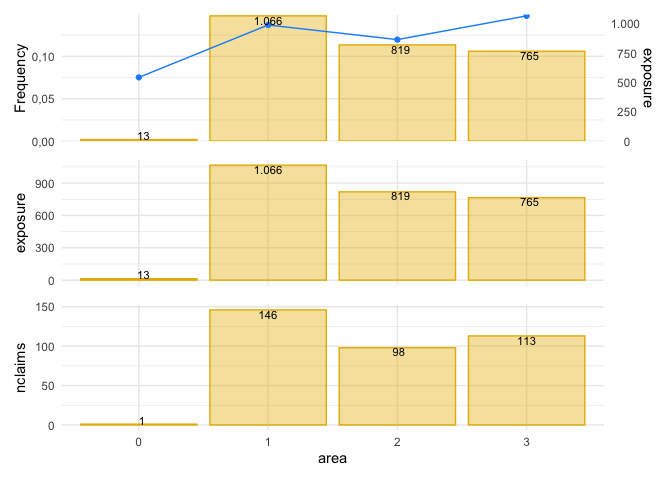
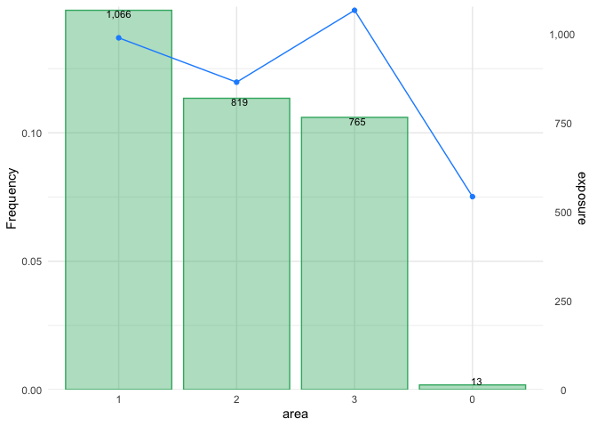

<!-- README.md is generated from README.Rmd. Please edit that file -->

# insurancerating

<!-- badges: start -->

[](https://cran.r-project.org/package=insurancerating)
[](https://cran.rstudio.com/package=insurancerating)
<!-- badges: end -->

The goal of insurancerating is to give analytic techniques that can be
used in insurance rating. It provides a data driven strategy for the
construction of tariff classes in P\&C insurance. The goal is to bin the
continuous factors such that categorical risk factors result which
capture the effect of the covariate on the response in an accurate way,
while being easy to use in a generalized linear model (GLM).

It also adds functionality showing additional lines for the reference
categories in the levels of the coefficients in the output of a
generalized linear regression analysis. In addition it implements a
procedure determining the level of a factor with the largest exposure,
and thereafter changing the base level of the factor to this level.

## Installation

Install insurancerating from CRAN:

``` r
install.packages("insurancerating")
```

Or the development version from GitHub:

``` r
# install.packages("devtools")
devtools::install_github("MHaringa/insurancerating")
```

## Example 1

This is a basic example which shows the techniques provided in
insurancerating.

The first part shows how to fit a GAM for the variable
*age\_policyholder* in the MTPL dataset:

``` r
library(insurancerating)
library(ggplot2)
library(dplyr)

# Claim frequency 
age_policyholder_frequency <- fit_gam(data = MTPL, 
                                      nclaims = nclaims, 
                                      x = age_policyholder, 
                                      exposure = exposure)

# Claim severity 
age_policyholder_severity <- fit_gam(data = MTPL, 
                                     nclaims = nclaims, 
                                     x = age_policyholder, 
                                     exposure = exposure, 
                                     amount = amount, 
                                     model = "severity")
```

Create plot:

``` r
autoplot(age_policyholder_frequency, show_observations = TRUE)
```

<!-- -->

Determine classes for the claim frequency (the points show the ratio
between the observed number of claims and exposure for each age):

``` r
clusters_freq <- construct_tariff_classes(age_policyholder_frequency)
clusters_sev <- construct_tariff_classes(age_policyholder_severity)

autoplot(clusters_freq, show_observations = TRUE)
```

<!-- -->

The figure shows that younger policyholders have a higher risk profile.
The fitted GAM is lower than might be expected from the observed claim
frequency for policyholders of age 19. This is because there are very
few young policyholders of age 19 present in the portfolio.

Show classes for the claim severity:

``` r
age_policyholder_severity %>%
  construct_tariff_classes() %>%
  autoplot(., show_observations = TRUE, remove_outliers = 100000)
```

<!-- -->

The second part adds the constructed tariff classes for the variable
*age\_policyholder* to the dataset, and sets the base level of the
factor *age\_policyholder* to the level with the largest exposure. In
this example for claim frequency the class for ages (39,50\], which
contains the largest exposure.

``` r
dat <- MTPL %>%
  mutate(age_policyholder_freq_cat = clusters_freq$tariff_classes) %>%
  mutate(age_policyholder_sev_cat = clusters_sev$tariff_classes) %>%
  mutate_if(is.character, as.factor) %>%
  mutate_if(is.factor, list(~biggest_reference(., exposure)))

glimpse(dat)
```

    ## Observations: 32,731
    ## Variables: 6
    ## $ age_policyholder          <int> 43, 21, 54, 44, 20, 38, 68, 45, 76, 30, 28,…
    ## $ nclaims                   <int> 0, 0, 0, 1, 1, 0, 0, 1, 0, 0, 0, 0, 0, 0, 0…
    ## $ exposure                  <dbl> 1.0000000, 1.0000000, 1.0000000, 1.0000000,…
    ## $ amount                    <dbl> 0, 0, 0, 57540, 2057, 0, 0, 6510, 0, 0, 0, …
    ## $ age_policyholder_freq_cat <fct> "(39,50]", "[18,25]", "(50,57]", "(39,50]",…
    ## $ age_policyholder_sev_cat  <fct> "(39,46]", "[18,25]", "(46,81]", "(39,46]",…

The last part is to fit a *generalized linear model*. The function
rating\_factors prints the output including the reference
group.

``` r
model <- glm(nclaims ~ age_policyholder_freq_cat, offset = log(exposure), family = "poisson", data = dat)
rating_factors(model)
```

    ##                         term     cluster  estimate
    ## 1                  Intercept (Intercept) 0.1368181
    ## 2  age_policyholder_freq_cat     (39,50] 1.0000000
    ## 3  age_policyholder_freq_cat     [18,25] 1.9438228
    ## 4  age_policyholder_freq_cat     (25,32] 1.3234995
    ## 5  age_policyholder_freq_cat     (32,39] 1.0568538
    ## 6  age_policyholder_freq_cat     (50,57] 0.8919696
    ## 7  age_policyholder_freq_cat     (57,64] 0.7423998
    ## 8  age_policyholder_freq_cat     (64,71] 0.7379362
    ## 9  age_policyholder_freq_cat     (71,83] 0.7021348
    ## 10 age_policyholder_freq_cat     (83,95] 0.6933378

## Example 2

This is a basic example which shows how to easily perform an univariate
analysis on a MTPL portfolio using `insurancerating`.

The first part shows how to create a frequency plot for the variable
`area` in the `MTPL2`
dataset:

``` r
x <- univariate_frequency(MTPL2, x = area, nclaims = nclaims, exposure = exposure)

# Print output
x
```

    ##   area nclaims   exposure  frequency
    ## 1    2      98  818.53973 0.11972540
    ## 2    3     113  764.99178 0.14771401
    ## 3    1     146 1065.74795 0.13699299
    ## 4    0       1   13.30685 0.07514927

``` r
# Print plot
autoplot(x)
```

<!-- -->

Or sort risk factor into descending order by exposure:

``` r
autoplot(x, sort = TRUE, dec.mark = ".", color_bg = "mediumseagreen")
```

<!-- -->

`univariate_average_severity()` calculates the average severity:

``` r
univariate_average_severity(MTPL2, x = area, severity = amount, 
                            nclaims = nclaims, premium = premium) %>%
  autoplot(.)
```

<!-- -->

Similar plots can be created for the risk premium, loss ratio, average
premium, and exposure, using `univariate_risk_premium()`,
`univariate_loss_ratio()`, `univariate_average_premium()`, and
`univariate_exposure()`, respectively.

`univariate_all()` combines these
plots:

``` r
y <- univariate_all(MTPL2, x = area, severity = amount, nclaims = nclaims, exposure = exposure)

# Print output
y
```

    ##   area  amount nclaims   exposure  frequency average_severity risk_premium
    ## 1    2 4063270      98  818.53973 0.11972540         41461.94    4964.0474
    ## 2    3 7945311     113  764.99178 0.14771401         70312.49   10386.1390
    ## 3    1 6896187     146 1065.74795 0.13699299         47234.16    6470.7486
    ## 4    0    6922       1   13.30685 0.07514927          6922.00     520.1832

In the above output the loss ratio is not shown because the premium is
not specified here.

``` r
autoplot(y)
```

    ## Ignoring plots 4: input is unknown

<!-- -->

`show_plots` can be used to specify the desired plots. The following
plots are available:

1.  frequency (i.e. number of claims / expsore)
2.  average severity (i.e. severity / number of claims)
3.  risk premium (i.e. severity / exposure)
4.  loss ratio (i.e. severity / premium)
5.  average premium (i.e. premium / exposure)
6.  exposure

Show the exposure and claim frequency:

``` r
autoplot(y, show_plots = c(6,1), background = FALSE, sort = TRUE)
```

<!-- -->
