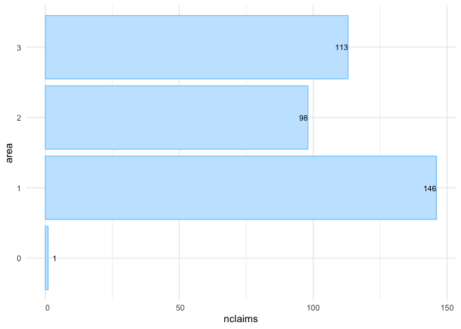

<!-- README.md is generated from README.Rmd. Please edit that file -->

# insurancerating 

<!-- badges: start -->

[](https://cran.r-project.org/package=insurancerating)
[](https://cran.rstudio.com/package=insurancerating)

<!-- badges: end -->

The `insurancerating` package provides functions to build, evaluate, and
visualize insurance rating models. `insurancerating` simplifies the
process of modeling premiums, and allows to analyze insurance risk
factors effectively.

## Installation

Install insurancerating from CRAN:

``` r
install.packages("insurancerating")
```

Or the development version from GitHub:

``` r
# install.packages("remotes")
remotes::install_github("MHaringa/insurancerating")
```

## Univariate

A univariate analysis focuses on examining the overall claim frequency,
severity, and risk premium. The primary objective is to assess whether
the experience data is reasonable by comparing it with past experiences
and using expert judgment.

This section provides a straightforward example of how to perform a
univariate analysis on an MTPL portfolio using `insurancerating`.
`univariate()` displays the basic risk indicators segmented by the
levels of the discrete risk factor:

``` r
library(insurancerating)
library(dplyr)

univariate(MTPL2, 
           x = area, # discrete risk factor
           nclaims = nclaims, # number of claims
           exposure = exposure, 
           premium = premium, 
           severity = amount) # loss
```

    ## # A tibble: 4 × 10
    ##    area  amount nclaims exposure premium frequency average_severity risk_premium
    ##   <int>   <int>   <int>    <dbl>   <int>     <dbl>            <dbl>        <dbl>
    ## 1     2 4063270      98    819.    51896    0.120            41462.        4964.
    ## 2     3 7945311     113    765.    49337    0.148            70312.       10386.
    ## 3     1 6896187     146   1066.    65753    0.137            47234.        6471.
    ## 4     0    6922       1     13.3     902    0.0751            6922          520.
    ## # ℹ 2 more variables: loss_ratio <dbl>, average_premium <dbl>

The following indicators are calculated:

1.  frequency (i.e. frequency = number of claims / exposure)
2.  average_severity (i.e. average severity = severity / number of
    claims)
3.  risk_premium (i.e. risk premium = severity / exposure = frequency x
    average severity)
4.  loss_ratio (i.e. loss ratio = severity / premium)
5.  average_premium (i.e. average premium = premium / exposure)

**Note on Exposure and Risk Premium**

In the context of insurance:

- The term *exposure* refers to the subject or asset that is being
  insured. For example, an insured vehicle is considered an exposure.
- If a vehicle is insured as of July 1st for a particular year, the
  insurance company would record this as an exposure of 0.5 for that
  year. This means that the vehicle was insured for half the year.

Additionally, the term *risk premium* is used interchangeably with *pure
premium* or *burning cost*. These terms represent the amount of premium
that is required to cover the expected loss, without including any
additional expenses or profit margins.

There are additional options available in `univariate()`, and the
following explains the most important ones. `univariate()` disregards
missing input arguments. For example, if premium and severity are not
provided, it will only calculate the claim frequency.

``` r
univariate(MTPL2, x = area, nclaims = nclaims, exposure = exposure) 
```

    ## # A tibble: 4 × 4
    ##    area nclaims exposure frequency
    ##   <int>   <int>    <dbl>     <dbl>
    ## 1     2      98    819.     0.120 
    ## 2     3     113    765.     0.148 
    ## 3     1     146   1066.     0.137 
    ## 4     0       1     13.3    0.0751

However, the above table is small and easy to understand, the same
information might be presented more effectively with a graph, as shown
below.

``` r
univariate(MTPL2, x = area, nclaims = nclaims, exposure = exposure) |>
  autoplot()
```

<!-- -->

In `autoplot.univariate()`, `show_plots` specifies both which plots to
display and the order in which they appear. The available plots include:

1.  frequency
2.  average_severity
3.  risk_premium
4.  loss_ratio
5.  average_premium
6.  exposure
7.  severity
8.  nclaims
9.  premium

For instance, to display the exposure and claim frequency plots:

``` r
univariate(MTPL2, x = area, nclaims = nclaims, exposure = exposure) |>
  autoplot(show_plots = c(6,1))
```

<!-- -->

To check whether claim frequency remains consistent over the years is
important for identifying trends or irregularities:

``` r
set.seed(1)
sample_years <- sample(2016:2019, nrow(MTPL2), replace = TRUE)

MTPL2 |>
  mutate(year = sample_years) |>
  univariate(x = area, nclaims = nclaims, exposure = exposure, by = year) |>
  autoplot(show_plots = 1)
```

<!-- -->

To remove the bars from the plot and display only the line graph, use
`background = FALSE`:

``` r
univariate(MTPL2, x = area, nclaims = nclaims, exposure = exposure) |>
  autoplot(show_plots = c(6,1), background = FALSE)
```

<!-- -->

`sort` arranges the levels of the risk factor in descending order based
on exposure:

``` r
univariate(MTPL2, x = area, nclaims = nclaims, exposure = exposure) |>
  autoplot(show_plots = 1, background = FALSE, sort = TRUE)
```

<!-- -->

`sort_manual` allows you to arrange the levels of a discrete risk factor
according to your preferred order. This is useful when the levels have a
natural sequence or when you want to exclude certain levels from the
output.

``` r
univariate(MTPL2, x = area, nclaims = nclaims, exposure = exposure) |>
  autoplot(show_plots = c(6,1), background = FALSE, 
           sort_manual = c("2", "3", "1", "0"))
```

<!-- -->

The graph below illustrates additional options:

``` r
univariate(MTPL2, x = area, nclaims = nclaims, exposure = exposure) |>
  autoplot(show_plots = c(6,1), background = FALSE, sort = TRUE, ncol = 2, 
           color_bg = "dodgerblue", color = "blue", 
           custom_theme = ggplot2::theme_bw())
```

<!-- -->

Alternatively, you can create a bar graph to display the number of
claims; this is the last `univariate()` plot with options presented
here:

``` r
univariate(MTPL2, x = area, nclaims = nclaims) |>
  autoplot(show_plots = 8, coord_flip = TRUE, sort = TRUE)
```

<!-- -->

In addition to `univariate()`, another option for one-way analysis is
`histbin()`. This function allows you to create a histogram for
continuous variables:

``` r
histbin(MTPL2, premium, bins = 20)
```

<!-- -->

In the context of insurance, it is common to encounter outliers in the
data, and one way to address this issue is by grouping the outliers into
a single bin:

``` r
histbin(MTPL2, premium, bins = 10, right = 110)
```

<!-- -->

Alternatively, you can apply a logarithmic transformation or remove
outliers, but these methods can obscure the original distribution.
Grouping outliers into a single bin preserves the overall distribution
while providing insight into their quantity.

## Continuous variables

This section explains how to get an understanding of the claim frequency
and claim severity for continuous variables in the portfolio. As an
example, we’ll use the variable *age_policyholder* in `MTPL`.

To do this, we fit a Generalized Additive Model (GAM) for
*age_policyholder*. A GAM is a flexible regression model that allows the
relationship between the predictors and the response variable to be
nonlinear by using smooth functions of the predictors. This makes it
easier to capture more complex patterns in the data compared to simpler
models that assume a straight-line relationship.

`fit_gam()` below displays the claim frequency (i.e. number of claims /
exposure) for different age groups:

``` r
age_policyholder_frequency <- fit_gam(data = MTPL, 
                                      nclaims = nclaims, 
                                      x = age_policyholder, 
                                      exposure = exposure, 
                                      model = "frequency")

# Create plot
autoplot(age_policyholder_frequency, show_observations = TRUE) /
  histbin(MTPL, age_policyholder, bins = 20)
```

<!-- -->

The figure shows that younger policyholders have a higher risk profile.
Since the GAM uses `exposure` as weights, the fitted line for those
under 25 is lower than the observed frequency due to the small number of
young policyholders. Similarly, low exposure for policyholders aged 80
to 100 means the GAM has little influence from this group.

In the insurance industry, GLMs (Generalized Linear Models) are often
used, so non-linear relationships found in GAMs must be turned into
risk-homogeneous categories. The goal is to group continuous risk
factors into categorical ones that accurately reflect how these factors
affect the response. These categories are then used as levels of the
risk factor in the GLM. There are two recommended ways to do this,
depending on the goal.

The first method is to bin the GAM output using evolutionary trees,
which group policyholders into risk-homogeneous categories based on
claim frequency. This approach is best when these bins will be used
directly in the final tariff without further refinement. This method is
based on Henckaerts et al. (2018); see `?construct_tariff_classes` for
details. If you plan to refine the bins later, such as by smoothing the
premium (that is reducing the tolerance for rate change), it is better
to manually select the bins instead of using evolutionary trees. That is
the second approach. Both methods are described below.

`construct_tariff_classes()` generates bins using evolutionary trees:

``` r
clusters_freq <- construct_tariff_classes(age_policyholder_frequency)

# Display plot
autoplot(clusters_freq, show_observations = TRUE)
```

<!-- -->

The above clearly demonstrates bins with risk-homogeneous categories. It
shows that the claim frequency for policyholders aged between 39 and 84
is almost identical. For those over 84, the claim frequency is slightly
higher, while young policyholders aged 18 to 25 have the highest claim
frequency. The groups aged 25 to 32 and 32 to 39 have slightly lower
claim frequencies than the youngest drivers but represent a higher risk
than the main group of policyholders aged 39 to 84.

You can follow the same steps for severity by specifying
`model = "severity"` in `fit_gam()`.

The final step is to add new columns to the MTPL data set that translate
the age of the policyholders into the corresponding bin(s):

``` r
# Create bins manually
policyholder_manual_cat <- seq(18, 95, by = 4)

dat <- MTPL |>
  mutate(age_policyholder_freq_evt = clusters_freq$tariff_classes) |>
  mutate(age_policyholder_freq_man = cut(age_policyholder, 
                                         breaks = policyholder_manual_cat, 
                                         include.lowest = TRUE)) |>
  mutate(across(where(is.character), as.factor)) |>
  mutate(across(where(is.factor), ~biggest_reference(., exposure)))

glimpse(dat)
```

    ## Rows: 30,000
    ## Columns: 9
    ## $ age_policyholder          <int> 70, 40, 78, 49, 59, 71, 55, 52, 51, 47, 62, …
    ## $ nclaims                   <int> 0, 0, 0, 0, 0, 0, 1, 0, 0, 0, 0, 1, 0, 0, 0,…
    ## $ exposure                  <dbl> 1.0000000, 1.0000000, 1.0000000, 1.0000000, …
    ## $ amount                    <dbl> 0, 0, 0, 0, 0, 0, 2607, 0, 0, 0, 0, 2890, 0,…
    ## $ power                     <int> 106, 74, 65, 64, 29, 66, 43, 55, 100, 66, 44…
    ## $ bm                        <int> 5, 3, 8, 10, 1, 6, 2, 2, 1, 2, 1, 2, 2, 9, 5…
    ## $ zip                       <fct> 1, 1, 2, 1, 3, 3, 3, 3, 3, 3, 2, 1, 1, 2, 2,…
    ## $ age_policyholder_freq_evt <fct> "(39,84]", "(39,84]", "(39,84]", "(39,84]", …
    ## $ age_policyholder_freq_man <fct> "(66,70]", "(38,42]", "(74,78]", "(46,50]", …

The last line above sets the base level of the factors (specifically
`age_policyholder_freq_evt` and `age_policyholder_freq_man`) to the one
with the highest exposure. For example, for `age_policyholder_freq_evt`,
the age group (39, 84\] is chosen as the base level because it has the
most exposure.

## Risk premium models

The final step is to create a risk premium using GLMs (Generalized
Linear Models). GLMs are widely used in the insurance industry, where
claim frequencies are typically modeled with a Poisson GLM and claim
severity with a Gamma GLM.

GLMs are favored because they allow for the modeling of complex
relationships between predictors and response variables while
accommodating various types of response distributions. The Poisson
distribution is particularly useful for modeling count data, such as the
number of claims, while the Gamma distribution effectively handles
continuous, positive response variables like claim severity. By
utilizing these models, insurers can accurately assess risk and set
appropriate premiums. `insurancerating` employs the standard `glm()`
function in R to facilitate this process.

### Example 1

The following code generates two different models for claim frequency.
`rating_factors()` displays the fitted coefficients:

``` r
mod_freq1 <- glm(nclaims ~ age_policyholder_freq_evt, 
                 offset = log(exposure), 
                 family = "poisson", 
                 data = dat)

mod_freq2 <- glm(nclaims ~ age_policyholder_freq_evt + age_policyholder, 
                 offset = log(exposure), 
                 family = "poisson", 
                 data = dat)

rating_factors(mod_freq1, mod_freq2) 
```

    ##                 risk_factor            level est_mod_freq1 est_mod_freq2
    ## 1               (Intercept)      (Intercept)     0.1179256     0.2458900
    ## 2 age_policyholder_freq_evt          (39,84]     1.0000000     1.0000000
    ## 3 age_policyholder_freq_evt          [18,25]     2.2168483     1.4530987
    ## 4 age_policyholder_freq_evt          (25,32]     1.5176253     1.0739519
    ## 5 age_policyholder_freq_evt          (32,39]     1.2278612     0.9526827
    ## 6 age_policyholder_freq_evt          (84,95]     0.5887492     0.9016893
    ## 7          age_policyholder age_policyholder            NA     0.9867281

`autoplot.riskfactor()` generates a figure of the coefficients. The base
level for the factor `age_policyholder_freq_cat` is the group with the
highest exposure, which is displayed first.

``` r
rating_factors(mod_freq1, mod_freq2) |> 
  autoplot()
```

<!-- -->

The figure above displays the age groups in a non-natural order, with
the group aged 39 to 84 appearing before the group aged 18 to 25. To
arrange the ages in their natural order, include `model_data` in
`rating_factors()` to sort the clustering in the original sequence.
Please note that ordering the factor `age_policyholder_freq_evt` will
only work if `biggest_reference()` is used to set the base level of the
factor to the level with the highest exposure.

``` r
rating_factors(mod_freq1, mod_freq2, model_data = dat) |>
  autoplot()
```

<!-- -->

The following graph presents additional options, for example, including
the exposure displayed as a bar graph:

``` r
rating_factors(mod_freq1, mod_freq2, model_data = dat, exposure = exposure) |>
  autoplot(linetype = TRUE) 
```

<!-- -->

### Example 2

This is a basic example which shows how to easily create premiums using
`insurancerating`.

Fit (again) a Poisson GLM and a Gamma GLM:

``` r
mod_freq <- glm(nclaims ~ zip + age_policyholder_freq_man, 
                offset = log(exposure), 
                family = "poisson", 
                data = dat)

mod_sev <- glm(amount ~ bm + zip, 
               weights = nclaims, 
               family = Gamma(link = "log"), 
               data = dat |> filter(amount > 0))
```

and multiply them to get the premium:

``` r
MTPL_premium <- dat |>
  add_prediction(mod_freq, mod_sev) |>
  mutate(premium = pred_nclaims_mod_freq * pred_amount_mod_sev) 

glimpse(MTPL_premium)
```

    ## Rows: 30,000
    ## Columns: 12
    ## $ age_policyholder          <int> 70, 40, 78, 49, 59, 71, 55, 52, 51, 47, 62, …
    ## $ nclaims                   <int> 0, 0, 0, 0, 0, 0, 1, 0, 0, 0, 0, 1, 0, 0, 0,…
    ## $ exposure                  <dbl> 1.0000000, 1.0000000, 1.0000000, 1.0000000, …
    ## $ amount                    <dbl> 0, 0, 0, 0, 0, 0, 2607, 0, 0, 0, 0, 2890, 0,…
    ## $ power                     <int> 106, 74, 65, 64, 29, 66, 43, 55, 100, 66, 44…
    ## $ bm                        <int> 5, 3, 8, 10, 1, 6, 2, 2, 1, 2, 1, 2, 2, 9, 5…
    ## $ zip                       <fct> 1, 1, 2, 1, 3, 3, 3, 3, 3, 3, 2, 1, 1, 2, 2,…
    ## $ age_policyholder_freq_evt <fct> "(39,84]", "(39,84]", "(39,84]", "(39,84]", …
    ## $ age_policyholder_freq_man <fct> "(66,70]", "(38,42]", "(74,78]", "(46,50]", …
    ## $ pred_nclaims_mod_freq     <dbl> 0.10057828, 0.13484076, 0.08467235, 0.140216…
    ## $ pred_amount_mod_sev       <dbl> 92178.78, 85686.38, 82808.65, 110644.28, 624…
    ## $ premium                   <dbl> 9271.184, 11554.016, 7011.604, 15514.147, 62…

### Example 3

The previous example provided a basic illustration of how to determine
premiums. This example delves deeper into the process of smoothing and
applying restrictions to the results. These methods are deduced from the
article Third Party Motor Liability Ratemaking with R, by Spedicato, G.
(2012).

The `MTPL_premium` dataset from the previous example is used again.
While restrictions could be applied to both frequency and severity
models, it is more appropriate to apply restrictions (and smoothing) to
the risk premium model. The key idea is that smoothing should be used to
limit the tolerance for rate changes, rather than changes in claim
frequency or other factors. To achieve this, start by fitting a *burning
model* without any restrictions:

``` r
burn_unrestricted <- glm(premium ~ zip + bm + age_policyholder_freq_man, 
                         weights = exposure, 
                         family = Gamma(link = "log"), 
                         data = MTPL_premium) 
```

This results in the following coefficients:

``` r
rating_factors(burn_unrestricted) 
```

    ##                  risk_factor       level est_burn_unrestricted
    ## 1                (Intercept) (Intercept)          1.028917e+04
    ## 2                        zip           1          1.000000e+00
    ## 3                        zip           0          3.540444e-01
    ## 4                        zip           2          7.300316e-01
    ## 5                        zip           3          7.501146e-01
    ## 6  age_policyholder_freq_man     (46,50]          1.000000e+00
    ## 7  age_policyholder_freq_man     [18,22]          2.113100e+00
    ## 8  age_policyholder_freq_man     (22,26]          1.709987e+00
    ## 9  age_policyholder_freq_man     (26,30]          1.417552e+00
    ## 10 age_policyholder_freq_man     (30,34]          1.065554e+00
    ## 11 age_policyholder_freq_man     (34,38]          1.111333e+00
    ## 12 age_policyholder_freq_man     (38,42]          9.547509e-01
    ## 13 age_policyholder_freq_man     (42,46]          1.046178e+00
    ## 14 age_policyholder_freq_man     (50,54]          9.131541e-01
    ## 15 age_policyholder_freq_man     (54,58]          8.234561e-01
    ## 16 age_policyholder_freq_man     (58,62]          7.545319e-01
    ## 17 age_policyholder_freq_man     (62,66]          7.806560e-01
    ## 18 age_policyholder_freq_man     (66,70]          7.276380e-01
    ## 19 age_policyholder_freq_man     (70,74]          7.309279e-01
    ## 20 age_policyholder_freq_man     (74,78]          6.846254e-01
    ## 21 age_policyholder_freq_man     (78,82]          7.978962e-01
    ## 22 age_policyholder_freq_man     (82,86]          1.093200e+00
    ## 23 age_policyholder_freq_man     (86,90]          3.032743e-01
    ## 24 age_policyholder_freq_man     (90,94]          3.763146e-05
    ## 25                        bm          bm          1.037382e+00

While the table above is concise and easy to interpret, the same
information can be presented more effectively through a graph, as shown
below. This visualization makes it easier to assess whether the
coefficients follow the desired trend:

``` r
rating_factors(burn_unrestricted, model_data = MTPL_premium, exposure = exposure) |>
  autoplot(risk_factor = "age_policyholder_freq_man")
```

<!-- -->

The figure above displays a pattern similar to the GAM; however, it
reveals some inconsistencies. For example, the premium for ages 30 to 34
is lower than for the 34 to 38 age group, and then decreases again for
the 38 to 42 group. This is undesirable, particularly from a commercial
perspective. To address this, smoothing can be applied to reduce the
tolerance for rate changes and create a more consistent premium
structure.

`insurancerating` offers `smooth_coef()` to apply smoothing. The
smoothed estimates are incorporated as an offset term in the model. An
offset is simply a fixed term added to the linear predictor, so if an
offset is already present in the model, the offset terms are combined
first (i.e., $\text{offset} = \log(a) + \log(b) = \log(a \cdot b)$).

The simplest approach for `smooth_coef()` is to fit a polynomial, which
is the default setting:

``` r
burn_unrestricted |>
  smooth_coef(x_cut = "age_policyholder_freq_man", 
              x_org = "age_policyholder", 
              breaks = seq(18, 99, 3)) |>
  print()
```

    ## Formula: premium ~ zip + bm + offset(log(age_policyholder_freq_man_smooth))

In `smooth_coef()`, `x_cut` refers to the risk factor with clusters, in
this case, “age_policyholder_freq_man”. `x_org` represents the original
risk factor without clustering, here “age_policyholder”. The `breaks`
parameter is a numerical vector specifying the new age groups that are
preferred from a commercial standpoint.

`autoplot()` generates a figure for the smoothed estimates. The blue
segments represent the estimates from the unrestricted model, while the
black line displays the smoothed coefficients. The red segments indicate
the newly estimated coefficients based on the polynomial and the
selected age groups. These age groups can be chosen to align with
commercial objectives:

``` r
burn_unrestricted |>
  smooth_coef(x_cut = "age_policyholder_freq_man", 
              x_org = "age_policyholder", 
              breaks = seq(18, 93, 5)) |>
  autoplot()
```

<!-- -->

As illustrated above, the fitted polynomial yields excessively high
coefficients for those under age 25 and significantly low coefficients
for individuals over age 88, which is undesirable.

The degree can be adjusted to a lower-order polynomial (in this case,
set to 1), resulting in a straight line, which is not ideal:

``` r
burn_unrestricted |>
  smooth_coef(x_cut = "age_policyholder_freq_man", 
              x_org = "age_policyholder", 
              degree = 1,
              breaks = seq(18, 93, 5)) |>
  autoplot()
```

<!-- -->

In most cases, and particularly in this situation, a better alternative
is to use a GAM rather than a polynomial:

``` r
burn_unrestricted |>
  smooth_coef(x_cut = "age_policyholder_freq_man", 
              x_org = "age_policyholder", 
              smoothing = "gam",
              breaks = seq(18, 99, 3)) |>
  autoplot()
```

<!-- -->

It is observed that for ages above 80, the fitted line decreases
rapidly, despite having very little exposure in this age group.
Therefore, the GAM should be weighted by the exposure, resulting in a
weighted GAM:

``` r
burn_unrestricted |>
  smooth_coef(x_cut = "age_policyholder_freq_man", 
              x_org = "age_policyholder", 
              smoothing = "gam",
              weights = "exposure",
              breaks = seq(18, 99, 5)) |>
  autoplot() /
autoplot(age_policyholder_frequency, show_observations = TRUE)
```

<!-- -->

We now observe a pattern that looks quite desirable (especially when
compared to the GAM in the second plot above). In the first plot, we see
that for ages above 75, the GAM starts to increase again, which is
favorable in this context, as the claim frequency for older drivers is
slightly higher. However, for other risk factors, such as vehicle power
or sum insured, a wavy pattern is not ideal from a commercial
perspective; it may be preferable for these risk factors to demonstrate
a monotonic increase or decrease.

To achieve this, `smooth_coef()` offers options for monotonic increasing
(“mpi”) or monotonic decreasing (“mpd”) trends. These are modeled using
shape-constrained additive models (SCAMs).

``` r
gam <- burn_unrestricted |>
  smooth_coef(x_cut = "age_policyholder_freq_man", 
              x_org = "age_policyholder", 
              smoothing = "gam",
              breaks = seq(18, 99, 3)) |>
  autoplot()

mpd <- burn_unrestricted |>
  smooth_coef(x_cut = "age_policyholder_freq_man", 
              x_org = "age_policyholder", 
              smoothing = "mpd",
              breaks = seq(18, 99, 3)) |>
  autoplot()

gam / mpd
```

<!-- -->

In addition to smoothing, there is often a need to impose restrictions
on the coefficients. For instance, many insurers implement some form of
a Bonus-Malus System in vehicle third-party liability insurance.
`restrict_coef()` can be used to apply these restrictions.

In `restrict_coef()`, `restrictions` must be a data frame where the
first column contains the names of the columns to which the restrictions
will be applied, and the second column lists the corresponding
restricted coefficients. The following example demonstrates restrictions
on the risk factor `zip`:

``` r
zip_df <- data.frame(zip = c(0,1,2,3),
                     zip_restricted = c(0.8, 0.9, 1, 1.2))

burn_unrestricted |>
  restrict_coef(restrictions = zip_df) |>
  print()
```

    ## Formula: premium ~ bm + age_policyholder_freq_man + offset(log(zip_restricted))

The examples above illustrate how to use `smooth_coef()` and
`restrict_coef()`. These two functions can be combined, but they must
always be followed by `update_glm()` to refit the GLM. This ensures that
the impact of the modified coefficients (resulting from `smooth_coef()`
and `restrict_coef()`) is taken into account in the fitting of other
coefficients. As a result, the values of other coefficients that are not
affected by smoothing or restrictions may also be adjusted when
refitting the model.

``` r
burn_restricted3 <- burn_unrestricted |>
  restrict_coef(restrictions = zip_df) |>
  smooth_coef(x_cut = "age_policyholder_freq_man", 
              x_org = "age_policyholder", 
              smoothing = "gam",
              weights = "exposure",
              breaks = seq(18, 99, 3)) |>
  update_glm() 

# Show rating factors
rating_factors(burn_restricted3)
```

    ##                risk_factor       level est_burn_restricted3
    ## 1              (Intercept) (Intercept)         8820.9732105
    ## 2           zip_restricted           0            0.8000000
    ## 3           zip_restricted           1            0.9000000
    ## 4           zip_restricted           2            1.0000000
    ## 5           zip_restricted           3            1.2000000
    ## 6  age_policyholder_smooth     [18,21]            2.0819663
    ## 7  age_policyholder_smooth     (21,24]            1.8232383
    ## 8  age_policyholder_smooth     (24,27]            1.5759076
    ## 9  age_policyholder_smooth     (27,30]            1.3573220
    ## 10 age_policyholder_smooth     (30,33]            1.1866671
    ## 11 age_policyholder_smooth     (33,36]            1.0764527
    ## 12 age_policyholder_smooth     (36,39]            1.0236651
    ## 13 age_policyholder_smooth     (39,42]            1.0099824
    ## 14 age_policyholder_smooth     (42,45]            1.0082040
    ## 15 age_policyholder_smooth     (45,48]            0.9941858
    ## 16 age_policyholder_smooth     (48,51]            0.9581483
    ## 17 age_policyholder_smooth     (51,54]            0.9049206
    ## 18 age_policyholder_smooth     (54,57]            0.8483375
    ## 19 age_policyholder_smooth     (57,60]            0.8014044
    ## 20 age_policyholder_smooth     (60,63]            0.7689384
    ## 21 age_policyholder_smooth     (63,66]            0.7488122
    ## 22 age_policyholder_smooth     (66,69]            0.7361431
    ## 23 age_policyholder_smooth     (69,72]            0.7286809
    ## 24 age_policyholder_smooth     (72,75]            0.7279182
    ## 25 age_policyholder_smooth     (75,78]            0.7355715
    ## 26 age_policyholder_smooth     (78,81]            0.7503285
    ## 27 age_policyholder_smooth     (81,84]            0.7661830
    ## 28 age_policyholder_smooth     (84,87]            0.7759663
    ## 29 age_policyholder_smooth     (87,90]            0.7760689
    ## 30 age_policyholder_smooth     (90,93]            0.7684741
    ## 31 age_policyholder_smooth     (93,96]            0.7589957
    ## 32 age_policyholder_smooth     (96,99]            0.7495117
    ## 33                      bm          bm            1.0372396

And visualize them:

``` r
# Show rating factors
rating_factors(burn_restricted3) |> autoplot()
```

<!-- -->

If you prefer not to refit the coefficients of the other risk
factors—such as when the exposure for the modified coefficients is very
low—you can apply only the manual changes and refit the intercept. To do
this, use `update_glm(intercept_only = TRUE)`. This will apply the
manual changes and refit the intercept, ensuring that the changes have
no impact on the other variables.

As the final step, incorporate the refined premiums into the portfolio:

``` r
premiums3 <- model_data(burn_restricted3) |>
  add_prediction(burn_restricted3)

glimpse(premiums3)
```

    ## Rows: 30,000
    ## Columns: 16
    ## $ age_policyholder                 <int> 18, 18, 18, 18, 19, 19, 19, 19, 19, 1…
    ## $ age_policyholder_freq_man_smooth <dbl> 2.081966, 2.081966, 2.081966, 2.08196…
    ## $ age_policyholder_smooth          <chr> "[18,21]", "[18,21]", "[18,21]", "[18…
    ## $ nclaims                          <int> 1, 0, 0, 0, 0, 1, 0, 1, 0, 1, 0, 0, 1…
    ## $ exposure                         <dbl> 1.000000000, 0.095890411, 0.186301370…
    ## $ amount                           <dbl> 261777, 0, 0, 0, 0, 6642, 0, 57540, 0…
    ## $ power                            <int> 40, 68, 37, 33, 47, 68, 110, 74, 55, …
    ## $ bm                               <int> 3, 5, 3, 1, 6, 1, 1, 2, 2, 2, 5, 4, 2…
    ## $ zip                              <fct> 3, 2, 2, 2, 3, 3, 1, 3, 3, 2, 1, 3, 2…
    ## $ age_policyholder_freq_evt        <fct> "[18,25]", "[18,25]", "[18,25]", "[18…
    ## $ age_policyholder_freq_man        <fct> "[18,22]", "[18,22]", "[18,22]", "[18…
    ## $ pred_nclaims_mod_freq            <dbl> 0.28908717, 0.02621662, 0.05093515, 0…
    ## $ pred_amount_mod_sev              <dbl> 67176.26, 74215.89, 68988.66, 64129.6…
    ## $ premium                          <dbl> 19419.7940, 1945.6898, 3513.9476, 331…
    ## $ zip_restricted                   <dbl> 1.2, 1.0, 1.0, 1.0, 1.2, 1.2, 0.9, 1.…
    ## $ pred_premium_burn_restricted3    <dbl> 24592.84, 22048.83, 20494.03, 19048.8…

Alternatively, you can use model points, which are unique combinations
of factors (predictors) that represent different groups of
policyholders:

``` r
premiums4 <- model_data(burn_restricted3) |>
  construct_model_points() |>
  add_prediction(burn_restricted3)

glimpse(premiums4)
```

    ## Rows: 2,392
    ## Columns: 8
    ## $ age_policyholder_smooth          <chr> "(21,24]", "(21,24]", "(21,24]", "(21…
    ## $ zip                              <fct> 1, 1, 1, 1, 1, 1, 1, 1, 1, 1, 1, 1, 1…
    ## $ bm                               <int> 1, 2, 3, 4, 5, 6, 7, 8, 9, 10, 11, 12…
    ## $ zip_restricted                   <dbl> 0.9, 0.9, 0.9, 0.9, 0.9, 0.9, 0.9, 0.…
    ## $ age_policyholder_freq_man_smooth <dbl> 1.823238, 1.823238, 1.823238, 1.82323…
    ## $ count                            <int> 142, 53, 13, 10, 16, 25, 14, 9, 10, 1…
    ## $ exposure                         <dbl> 118.427397, 43.178082, 12.410959, 8.1…
    ## $ pred_premium_burn_restricted3    <dbl> 15013.49, 15572.58, 16152.50, 16754.0…

### Example 4

The last example illustrates additional options for model validation and
performance evaluation. The methods are presented in a random order and
use the models from the previous examples.

`model_performance()` computes indices of model performance for GLMs:

``` r
model_performance(mod_freq1, mod_freq2) 
```

    ## # Comparison of Model Performance Indices
    ## 
    ## Model     |      AIC |      BIC | RMSE
    ## --------------------------------------
    ## mod_freq1 | 22983.34 | 23024.88 | 0.36
    ## mod_freq2 | 22943.06 | 22992.92 | 0.36

The RMSE (Root Mean Square Error) is the square root of the average
squared differences between predicted and actual observations,
reflecting how well the model fits the data. It can be interpreted as
the standard deviation of the unexplained variance and is expressed in
the same units as the response variable.

`bootstrap_rmse()` computes the RMSE for bootstrap replicates,
conducting this process times. Specifically, in each iteration, a sample
is drawn with replacement from the dataset, and the model is refitted
using this sample. The root mean squared error is then calculated. The
following visualizes this:

``` r
bootstrap_rmse(mod_freq1, dat, n = 100, show_progress = FALSE) |> 
  autoplot()
```

<!-- -->

This analysis is useful for assessing the stability of the fitted
model’s predictive ability by examining the variation in the computed
RMSE. For claim severity models, it can be particularly beneficial to
evaluate the RMSE variation when the portfolio includes large claim
sizes. It is important to check this variation because a stable model
with consistent coefficients is desired; the coefficients should not
change significantly when the data varies slightly.

The figure above illustrates that the RMSE variation for the frequency
model is quite low, which is expected. The dashed line represents the
RMSE of the original fitted model, while the other lines indicate the
95% confidence interval.

`check_overdispersion()` calculates the dispersion ratio for a Poisson
GLM. A dispersion ratio greater than one suggests overdispersion, which
occurs when the observed variance exceeds the variance predicted by the
theoretical model. If the dispersion ratio is close to one, it indicates
that a Poisson model fits the data well. A $p$-value less than .05 also
suggests overdispersion. If the dispersion ratio is greater than 2, it
may indicate a more significant issue with the data, so it is advisable
to check for outliers again.

``` r
check_overdispersion(mod_freq1)
```

    ##        dispersion ratio =     1.185
    ##   Pearson's Chi-Squared = 35554.163
    ##                 p-value =   < 0.001

    ## Overdispersion detected.

`check_residuals()` calculates standardized residuals from GLMs, scaling
them between 0 and 1, making them easier to interpret, similar to
residuals from linear models:

``` r
check_residuals(mod_freq1, n_simulations = 600) |>
  autoplot()
```

    ## OK: residuals appear as from the expected distribution (p = 0.271).

<!-- -->

`check_residuals()` helps identify deviations from the expected
distribution and generates a uniform quantile-quantile (QQ) plot. The
simulated residuals in the QQ plot above show no significant deviation
from a Poisson distribution. Keep in mind that formal tests for residual
distribution usually yield significant results, so visual inspections
like QQ plots are preferred.

Diagnosing issues in GLMs is challenging because standard residual plots
often don’t work well. This is due to the expected data distribution
changing with fitted values, which can make it seem like there are
issues like non-normality or heteroscedasticity, even if the model is
correct. To address this, `check_residuals()` uses a simulation-based
approach to create standardized residuals that can be intuitively
understood. This explanation is adopted from the [vignette for
DHARMa](https://cran.r-project.org/web/packages/DHARMa/vignettes/DHARMa.html).
