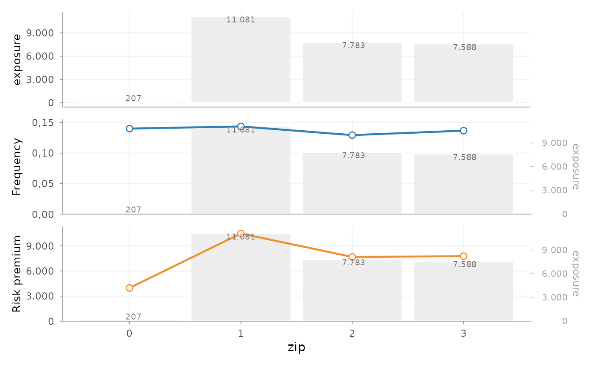
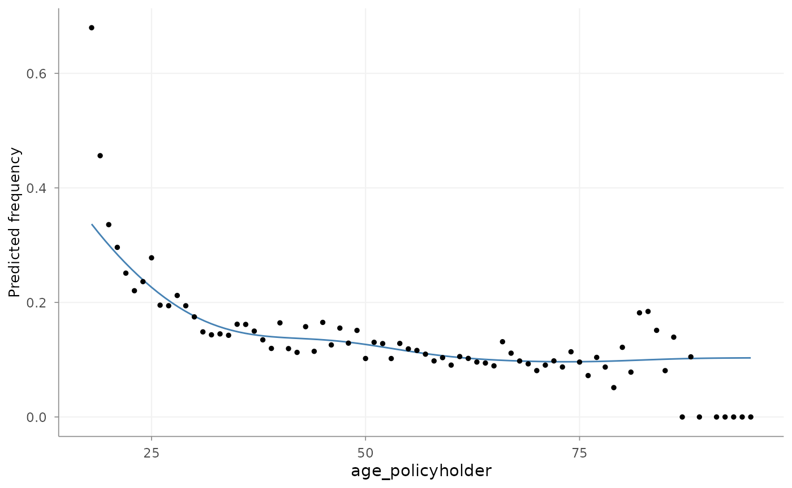
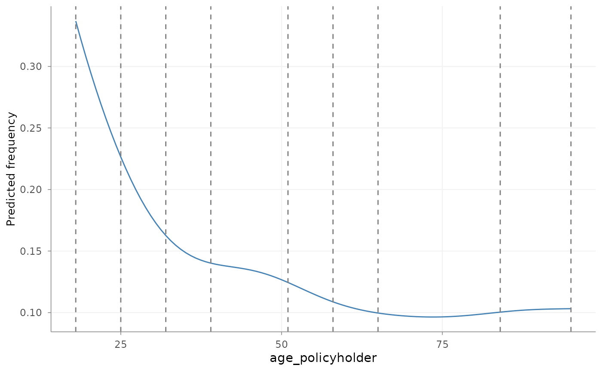
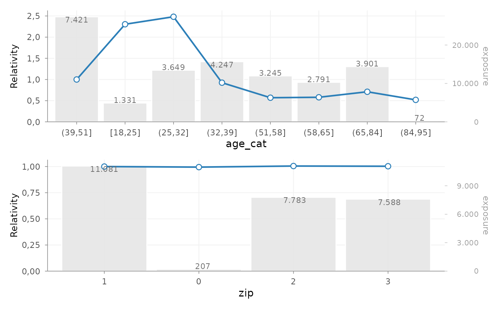
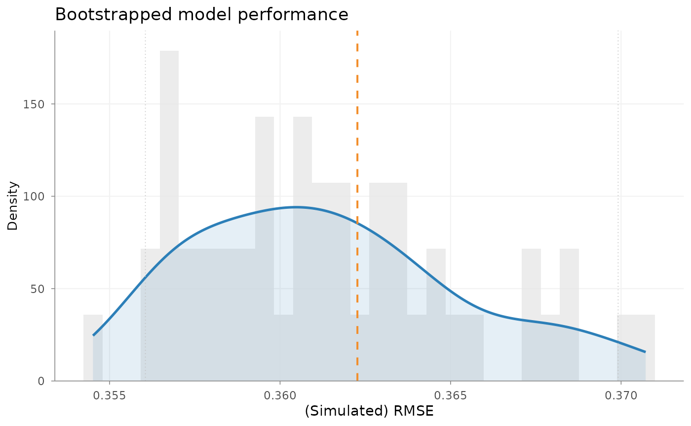

# Getting started

## Introduction

`insurancerating` provides functions for common actuarial pricing tasks
in R.

A common GLM-based pricing exercise often combines several tasks:

1.  portfolio analysis
2.  model estimation
3.  interpretation of fitted coefficients
4.  refinement of tariff structure

This vignette presents one possible GLM-based analysis and illustrates
how the functions can be combined:

- analyse risk factors with
  [`factor_analysis()`](https://mharinga.github.io/insurancerating/reference/factor_analysis.md)
- estimate pricing models with
  [`glm()`](https://rdrr.io/r/stats/glm.html)
- interpret coefficients with
  [`rating_table()`](https://mharinga.github.io/insurancerating/reference/rating_table.md)
- assess model stability with
  [`model_performance()`](https://mharinga.github.io/insurancerating/reference/model_performance.md)
  and
  [`bootstrap_performance()`](https://mharinga.github.io/insurancerating/reference/bootstrap_performance.md)

The focus is on the transition from observed portfolio experience to
fitted effects and a tariff structure that can be reviewed actuarially.

## Data

We use the example dataset `MTPL2`, which contains a motor portfolio
with:

- number of claims (`nclaims`),
- exposure (`exposure`),
- premium (`premium`),
- claim amounts (`amount`),
- several rating factors

``` r


library(insurancerating)
library(dplyr)

head(MTPL2)
#> # A tibble: 6 × 6
#>   customer_id  area nclaims amount exposure premium
#>         <int> <int>   <int>  <int>    <dbl>   <int>
#> 1       92617     2       0      0   1           90
#> 2      120632     2       0      0   1           82
#> 3      147800     2       0      0   1           47
#> 4       29763     3       0      0   0.0630      44
#> 5       61107     1       1   6066   1           69
#> 6        4318     3       0      0   1           66
```

## Step 1 — Portfolio analysis

### Factor analysis

A pricing analysis commonly starts with a descriptive review of the
portfolio.

Before fitting a model, it is useful to assess:

- how experience differs across factor levels
- whether observed differences are supported by sufficient exposure and
  claim volume
- whether the observed pattern is plausible

This is done with
[`factor_analysis()`](https://mharinga.github.io/insurancerating/reference/factor_analysis.md).

### Basic factor analysis

We start by analysing a single risk factor.

``` r


fa <- factor_analysis(
  MTPL,
  risk_factors = "zip",
  claim_count = "nclaims",
  exposure = "exposure",
  claim_amount = "amount"
)

fa
#>   zip    amount nclaims   exposure frequency average_severity risk_premium
#> 1   1 116178669    1593 11080.6274 0.1437644         72930.74    10484.846
#> 2   2  59751985    1008  7782.6301 0.1295192         59277.76     7677.608
#> 3   3  58988962    1038  7587.5644 0.1368028         56829.44     7774.427
#> 4   0    821510      29   206.8438 0.1402024         28327.93     3971.644
```

The output provides commonly used portfolio metrics such as:

- frequency = claims / exposure
- average severity = loss / claims
- risk premium = loss / exposure
- loss ratio = loss / premium
- average premium = premium / exposure

### Visualising factor behaviour

``` r


autoplot(fa, metrics = c("exposure", "frequency", "risk_premium"))
```



This provides a direct view of:

- the distribution of exposure
- the variation in claim frequency
- the variation in risk premium

These are descriptive, univariate results. They show the observed
experience and volume by level, but do not control for correlations with
other risk factors.

## Step 2 — Continuous variables

### Why continuous variables are treated separately

Continuous variables can be modelled directly or translated into grouped
tariff variables, depending on the model and implementation environment.
This example uses the following sequence:

1.  analysed as continuous variables
2.  translated into tariff segments
3.  used in a GLM as categorical rating factors

Grouping makes the resulting tariff effect discrete and directly
implementable, but introduces a segmentation choice that should be
reviewed.

### Analysing the shape with a GAM

``` r


age_freq <- risk_factor_gam(
  data = MTPL,
  risk_factor = "age_policyholder",
  claim_count = "nclaims",
  exposure = "exposure"
)

autoplot(age_freq, show_observations = TRUE)
```



This step is used to inspect:

- non-linear patterns
- local volatility
- areas with low exposure
- plausible breakpoints for tariff segments

### Deriving tariff segments

``` r


age_segments <- derive_tariff_segments(age_freq)
autoplot(age_segments)
```



``` r

summary(age_segments)
#>   segment portfolio_records risk_factor_values   exposure claim_count
#> 1 [18,25]              1543                  8 1331.17534         348
#> 2 (25,32]              4254                  7 3648.72055         653
#> 3 (32,39]              4919                  7 4247.34795         615
#> 4 (39,51]              8366                 12 7421.35890        1009
#> 5 (51,58]              3594                  7 3245.45479         372
#> 6 (58,65]              3058                  7 2790.83288         272
#> 7 (65,84]              4181                 19 3900.75890         394
#> 8 (84,95]                85                 10   72.01644           5
#>    frequency
#> 1 0.26142311
#> 2 0.17896684
#> 3 0.14479624
#> 4 0.13595893
#> 5 0.11462184
#> 6 0.09746194
#> 7 0.10100599
#> 8 0.06942859
```

This derives candidate segment boundaries from the fitted continuous
effect. Exposure and claim volume have already informed the GAM
estimate. They are reported by
[`summary()`](https://rdrr.io/r/base/summary.html) for review, but are
not applied again when the fitted curve is divided into intervals. The
evolutionary tree approximates the GAM curve rather than the individual
claim outcomes. Each distinct risk-factor value on the fitted curve has
equal influence on this approximation; exposure is not applied as a
second weight.

The resulting segments should be reviewed against exposure, observed
experience, stability and practical tariff requirements before they are
used in a model.

### Adding tariff segments to the data

``` r


dat <- MTPL |>
  add_tariff_segments(age_segments, name = "age_cat") |>
  mutate(across(where(is.character), as.factor)) |>
  mutate(across(where(is.factor), ~ set_reference_level(., exposure)))
```

[`set_reference_level()`](https://mharinga.github.io/insurancerating/reference/set_reference_level.md)
sets the reference level to the level with the highest exposure. This
changes the coefficient parameterisation, not the fitted values. A
high-exposure level is often a useful baseline because its relativity is
supported by a substantial part of the portfolio.

## Step 3 — Model estimation

### Why GLMs are used

Generalized linear models are widely used in insurance pricing. They
can:

- accommodate non-normal response distributions
- produce interpretable multiplicative effects
- can be translated into tariff relativities

A common decomposition is:

- frequency –\> Poisson GLM
- severity –\> Gamma GLM

### Frequency model

``` r


mod_freq <- glm(
  nclaims ~ age_cat,
  offset = log(exposure),
  family = poisson(),
  data = dat
)
```

### Severity model

``` r


mod_sev <- glm(
  amount ~ age_cat,
  weights = nclaims,
  family = Gamma(link = "log"),
  data = dat |> filter(amount > 0)
)
```

Frequency and severity are modelled separately because they capture
different aspects of the loss process.

### Constructing a premium proxy

``` r


premium_df <- dat |>
  add_prediction(mod_freq, mod_sev) |>
  mutate(premium = pred_nclaims_mod_freq * pred_amount_mod_sev)

head(premium_df)
#>   age_policyholder nclaims  exposure amount power bm zip age_cat
#> 1               70       0 1.0000000      0   106  5   1 (65,84]
#> 2               40       0 1.0000000      0    74  3   1 (39,51]
#> 3               78       0 1.0000000      0    65  8   2 (65,84]
#> 4               49       0 1.0000000      0    64 10   1 (39,51]
#> 5               59       0 1.0000000      0    29  1   3 (58,65]
#> 6               71       0 0.4547945      0    66  6   3 (65,84]
#>   pred_nclaims_mod_freq pred_amount_mod_sev  premium
#> 1            0.10100599            67736.95 6841.837
#> 2            0.13595893            72328.67 9833.729
#> 3            0.10100599            67736.95 6841.837
#> 4            0.13595893            72328.67 9833.729
#> 5            0.09746194            57782.98 5631.642
#> 6            0.04593697            67736.95 3111.630
```

This produces an expected-loss proxy from the fitted frequency and
severity components. Its precise unit depends on the exposure treatment
in the frequency prediction and should be checked before it is used as a
model response.

## Step 4 — Premium model

### Fitting a premium model

``` r


burn_unrestricted <- glm(
  premium ~ age_cat + zip,
  weights = exposure,
  family = Gamma(link = "log"),
  data = premium_df
)
```

This model combines the rating factors into one fitted risk-premium
structure.

It can be used to inspect the combined effect of the frequency and
severity components. Commercial loadings and other premium components
are outside this technical risk-premium model.

## Step 5 — Interpreting coefficients

### Rating table

``` r


rt <- rating_table(burn_unrestricted)
rt
#>    risk_factor       level est_burn_unrestricted exposure
#> 1  (Intercept) (Intercept)          9370.4023322       NA
#> 2      age_cat     (39,51]             1.0000000     7421
#> 3      age_cat     [18,25]             2.3041459     1331
#> 4      age_cat     (25,32]             2.4813038     3649
#> 5      age_cat     (32,39]             0.9246871     4247
#> 6      age_cat     (51,58]             0.5699965     3245
#> 7      age_cat     (58,65]             0.5798450     2791
#> 8      age_cat     (65,84]             0.7103948     3901
#> 9      age_cat     (84,95]             0.5190330       72
#> 10         zip           1             1.0000000    11081
#> 11         zip           0             0.9946246      207
#> 12         zip           2             1.0049888     7783
#> 13         zip           3             1.0028308     7588
```

[`rating_table()`](https://mharinga.github.io/insurancerating/reference/rating_table.md)
expresses fitted coefficients in terms of the original factor levels,
including the reference level.

This output is commonly used to inspect tariff relativities.

### Visualising coefficients

``` r


rating_table(burn_unrestricted) |>
  autoplot()
```



This plot can be used to assess:

- the relative size of coefficients
- the structure across levels
- the exposure behind each level
- whether additional refinement may be needed

At this stage, the relevant questions are:

- are coefficients sufficiently stable?
- do they follow the expected pattern?
- are some levels driven by limited exposure?

## Step 6 — Model evaluation

### Model performance

``` r


model_performance(mod_freq)
#> # Comparison of Model Performance Indices
#> 
#>  Model   |   AIC    |    BIC    | RMSE  
#> ---------+----------+-----------+------ 
#> mod_freq | 22949.04 | 23015.512 | 0.362
```

This reports AIC, BIC and response-scale RMSE. These measures are most
meaningful when models use the same response, records, weights and
offsets.

### Bootstrap performance

``` r


bp <- bootstrap_performance(
  mod_freq,
  dat,
  n_resamples = 50,
  sample_fraction = 0.8,
  sampling = "bootstrap",
  show_progress = FALSE
)
autoplot(bp)
```



This refits the model on repeated bootstrap samples and evaluates RMSE
on out-of-bag records. The resulting distribution describes sensitivity
to the sampled portfolio records; it is not a prediction interval for
future claims.

A single fit statistic is usually not sufficient. In pricing practice,
it is also relevant to assess whether the model behaves consistently
under small data perturbations.

## Step 7 — From model to tariff

At this point, the example has produced:

- portfolio-level insight
- fitted pricing models
- interpretable factor relativities
- basic performance diagnostics

In many cases, a further step is required before the model output can be
used as a tariff.

Typical reasons include:

- irregular coefficient patterns
- monotonicity requirements
- externally imposed restrictions
- expert-driven adjustments

This can be handled with the refinement tools described in [Refinement
building
blocks](https://mharinga.github.io/insurancerating/articles/refinement-workflow.md).

## Summary

A possible sequence in `insurancerating` is:

``` r


factor_analysis()             # analyse portfolio behaviour
risk_factor_gam()             # analyse continuous variables
derive_tariff_segments()      # derive tariff segments
glm()                         # estimate pricing models
rating_table()                # interpret fitted coefficients
bootstrap_performance()       # assess stability
prepare_refinement()          # refine tariff structure if needed
```

The sequence distinguishes observed experience, fitted model effects,
candidate tariff segmentation and model diagnostics. The final modelling
choices remain dependent on the portfolio and pricing objective.

## Next steps

The following vignette covers the refinement step in more detail:

- [Refinement building
  blocks](https://mharinga.github.io/insurancerating/articles/refinement-workflow.md)

For the conceptual background to exposure, risk premium, and tariff
design, see:

- [Pricing workflow building
  blocks](https://mharinga.github.io/insurancerating/articles/pricing-workflow-building-blocks.md)
