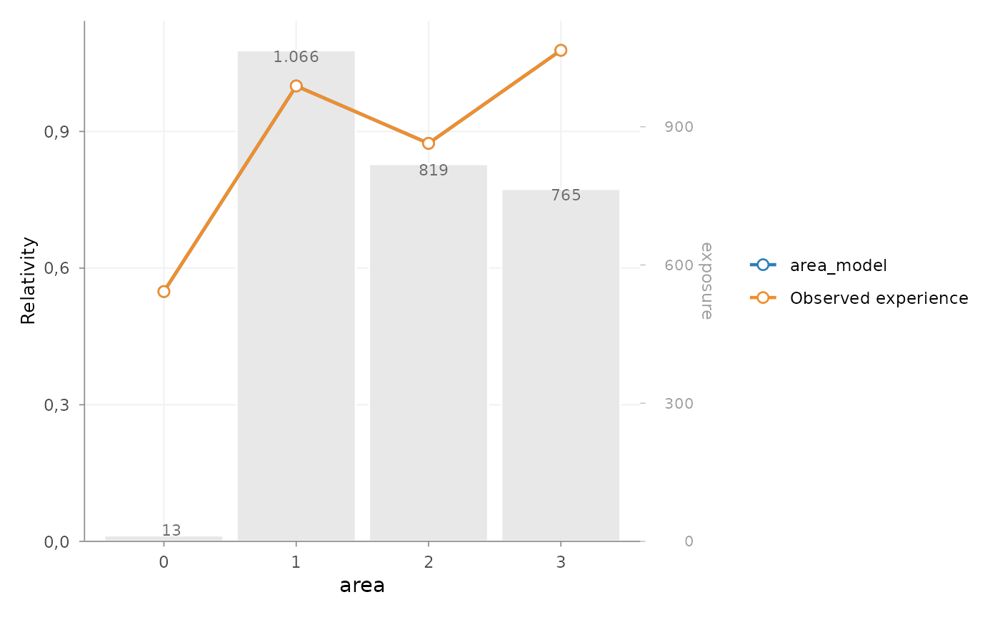
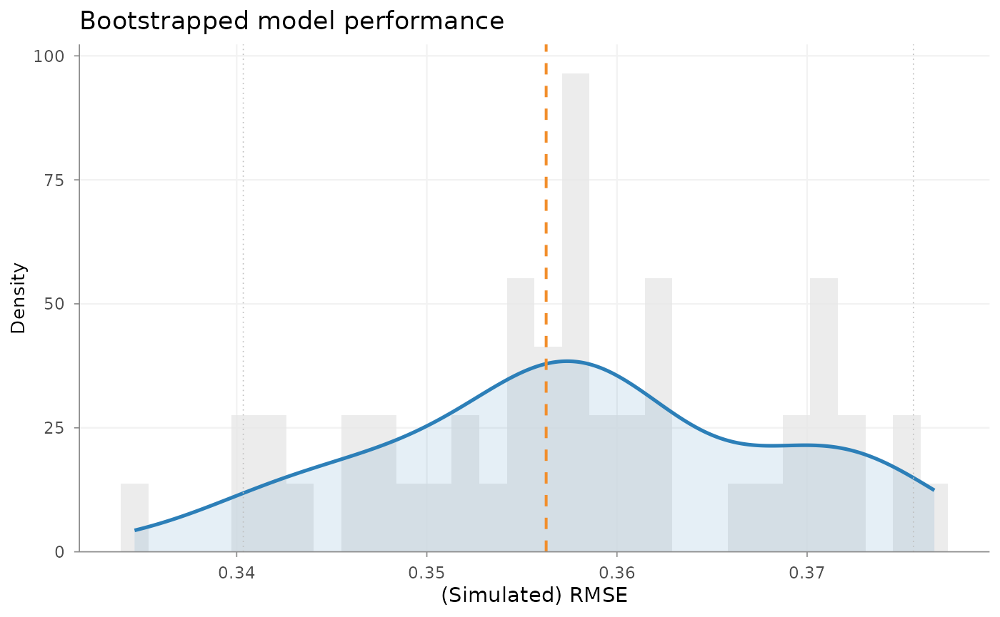
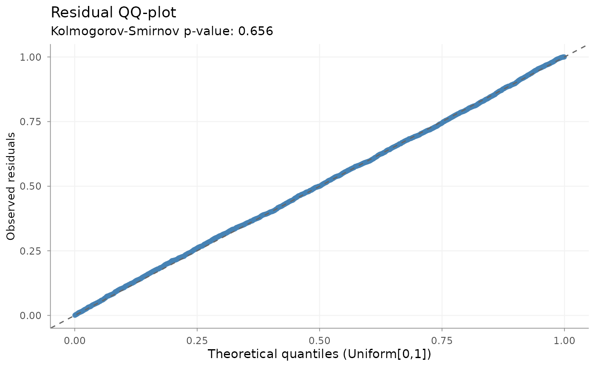

# Model validation

## What does model validation mean?

Validation of an insurance pricing model is broader than comparing fit
statistics. A model may describe the estimation data well while
producing unstable, weakly supported or actuarially implausible tariff
relativities. Conversely, a statistically detectable imperfection may
have little practical pricing effect in the insured portfolio.

No single metric determines whether a model is adequate. A validation
review normally combines several dimensions:

| Dimension | Practical question |
|----|----|
| Statistical adequacy | Are the model structure and distribution broadly consistent with the data? |
| Predictive performance | How well does the model predict the relevant outcome, preferably outside the estimation sample where appropriate? |
| Stability | How sensitive are estimates or performance to variation in the observed sample? |
| Tariff plausibility | Are the effects interpretable, credible and suitable for the intended tariff? |
| Portfolio behaviour | Where does expected experience differ systematically from observed experience? |

These dimensions are complementary rather than a mandatory sequence.
Their relative importance depends on the response, portfolio, modelling
objective and intended use of the tariff.

This vignette starts from fitted models. [Getting
Started](https://mharinga.github.io/insurancerating/articles/getting-started.md)
provides the worked modelling example, while [Pricing workflow and
package building
blocks](https://mharinga.github.io/insurancerating/articles/pricing-workflow-building-blocks.md)
maps validation within the wider package.

## Validation map

The following functions support different validation questions. Not
every model requires every diagnostic.

| Validation question | Typical tool |
|----|----|
| How do alternative fitted models compare? | [`model_performance()`](https://mharinga.github.io/insurancerating/reference/model_performance.md) |
| Are tariff relativities plausible and sufficiently supported? | [`rating_table()`](https://mharinga.github.io/insurancerating/reference/rating_table.md) |
| Does observed portfolio experience support the fitted pattern? | [`add_portfolio_experience()`](https://mharinga.github.io/insurancerating/reference/add_portfolio_experience.md) |
| How sensitive is measured performance to portfolio resampling? | [`bootstrap_performance()`](https://mharinga.github.io/insurancerating/reference/bootstrap_performance.md) |
| Is a Poisson frequency model materially overdispersed? | [`check_overdispersion()`](https://mharinga.github.io/insurancerating/reference/check_overdispersion.md) |
| Do simulation-based residuals show remaining structure? | [`check_residuals()`](https://mharinga.github.io/insurancerating/reference/check_residuals.md) |
| Where does the model over- or under-predict? | exposure-aware observed-versus-expected review |

## Compact example setup

The examples use two Poisson frequency models fitted to the same
records, response and exposure definition. `expected_claims` from these
models is the expected claim count for each observed policy period,
because the prediction includes its earned-exposure offset.

``` r

library(insurancerating)

portfolio <- as.data.frame(MTPL2)
portfolio$area <- factor(portfolio$area)
portfolio$area <- set_reference_level(portfolio$area, portfolio$exposure)

intercept_model <- glm(
  nclaims ~ 1 + offset(log(exposure)),
  family = poisson(),
  data = portfolio
)

area_model <- glm(
  nclaims ~ area + offset(log(exposure)),
  family = poisson(),
  data = portfolio
)
```

The fitted model is starting material here; construction of frequency,
severity and technical risk-premium models is covered elsewhere.

## Comparing model performance

``` r

model_performance(intercept_model, area_model)
#> # Comparison of Model Performance Indices
#> 
#>      Model      |   AIC    |   BIC    | RMSE  
#> ----------------+----------+----------+------ 
#> intercept_model | 2284.056 | 2290.063 | 0.356 
#>      area_model |  2287.25 | 2311.275 | 0.356
```

[`model_performance()`](https://mharinga.github.io/insurancerating/reference/model_performance.md)
reports AIC, BIC and response-scale RMSE:

- AIC and BIC compare likelihood fit while penalising model complexity;
- RMSE summarises prediction error in the response unit and gives
  relatively high weight to large errors.

These values are most directly comparable when models use the same
response, estimation records, weights and offsets, as they do here. The
RMSE shown is calculated on the estimation data. It is therefore an
in-sample description, not an estimate of performance on a future
portfolio.

Lower values can support a model comparison, but a small improvement
does not automatically imply a better tariff. Exposure by level,
coefficient stability, residual behaviour, observed experience and
practical interpretability remain part of the assessment.

## Inspecting tariff structure and observed experience

[`rating_table()`](https://mharinga.github.io/insurancerating/reference/rating_table.md)
expresses fitted GLM effects as tariff relativities and shows the
exposure supporting each level. This makes the statistical output easier
to review in actuarial terms. Observed experience can be attached to the
same table for a direct graphical comparison.

``` r

area_table <- rating_table(
  area_model,
  model_data = portfolio,
  exposure = "exposure"
)

area_table
#>   risk_factor       level est_area_model exposure
#> 1 (Intercept) (Intercept)      0.1369930       NA
#> 2        area           0      0.5485629       13
#> 3        area           1      1.0000000     1066
#> 4        area           2      0.8739528      819
#> 5        area           3      1.0782596      765

area_review <- area_table |>
  add_portfolio_experience(
    data = portfolio,
    claim_count = "nclaims",
    exposure = "exposure",
    metric = "frequency"
  )

autoplot(
  area_review,
  risk_factors = "area",
  metric = "frequency"
)
```



A model with slightly better aggregate fit can still be unattractive
when it creates volatile neighbouring relativities, extreme effects
supported by little exposure or shapes without a plausible risk
interpretation. An extreme coefficient in a small segment should
therefore not be interpreted in the same way as the same coefficient
supported by a substantial share of the portfolio.

The model line shows conditional tariff relativities. The observed line
shows unadjusted portfolio experience by area. They answer different
questions and need not coincide exactly: observed experience also
reflects differences in the mix of other risk characteristics. The
comparison is useful for identifying levels that require further
investigation, especially when interpreted with their exposure.

## Assessing resampling stability

``` r

set.seed(123)

bootstrap_result <- bootstrap_performance(
  area_model,
  portfolio,
  n_resamples = 50,
  sample_fraction = 0.8,
  sampling = "bootstrap",
  show_progress = FALSE
)

autoplot(bootstrap_result)
```



With this specification,
[`bootstrap_performance()`](https://mharinga.github.io/insurancerating/reference/bootstrap_performance.md)
samples portfolio rows with replacement, refits the model and evaluates
response-scale RMSE on rows that were not selected for that replicate.
Its RMSE distribution describes how sensitive measured performance is to
repeated sampling from the observed portfolio.

This is a resampling-stability diagnostic. It is not independent
validation on a genuinely later or external portfolio, and it does not
capture all future claim, trend, mix or specification uncertainty. A
narrow distribution indicates less sensitivity to the sampled records; a
wide distribution may point to sparse segments or an unstable
specification.

When prediction on unseen data is central to the objective, this
evidence should be complemented by a suitable holdout, cross-validation
or temporal validation design. With `sample_fraction = 1`, the function
instead evaluates on sampled training rows and should be interpreted as
in-sample stability.

## Checking distributional assumptions

### Overdispersion

``` r

dispersion_check <- check_overdispersion(area_model)
dispersion_check
#> Dispersion ratio =    1.220
#> Pearson's Chi-squared = 3655.711
#> p-value =  < 0.001
#> Overdispersion detected.
```

For a Poisson frequency GLM, the dispersion ratio is Pearson’s
chi-squared statistic divided by the residual degrees of freedom. A
value above one means that observed variation exceeds the variance
implied by the Poisson model.

Both statistical evidence and practical magnitude matter. In a large
insurance portfolio, a small departure can produce a very small p-value
simply because many observations are available. The size of the
dispersion ratio and its effect on uncertainty and tariff decisions are
generally more informative than the p-value alone. Overdispersion can
indicate omitted heterogeneity, clustering, unusual observations or
model misspecification, but does not by itself identify the cause.

### Simulation-based residuals

``` r

set.seed(123)

residual_check <- check_residuals(
  area_model,
  n_simulations = 250
)

autoplot(residual_check)
```



[`check_residuals()`](https://mharinga.github.io/insurancerating/reference/check_residuals.md)
uses DHARMa simulations from the fitted model to construct scaled
residuals. The QQ plot and uniformity test assess whether the observed
response behaves consistently with the distribution implied by that
model.

Systematic departures can indicate remaining structure, distributional
mismatch or unusual observations. The uniformity p-value is a diagnostic
signal, not a stand-alone acceptance rule. Its interpretation should be
combined with the location and shape of departures, fitted values,
exposure and relevant risk-factor levels.

## Reviewing observed versus expected experience

An observed-versus-expected review asks where the fitted model
systematically over- or under-predicts the portfolio. The following
example aggregates actual and expected claim counts by area.

``` r

validation_data <- portfolio
validation_data$expected_claims <- predict(
  area_model,
  newdata = validation_data,
  type = "response"
)

area_oe <- rating_grid(
  validation_data,
  group_by = "area",
  exposure = "exposure",
  aggregate_cols = c("nclaims", "expected_claims")
)

area_oe$observed_frequency <-
  area_oe$nclaims / area_oe$exposure
area_oe$expected_frequency <-
  area_oe$expected_claims / area_oe$exposure
area_oe$observed_expected_ratio <- ifelse(
  area_oe$expected_claims > 0,
  area_oe$nclaims / area_oe$expected_claims,
  NA_real_
)

area_oe
#>   area nclaims expected_claims   exposure observed_frequency expected_frequency
#> 1    1     146             146 1065.74795         0.13699299         0.13699299
#> 2    0       1               1   13.30685         0.07514927         0.07514927
#> 3    2      98              98  818.53973         0.11972540         0.11972540
#> 4    3     113             113  764.99178         0.14771401         0.14771401
#>   observed_expected_ratio
#> 1                       1
#> 2                       1
#> 3                       1
#> 4                       1
```

Because the model prediction includes earned exposure, summing
`expected_claims` gives the expected number of claims for each area.
Dividing observed and expected counts by aggregated exposure gives the
corresponding frequencies. A ratio above one indicates more observed
claims than expected; a ratio below one indicates fewer.

[`rating_grid()`](https://mharinga.github.io/insurancerating/reference/rating_grid.md)
does not validate the model by itself. It prepares a compact model-point
or segment-level view by aggregating additive portfolio quantities. Here
it supports an O:E review; elsewhere it is primarily used to reduce
portfolios before modelling or implementation. See [Large
Portfolios](https://mharinga.github.io/insurancerating/articles/large-portfolios.md)
for that role.

O:E differences should always be read with exposure and claim volume. A
large ratio in a small segment may reflect limited experience, while a
persistent deviation in a well-exposed segment can indicate missing
structure or miscalibration. Similar reviews can be made by rating
level, predicted-risk band, underwriting period or another segment
relevant to the portfolio.

## Validation, investigation and refinement

Validation identifies evidence; it should not silently alter the model.
A useful response to an issue is:

1.  identify the affected observations or tariff levels;
2.  investigate the likely cause;
3.  revise the data or model when the statistical specification is
    responsible;
4.  apply an explicit actuarial refinement only when it has a defensible
    tariff rationale;
5.  validate the resulting model again.

Incorrect exposure, data-quality problems, missing interactions, poor
segmentation, inappropriate distributions and large-loss treatment can
all produce unattractive diagnostics. These issues may require
revisiting the model rather than smoothing or restricting its
coefficients. The [Refinement building
blocks](https://mharinga.github.io/insurancerating/articles/refinement-workflow.md)
vignette explains how justified tariff adjustments can be recorded and
refitted explicitly.

## Putting the evidence together

Validation should combine evidence rather than rank models on one
metric. A model may have a slightly lower AIC but unstable coefficients,
weak observed support and material residual structure. Such a model may
be less suitable for tariff implementation than a more stable
alternative.

Conversely, a statistically significant diagnostic result may have
little practical effect when its magnitude is small and portfolio
behaviour remains stable. The conclusion should reflect statistical
adequacy, predictive evidence, sampling stability, exposure and
credibility, actuarial plausibility and the intended pricing use.

## Where to go next

- [Getting
  Started](https://mharinga.github.io/insurancerating/articles/getting-started.md)
  constructs and interprets a pricing model in one worked example.
- [Pricing workflow and package building
  blocks](https://mharinga.github.io/insurancerating/articles/pricing-workflow-building-blocks.md)
  maps the complete package architecture.
- [Refinement building
  blocks](https://mharinga.github.io/insurancerating/articles/refinement-workflow.md)
  translates identified tariff issues into explicit, reviewable
  adjustments.
- [Large
  Portfolios](https://mharinga.github.io/insurancerating/articles/large-portfolios.md)
  covers model-point aggregation and database-backed reduction.
