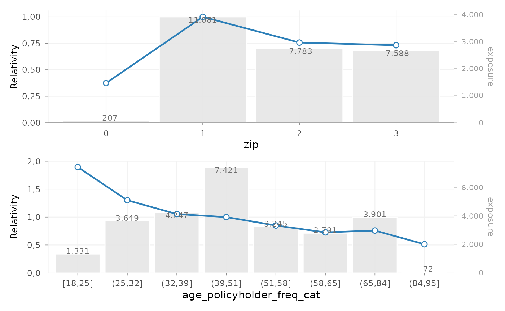
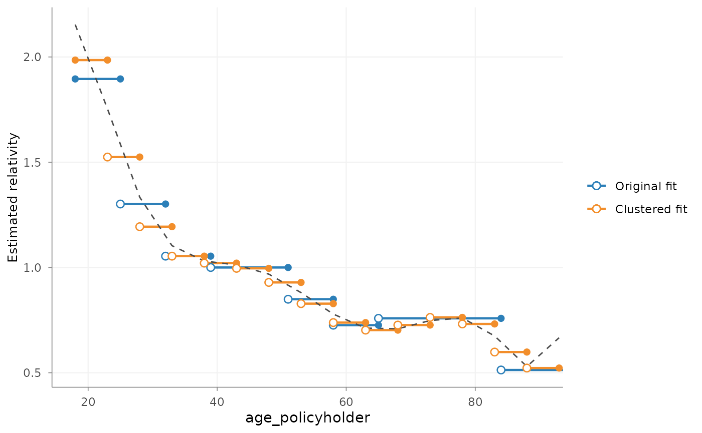
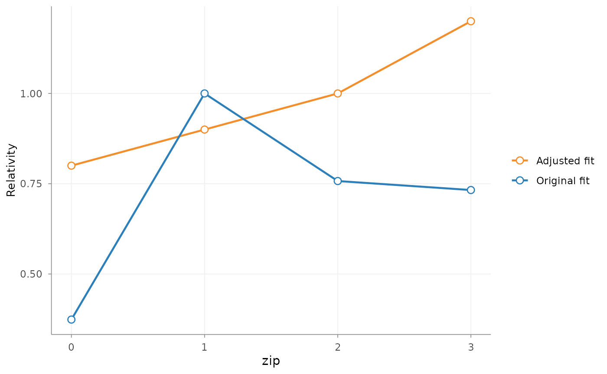
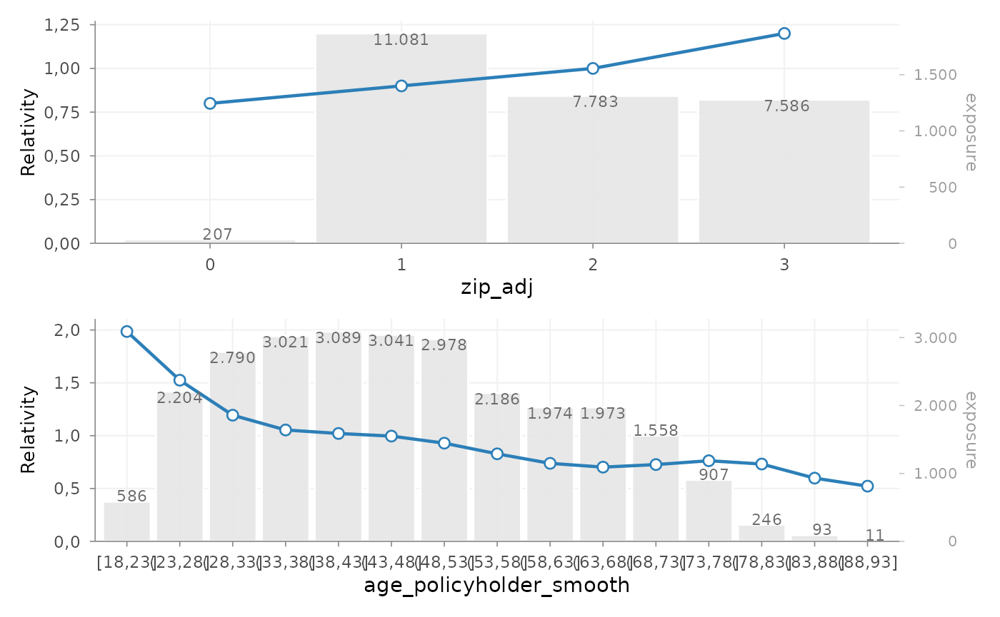

# Refinement building blocks

## Introduction

In many pricing analyses, model estimation is followed by a translation
step.

A fitted GLM may capture the structure of the portfolio well, while some
fitted effects still need to be reviewed before they are used in a
tariff.

Common reasons include:

- irregular local variation
- lack of monotonicity
- externally imposed tariff structures
- expert judgement not directly represented in the model
- implementation constraints in policy administration systems

For this reason, actuarial pricing work often distinguishes between:

1.  model estimation
2.  tariff refinement
3.  final refit of the pricing structure

`insurancerating` provides a staged refinement interface:

1.  fit an unrestricted model
2.  initialise a refinement object with
    [`prepare_refinement()`](https://mharinga.github.io/insurancerating/reference/prepare_refinement.md)
3.  add one or more refinement steps
4.  inspect these steps before refit
5.  call
    [`refit()`](https://mharinga.github.io/insurancerating/reference/refit.md)
    to obtain the final fitted model

This separation can make tariff adjustments easier to understand,
reproduce, and audit.

## When refinement can help

Refinement can help when the estimated model output is useful, but the
fitted coefficient pattern needs additional structure before it is used
in a tariff.

Typical use cases include:

- smoothing a rating factor derived from a continuous variable
- imposing monotonicity
- restricting coefficients to a predefined relativity structure
- introducing expert-based relativities within existing model levels
- simplifying the final tariff for practical implementation

In many workflows, refinement is applied to the model that represents
the final pricing signal, such as a premium or pure-premium model. In
other cases, it may also be useful for selected frequency or severity
effects. The relevant question is whether the adjusted coefficient
pattern is intended to support the tariff structure that will be
reviewed or implemented.

## Example setup

The example below starts from one common premium modelling setup:

- analyse a continuous variable with a GAM
- convert it to tariff segments
- fit frequency and severity models
- combine both into a premium proxy
- fit an unrestricted premium model

``` r


library(insurancerating)
library(dplyr)

age_policyholder_frequency <- risk_factor_gam(
  data = MTPL,
  claim_count = "nclaims",
  risk_factor = "age_policyholder",
  exposure = "exposure"
)

age_segments_freq <- derive_tariff_segments(age_policyholder_frequency)

dat <- MTPL |>
  add_tariff_segments(age_segments_freq, name = "age_policyholder_freq_cat") |>
  mutate(across(where(is.character), as.factor)) |>
  mutate(across(where(is.factor), ~ set_reference_level(., exposure)))

freq <- glm(
  nclaims ~ bm + age_policyholder_freq_cat,
  offset = log(exposure),
  family = poisson(),
  data = dat
)

sev <- glm(
  amount ~ zip,
  weights = nclaims,
  family = Gamma(link = "log"),
  data = dat |> filter(amount > 0)
)

premium_df <- dat |>
  add_prediction(freq, sev) |>
  mutate(premium = pred_nclaims_freq * pred_amount_sev)

burn_unrestricted <- glm(
  premium ~ zip + bm + age_policyholder_freq_cat,
  weights = exposure,
  family = Gamma(link = "log"),
  data = premium_df
)
```

Before refinement, inspect the unrestricted coefficient structure:

``` r


rating_table(burn_unrestricted)
#>          level               risk_factor est_burn_unrestricted exposure
#> 1  (Intercept)               (Intercept)          1.228041e+04       NA
#> 2            0                       zip          3.737317e-01      207
#> 3            1                       zip          1.000000e+00    11081
#> 4            2                       zip          7.574226e-01     7783
#> 5            3                       zip          7.325129e-01     7588
#> 6      [18,25] age_policyholder_freq_cat          1.895596e+00     1331
#> 7      (25,32] age_policyholder_freq_cat          1.301496e+00     3649
#> 8      (32,39] age_policyholder_freq_cat          1.053848e+00     4247
#> 9      (39,51] age_policyholder_freq_cat          1.000000e+00     7421
#> 10     (51,58] age_policyholder_freq_cat          8.491823e-01     3245
#> 11     (58,65] age_policyholder_freq_cat          7.258652e-01     2791
#> 12     (65,84] age_policyholder_freq_cat          7.584714e-01     3901
#> 13     (84,95] age_policyholder_freq_cat          5.131699e-01       72
#> 14          bm                        bm          9.980551e-01       NA

rating_table(burn_unrestricted) |>
  autoplot()
```



At this stage, the coefficients reflect the unrestricted model fit. This
output is often informative by itself. If the pattern is too irregular,
too granular or difficult to explain, a refinement step can be added
explicitly.

## The refinement object

Refinement begins with:

``` r


ref <- prepare_refinement(burn_unrestricted)
ref
#> <rating_refinement>
#> Base model: glm, lm
#> Steps: 0
```

A `rating_refinement` object stores:

- the fitted base model
- the underlying model data
- the refinement steps added through the refinement interface

At this point, the model itself has not been refitted. The refinement
object represents a proposed tariff adjustment structure, not yet the
final fitted result.

This distinction is useful because refinement steps can be inspected
before they are incorporated into the final model.

## Smoothing

### Purpose

Smoothing can be used when a rating factor derived from a continuous
variable contains local variation that is hard to justify in a tariff.

For example, a coefficient pattern such as:

- age 30–34 lower
- age 34–38 higher
- age 38–42 lower again

may be statistically possible, but difficult to explain or maintain.
Smoothing adds a more stable structure to the rating factor.

### Adding smoothing

``` r


ref <- ref |>
  add_smoothing(
    model_variable = "age_policyholder_freq_cat",
    source_variable = "age_policyholder",
    breaks = seq(18, 95, 5),
    weights = "exposure"
  )
```

The key arguments are:

- `model_variable`: the grouped variable present in the GLM
- `source_variable`: the original continuous portfolio variable
- `breaks`: the preferred commercial cut points
- `smoothing`: the smoothing specification
- `weights`: optional weighting, typically exposure

### Inspecting smoothing before refit

``` r


print(ref)
#> <rating_refinement>
#> Base model: glm, lm
#> Steps: 1
#> 1. smoothing [age_policyholder_freq_cat]
autoplot(
  ref,
  variable = "age_policyholder_freq_cat",
  x_max = 90
)
```



This plot belongs to the **pre-refit stage**. It shows:

- the original fitted coefficients
- the proposed smoothed structure

The purpose is to inspect the refinement step itself, before it is
incorporated into the final fitted model.

### Choosing a smoothing method

Typical smoothing choices are:

- `"spline"`: polynomial-style smoothing
- `"gam"`: flexible smooth curve
- `"mpi"`: monotone increasing
- `"mpd"`: monotone decreasing

The appropriate choice depends on the pricing context.

For example:

- age may justify a flexible smooth
- insured value or power may require a monotonic relationship
- low-exposure tails may benefit from exposure weighting

## Restrictions

### Purpose

Restrictions can be used when coefficients need to follow a predefined
structure.

Typical examples include:

- bonus-malus systems
- governance-approved relativities
- externally mandated tariff structures
- implementation constraints in policy systems

Restrictions differ from smoothing:

- smoothing reshapes the fitted pattern
- restriction imposes user-defined coefficients

### Adding restrictions

``` r


zip_df <- data.frame(
  zip = c(0, 1, 2, 3),
  zip_adj = c(0.8, 0.9, 1.0, 1.2)
)

ref <- ref |>
  add_restriction(restrictions = zip_df)
```

The restriction table must contain exactly two columns:

- the original factor levels
- the adjusted coefficients

### Inspecting restrictions before refit

``` r


autoplot(ref, variable = "zip")
```



This shows the proposed restricted structure relative to the original
fitted model.

## Expert-based relativities

### Purpose

In some cases, the fitted model uses a broad factor level, while
portfolio or business knowledge suggests that more granular
differentiation may be useful.

For example, a model may estimate one coefficient for “construction”,
while pricing practice distinguishes between:

- residential construction
- commercial construction
- civil engineering

This can be relevant when subgroup exposure is too limited to estimate
stable coefficients directly.

### Adding relativities

``` r


relativities_activity <- relativities(
  split_level(
    "construction",
    c("residential_construction", "commercial_construction"),
    c(1.00, 1.15)
  )
)

ref <- ref |>
  add_relativities(
    model_variable = "business_activity",
    split_variable = "business_activity_split",
    relativities = relativities_activity,
    exposure = "exposure",
    normalize = TRUE
  )
```

If `normalize = TRUE`, the relativities are scaled so that their
exposure-weighted average remains equal to 1 within the original level.

This preserves the original model signal while introducing finer
structure.

## Refit

### Why refit is required

Refinement steps alter part of the model structure. Once these changes
are applied, the remaining coefficients may also adjust.

For that reason, the sequence does not end with
[`add_smoothing()`](https://mharinga.github.io/insurancerating/reference/add_smoothing.md)
or
[`add_restriction()`](https://mharinga.github.io/insurancerating/reference/add_restriction.md).
The final step is:

``` r


burn_refined <- refit(ref)
```

This refits the model while incorporating the documented refinement
steps.

### Inspecting the final fitted result

After refit, use
[`rating_table()`](https://mharinga.github.io/insurancerating/reference/rating_table.md):

``` r


rating_table(burn_refined)
#>          level             risk_factor est_burn_refined exposure
#> 1  (Intercept)             (Intercept)     1.070848e+04       NA
#> 2            0                 zip_adj     8.000000e-01      207
#> 3            1                 zip_adj     9.000000e-01    11081
#> 4            2                 zip_adj     1.000000e+00     7783
#> 5            3                 zip_adj     1.200000e+00     7586
#> 6      [18,23] age_policyholder_smooth     1.985214e+00      586
#> 7      (23,28] age_policyholder_smooth     1.524645e+00     2204
#> 8      (28,33] age_policyholder_smooth     1.193787e+00     2790
#> 9      (33,38] age_policyholder_smooth     1.053848e+00     3021
#> 10     (38,43] age_policyholder_smooth     1.020715e+00     3089
#> 11     (43,48] age_policyholder_smooth     9.959711e-01     3041
#> 12     (48,53] age_policyholder_smooth     9.290435e-01     2978
#> 13     (53,58] age_policyholder_smooth     8.282178e-01     2186
#> 14     (58,63] age_policyholder_smooth     7.382691e-01     1974
#> 15     (63,68] age_policyholder_smooth     7.024490e-01     1973
#> 16     (68,73] age_policyholder_smooth     7.265697e-01     1558
#> 17     (73,78] age_policyholder_smooth     7.629301e-01      907
#> 18     (78,83] age_policyholder_smooth     7.318230e-01      246
#> 19     (83,88] age_policyholder_smooth     5.983689e-01       93
#> 20     (88,93] age_policyholder_smooth     5.224158e-01       11
#> 21          bm                      bm     9.977213e-01       NA
```

At this point, the output no longer represents a proposed refinement
plan. It represents the fitted coefficient structure after refinement.

The distinction is:

- before
  [`refit()`](https://mharinga.github.io/insurancerating/reference/refit.md)
  –\> inspect the refinement plan
- after
  [`refit()`](https://mharinga.github.io/insurancerating/reference/refit.md)
  –\> inspect the fitted tariff structure

If smoothing, restrictions, and relativities have been applied, they are
now embedded in the fitted model output.

### Visualising the final structure

``` r


rating_table(burn_refined) |>
  autoplot()
```


## Model data and rating grids

After refit, model structure can be extracted with
[`extract_model_data()`](https://mharinga.github.io/insurancerating/reference/extract_model_data.md):

``` r


md <- extract_model_data(burn_refined)
head(md)
#>   age_policyholder age_policyholder_freq_cat_smooth age_policyholder_smooth
#> 1               18                         1.985214                 [18,23]
#> 2               18                         1.985214                 [18,23]
#> 3               18                         1.985214                 [18,23]
#> 4               18                         1.985214                 [18,23]
#> 5               19                         1.985214                 [18,23]
#> 6               19                         1.985214                 [18,23]
#>   nclaims   exposure amount power bm zip age_policyholder_freq_cat
#> 1       1 1.00000000 261777    40  3   3                   [18,25]
#> 2       0 0.09589041      0    68  5   2                   [18,25]
#> 3       0 0.18630137      0    37  3   2                   [18,25]
#> 4       0 0.18904110      0    33  1   2                   [18,25]
#> 5       0 1.00000000      0    47  6   3                   [18,25]
#> 6       1 0.06849315   6642    68  1   3                   [18,25]
#>   pred_nclaims_freq pred_amount_sev   premium zip_adj
#> 1        0.26210773        68671.20 17999.251     1.2
#> 2        0.02502713        70854.51  1773.285     1.0
#> 3        0.04883103        70854.51  3459.898     1.0
#> 4        0.04975996        70854.51  3525.718     1.0
#> 5        0.26044368        68671.20 17884.979     1.2
#> 6        0.01802897        68671.20  1238.071     1.2
```

Observed model-point combinations can be obtained with
[`rating_grid()`](https://mharinga.github.io/insurancerating/reference/rating_grid.md):

``` r


grid <- rating_grid(burn_refined)
head(grid)
#>   age_policyholder_smooth zip bm count   exposure zip_adj
#> 1                 (23,28]   1  1   414 342.578082     0.9
#> 2                 (23,28]   1  4    26  22.315068     0.9
#> 3                 (23,28]   0  4     1   1.000000     0.8
#> 4                 (23,28]   0  1     7   5.268493     0.8
#> 5                 (23,28]   1  7    33  28.334247     0.9
#> 6                 (23,28]   2 13     5   4.041096     1.0
#>   age_policyholder_freq_cat_smooth
#> 1                         1.524645
#> 2                         1.524645
#> 3                         1.524645
#> 4                         1.524645
#> 5                         1.524645
#> 6                         1.524645
```

This is typically used for:

- tariff review
- portfolio summaries
- compact prediction input
- implementation support

## Complete example

One possible refinement sequence is:

``` r


zip_df <- data.frame(
  zip = c(0, 1, 2, 3),
  zip_adj = c(0.8, 0.9, 1.0, 1.2)
)

burn_refined <- prepare_refinement(burn_unrestricted) |>
  add_smoothing(
    model_variable = "age_policyholder_freq_cat",
    source_variable = "age_policyholder",
    breaks = seq(18, 95, 5),
    weights = "exposure"
  ) |>
  add_restriction(zip_df) |>
  refit()

rating_table(burn_refined)
#>          level             risk_factor est_burn_refined exposure
#> 1  (Intercept)             (Intercept)     1.070848e+04       NA
#> 2            0                 zip_adj     8.000000e-01      207
#> 3            1                 zip_adj     9.000000e-01    11081
#> 4            2                 zip_adj     1.000000e+00     7783
#> 5            3                 zip_adj     1.200000e+00     7586
#> 6      [18,23] age_policyholder_smooth     1.985214e+00      586
#> 7      (23,28] age_policyholder_smooth     1.524645e+00     2204
#> 8      (28,33] age_policyholder_smooth     1.193787e+00     2790
#> 9      (33,38] age_policyholder_smooth     1.053848e+00     3021
#> 10     (38,43] age_policyholder_smooth     1.020715e+00     3089
#> 11     (43,48] age_policyholder_smooth     9.959711e-01     3041
#> 12     (48,53] age_policyholder_smooth     9.290435e-01     2978
#> 13     (53,58] age_policyholder_smooth     8.282178e-01     2186
#> 14     (58,63] age_policyholder_smooth     7.382691e-01     1974
#> 15     (63,68] age_policyholder_smooth     7.024490e-01     1973
#> 16     (68,73] age_policyholder_smooth     7.265697e-01     1558
#> 17     (73,78] age_policyholder_smooth     7.629301e-01      907
#> 18     (78,83] age_policyholder_smooth     7.318230e-01      246
#> 19     (83,88] age_policyholder_smooth     5.983689e-01       93
#> 20     (88,93] age_policyholder_smooth     5.224158e-01       11
#> 21          bm                      bm     9.977213e-01       NA

rating_table(burn_refined) |>
  autoplot()
```



## Legacy interface

Legacy entry points remain available:

``` r


burn_refined_old <- burn_unrestricted |>
  smooth_coef(
    x_cut = "age_policyholder_freq_man",
    x_org = "age_policyholder",
    breaks = seq(18, 95, 5)
  ) |>
  restrict_coef(zip_df) |>
  refit_glm()
```

These are primarily maintained for backward compatibility.

For new code, the recommended interface is:

``` r

prepare_refinement() |> add_*() |> refit()
```

This keeps the sequence of tariff adjustments explicit.

## Summary

The refinement interface helps separate:

- model estimation
- tariff adjustments
- final fitted output

This makes it easier to document and inspect adjustments before the
model is refitted. In practice, this can support tariff structures that
are:

- statistically grounded
- interpretable
- commercially usable
- easier to implement

## Next steps

For the underlying pricing concepts, see:

- [Pricing workflow building
  blocks](https://mharinga.github.io/insurancerating/articles/pricing-workflow-building-blocks.md)

For an example sequence from portfolio analysis to fitted tariff, see:

- [Getting
  started](https://mharinga.github.io/insurancerating/articles/getting-started.md)
