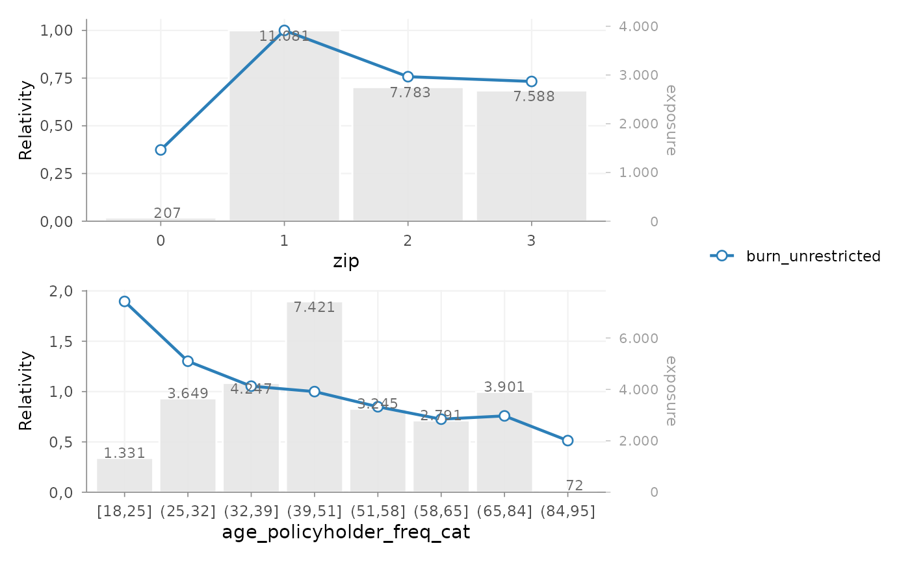
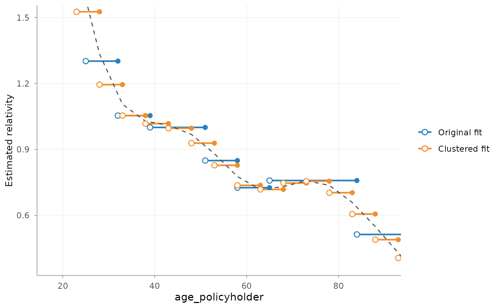
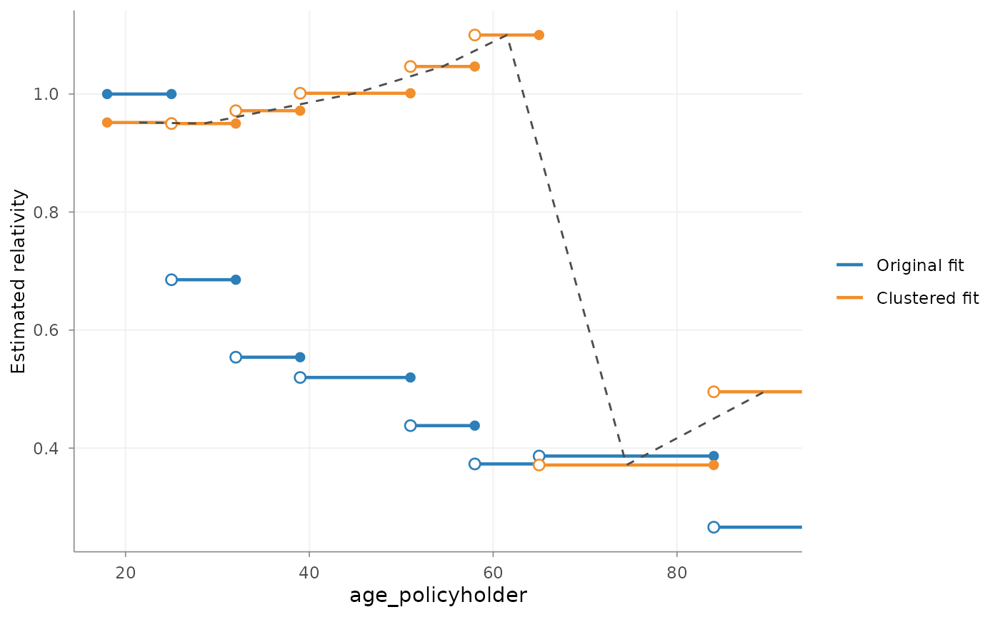
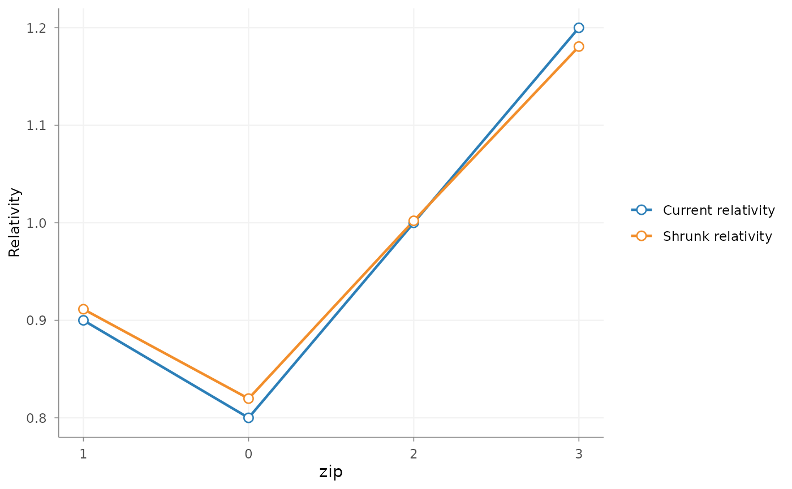
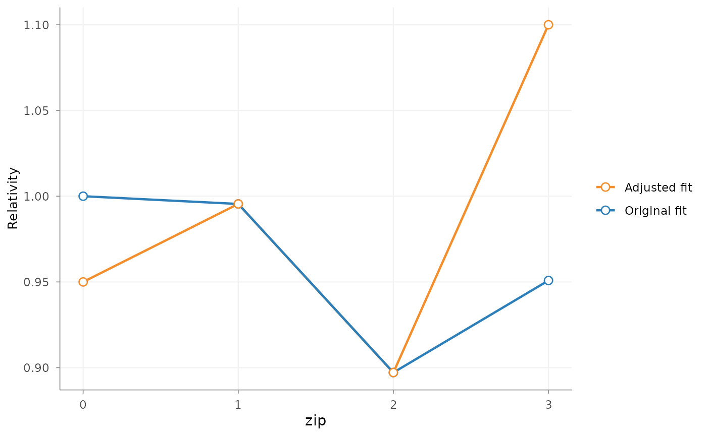

# Refinement building blocks

## Introduction

In many pricing analyses, model estimation is followed by a translation
step.

A fitted GLM may capture the structure of the portfolio well, while some
fitted effects still need to be reviewed before they are used in a
tariff.

Common reasons include:

- irregular local variation
- lack of monotonicity
- externally imposed tariff structures
- expert judgement not directly represented in the model
- implementation constraints in policy administration systems

For this reason, actuarial pricing work often distinguishes between:

1.  model estimation
2.  tariff refinement
3.  final refit of the pricing structure

`insurancerating` provides a staged refinement interface:

1.  fit an unrestricted model
2.  initialise a refinement object with
    [`prepare_refinement()`](https://mharinga.github.io/insurancerating/reference/prepare_refinement.md)
3.  add one or more refinement steps
4.  inspect these steps before refit
5.  call
    [`refit()`](https://mharinga.github.io/insurancerating/reference/refit.md)
    to obtain the final fitted model

This separation records which adjustments are proposed before they are
included in the fitted model. It also distinguishes estimated GLM
effects from explicit tariff assumptions.

## When refinement can help

Refinement can be considered when the estimated model captures the main
risk structure, but selected coefficient patterns require additional
structure before tariff implementation.

Typical use cases include:

- smoothing a rating factor derived from a continuous variable
- imposing monotonicity
- restricting coefficients to a predefined relativity structure
- introducing expert-based relativities within existing model levels
- simplifying the final tariff for practical implementation

In many workflows, refinement is applied to the model that represents
the final pricing signal, such as a premium or risk-premium model. In
other cases, it may also be useful for selected frequency or severity
effects. The relevant question is whether the adjusted coefficient
pattern is intended to support the tariff structure that will be
reviewed or implemented.

## Example setup

The example below starts from one common premium modelling setup:

- analyse a continuous variable with a GAM
- convert it to tariff segments
- fit frequency and severity models
- combine both into a premium proxy
- fit an unrestricted premium model

``` r


library(insurancerating)
library(dplyr)

age_policyholder_frequency <- risk_factor_gam(
  data = MTPL,
  claim_count = "nclaims",
  risk_factor = "age_policyholder",
  exposure = "exposure"
)

age_segments_freq <- derive_tariff_segments(
  age_policyholder_frequency,
  seed = 1
)

dat <- MTPL |>
  add_tariff_segments(age_segments_freq, name = "age_policyholder_freq_cat") |>
  mutate(across(where(is.character), as.factor)) |>
  mutate(across(where(is.factor), ~ set_reference_level(., exposure)))

freq <- glm(
  nclaims ~ bm + age_policyholder_freq_cat,
  offset = log(exposure),
  family = poisson(),
  data = dat
)

sev <- glm(
  amount ~ zip,
  weights = nclaims,
  family = Gamma(link = "log"),
  data = dat |> filter(amount > 0)
)

premium_df <- dat |>
  add_prediction(freq, sev) |>
  mutate(premium = pred_nclaims_freq * pred_amount_sev)

burn_unrestricted <- glm(
  premium ~ zip + bm + age_policyholder_freq_cat,
  weights = exposure,
  family = Gamma(link = "log"),
  data = premium_df
)
```

Before refinement, inspect the unrestricted coefficient structure:

``` r


rating_table(burn_unrestricted)
#>          level               risk_factor est_burn_unrestricted exposure
#> 1  (Intercept)               (Intercept)          1.228041e+04       NA
#> 2            0                       zip          3.737317e-01      207
#> 3            1                       zip          1.000000e+00    11081
#> 4            2                       zip          7.574226e-01     7783
#> 5            3                       zip          7.325129e-01     7588
#> 6      [18,25] age_policyholder_freq_cat          1.895596e+00     1331
#> 7      (25,32] age_policyholder_freq_cat          1.301496e+00     3649
#> 8      (32,39] age_policyholder_freq_cat          1.053848e+00     4247
#> 9      (39,51] age_policyholder_freq_cat          1.000000e+00     7421
#> 10     (51,58] age_policyholder_freq_cat          8.491823e-01     3245
#> 11     (58,65] age_policyholder_freq_cat          7.258652e-01     2791
#> 12     (65,84] age_policyholder_freq_cat          7.584714e-01     3901
#> 13     (84,95] age_policyholder_freq_cat          5.131699e-01       72
#> 14          bm                        bm          9.980551e-01       NA

rating_table(burn_unrestricted) |>
  autoplot()
```



At this stage, the coefficients reflect the unrestricted model fit. This
output is often informative by itself. If the pattern is too irregular,
too granular or difficult to explain, a refinement step can be added
explicitly.

## The refinement object

Refinement begins with:

``` r


ref <- prepare_refinement(burn_unrestricted)
ref
#> <rating_refinement>
#> Base model: Gamma GLM (log link)
#> Steps: 0
```

A `rating_refinement` object stores:

- the fitted base model
- the underlying model data
- the refinement steps added through the refinement interface

At this point, the model itself has not been refitted. The refinement
object represents a proposed tariff adjustment structure, not yet the
final fitted result.

This distinction is useful because refinement steps can be inspected
before they are incorporated into the final model.

## Smoothing

### Purpose

Smoothing can be used when a rating factor derived from a continuous
variable contains local variation that is hard to justify in a tariff.

For example, a coefficient pattern such as:

- age 30–34 lower
- age 34–38 higher
- age 38–42 lower again

may be compatible with the observed sample, but unstable across periods
or difficult to support actuarially. Smoothing replaces local variation
with an explicitly regularised coefficient pattern.

### Adding smoothing

``` r


ref <- ref |>
  add_smoothing(
    model_variable = "age_policyholder_freq_cat",
    source_variable = "age_policyholder",
    breaks = c(seq(18, 93, 5), 95),
    weights = "exposure"
  )
```

The key arguments are:

- `model_variable`: the grouped variable present in the GLM
- `source_variable`: the original continuous portfolio variable
- `breaks`: the preferred commercial cut points
- `smoothing`: the smoothing specification; `"spline"` is the
  general-purpose default
- `weights`: optional weighting, typically exposure

Use `"increasing"` or `"decreasing"` when the tariff effect is required
to move monotonically. Convex, concave and combined shape constraints
are available for cases where that additional assumption can be
supported actuarially. `"poly"` fits a global polynomial and uses
`degree`; `"gam"` fits a thin-plate smooth that can be used as an
unconstrained comparison. For spline methods, `k` limits the available
curve flexibility but is not the fitted effective number of degrees of
freedom.

### Inspecting smoothing before refit

``` r


print(ref)
#> <rating_refinement>
#> Base model: Gamma GLM (log link)
#> Steps: 1
#>   1. Smoothing: age_policyholder_freq_cat from age_policyholder (method: spline, k: 8)
autoplot(
  ref,
  variable = "age_policyholder_freq_cat",
  x_max = 90,
  y_max = 1.5
)
```



This plot belongs to the **pre-refit stage**. It shows:

- the original fitted coefficients
- the proposed smoothed structure

The purpose is to inspect the refinement step itself, before it is
incorporated into the final fitted model.

### Choosing a smoothing method

Typical smoothing choices are:

- `"spline"`: unconstrained penalised cubic regression spline; the
  general-purpose default
- `"poly"`: global polynomial controlled by `degree`
- `"gam"`: thin-plate regression spline fitted with `mgcv`, mainly
  useful as an unconstrained comparison
- `"increasing"`: monotone increasing
- `"decreasing"`: monotone decreasing

Monotonicity concerns the direction of the tariff effect. Convexity and
concavity concern how its slope changes. A convex effect has an
increasing slope and may be U-shaped when its direction is not
constrained; a concave effect has a decreasing slope and may be inverted
U-shaped. For an increasing effect, convexity implies acceleration and
concavity implies flattening. For a decreasing effect, convexity implies
flattening and concavity implies a steeper decline.

The readable advanced options are `"convex"`, `"concave"`,
`"increasing_convex"`, `"increasing_concave"`, `"decreasing_convex"` and
`"decreasing_concave"`. They should be used only when the assumed
curvature has an actuarial or economic basis in addition to any
directional assumption. The former short codes `"mpi"`, `"mpd"`, `"cx"`,
`"cv"`, `"micx"`, `"micv"`, `"mdcx"` and `"mdcv"` remain accepted for
compatibility.

For example:

- age may justify a flexible smooth
- insured value or power may require a monotonic relationship
- low-exposure tails may benefit from exposure weighting

## Restrictions

### Purpose

Restrictions can be used when coefficients need to follow a predefined
structure.

Typical examples include:

- bonus-malus systems
- governance-approved relativities
- externally mandated tariff structures
- implementation constraints in policy systems

Restrictions differ from smoothing:

- smoothing reshapes the fitted pattern
- restriction imposes user-defined coefficients

### Adding restrictions

``` r


zip_df <- data.frame(
  zip = c(0, 1, 2, 3),
  zip_adj = c(0.8, 0.9, 1.0, 1.2)
)

ref <- ref |>
  add_restriction(restrictions = zip_df)
```

The restriction table must contain exactly two columns:

- the original factor levels
- the adjusted coefficients

### Inspecting restrictions before refit

``` r


autoplot(ref, variable = "zip")
```



This shows the proposed restricted structure relative to the original
fitted model.

## Shrinkage of categorical relativities

### Purpose

Shrinkage can be used when the ordering of a categorical risk-factor
pattern is considered credible, but the distance between its highest and
lowest relativities is too large for the available experience or the
intended tariff. It differs from a restriction: a restriction supplies
selected relativities directly, whereas shrinkage systematically moves
all current relativities towards a common level.

The adjustment is made on the logarithmic scale. With
`credibility = 0.9`, each level retains 90 percent of its current
logarithmic effect and receives 10 percent of the common effect. The
resulting relativities are rescaled to retain their weighted arithmetic
mean. This reduces differentiation without changing the selected
weighted level of the risk factor.

``` r


ref <- ref |>
  add_shrinkage(
    model_variable = "zip",
    credibility = 0.9,
    weights = "exposure"
  )

summary(ref)
#> Refinement specification
#> 
#> Package: insurancerating 0.8.1.9000
#> Created: 2026-08-05 13:32:14 UTC
#> Observations: 30,000
#> Family: Gamma (log link)
#> Base formula:
#>   premium ~ zip + bm + age_policyholder_freq_cat
#> Offset: none
#> 
#> Refinement steps: 3
#>   1. Smoothing: age_policyholder_freq_cat from age_policyholder (method: spline, k: 8)
#>      16 intervals over 18 to 95
#>   2. Restriction: zip -> zip_adj (4 levels)
#>      0 = 0.8; 1 = 0.9; 2 = 1.0; 3 = 1.2
#>   3. Shrinkage: zip (credibility: 0.9, weights: exposure, weighted mean preserved)
#>      credibility = 0.9; weights = exposure; weighted mean preserved
autoplot(ref, step = 3)
```



Exposure is generally an appropriate basis for frequency or risk-premium
relativities. Claim count is generally more appropriate for severity
relativities. With `weights = NULL`, explicit GLM weights are used
first; otherwise a simple exposure offset is used when it can be
identified without ambiguity. Use `weights = "equal"` when every tariff
level should receive the same weight. Equal weighting is an explicit
unweighted level comparison and does not necessarily preserve the
observed portfolio level.

The `credibility` value is a refinement assumption rather than a
formally estimated Buhlmann credibility factor. Its selection should be
assessed against exposure, stability over time and the intended degree
of tariff differentiation.

## Expert-based relativities

### Purpose

In some cases, the fitted model uses a broad factor level, while
portfolio or business knowledge suggests that more granular
differentiation may be useful.

For example, a model may estimate one coefficient for “construction”,
while pricing practice distinguishes between:

- residential construction
- commercial construction
- civil engineering

This can be relevant when subgroup exposure is too limited to estimate
stable coefficients directly.

### Adding relativities

``` r


relativities_activity <- relativities(
  split_level(
    "construction",
    c("residential_construction", "commercial_construction"),
    c(1.00, 1.15)
  ),
  split_level(
    "services",
    c("professional_services", "personal_services"),
    c(0.95, 1.05)
  )
)

ref <- ref |>
  add_relativities(
    model_variable = "business_activity",
    split_variable = "business_activity_split",
    output_variable = "business_activity_tariff_segment",
    relativities = relativities_activity,
    exposure = "exposure",
    normalize = TRUE
  )
```

If `normalize = TRUE`, the relativities are scaled so that their
exposure-weighted average remains equal to 1 within the original level.

`output_variable` names the resulting hybrid tariff factor. In this
example, the explicitly split construction and services levels are
represented by their detailed levels, while unsplit levels retain their
original `business_activity` value. A name ending in `_tariff_segment`
can make this role explicit in later model and reporting steps.

This preserves the original model signal while introducing finer
structure. When `model_variable` has already been restricted with
[`add_restriction()`](https://mharinga.github.io/insurancerating/reference/add_restriction.md),
the restricted coefficients are used automatically as the basis for
these relativities. Refinement order is therefore part of the
specification.

## Refit

### Why refit is required

Refinement steps alter part of the model structure. Once these changes
are applied, the remaining coefficients may also adjust.

For that reason, the sequence does not end with
[`add_smoothing()`](https://mharinga.github.io/insurancerating/reference/add_smoothing.md)
or
[`add_restriction()`](https://mharinga.github.io/insurancerating/reference/add_restriction.md).
The final step is:

``` r


summary(ref)
#> Refinement specification
#> 
#> Package: insurancerating 0.8.1.9000
#> Created: 2026-08-05 13:32:14 UTC
#> Observations: 30,000
#> Family: Gamma (log link)
#> Base formula:
#>   premium ~ zip + bm + age_policyholder_freq_cat
#> Offset: none
#> 
#> Refinement steps: 3
#>   1. Smoothing: age_policyholder_freq_cat from age_policyholder (method: spline, k: 8)
#>      16 intervals over 18 to 95
#>   2. Restriction: zip -> zip_adj (4 levels)
#>      0 = 0.8; 1 = 0.9; 2 = 1.0; 3 = 1.2
#>   3. Shrinkage: zip (credibility: 0.9, weights: exposure, weighted mean preserved)
#>      credibility = 0.9; weights = exposure; weighted mean preserved

burn_refined <- refit(ref)
```

`summary(ref)` describes the base model and the ordered refinement
specification before a new GLM is fitted. This provides a direct review
of the assumptions that will be applied.
[`refit()`](https://mharinga.github.io/insurancerating/reference/refit.md)
then fits the model while incorporating those documented steps.

### Inspecting the final fitted result

After refit, use
[`rating_table()`](https://mharinga.github.io/insurancerating/reference/rating_table.md):

``` r


rating_table(burn_refined)
#>          level             risk_factor est_burn_refined exposure
#> 1  (Intercept)             (Intercept)     1.064197e+04       NA
#> 2            0                 zip_adj     8.000000e-01      207
#> 3            1                 zip_adj     9.000000e-01    11081
#> 4            2                 zip_adj     1.000000e+00     7783
#> 5            3                 zip_adj     1.200000e+00     7588
#> 6            0                     zip     8.197246e-01      207
#> 7            1                     zip     9.113921e-01    11081
#> 8            2                     zip     1.002044e+00     7783
#> 9            3                     zip     1.180729e+00     7588
#> 10     [18,23] age_policyholder_smooth     1.991647e+00      586
#> 11     (23,28] age_policyholder_smooth     1.525996e+00     2204
#> 12     (28,33] age_policyholder_smooth     1.194587e+00     2790
#> 13     (33,38] age_policyholder_smooth     1.053848e+00     3021
#> 14     (38,43] age_policyholder_smooth     1.017313e+00     3089
#> 15     (43,48] age_policyholder_smooth     9.961032e-01     3041
#> 16     (48,53] age_policyholder_smooth     9.284442e-01     2978
#> 17     (53,58] age_policyholder_smooth     8.277635e-01     2186
#> 18     (58,63] age_policyholder_smooth     7.364565e-01     1974
#> 19     (63,68] age_policyholder_smooth     7.179164e-01     1973
#> 20     (68,73] age_policyholder_smooth     7.466678e-01     1558
#> 21     (73,78] age_policyholder_smooth     7.554871e-01      907
#> 22     (78,83] age_policyholder_smooth     7.030268e-01      246
#> 23     (83,88] age_policyholder_smooth     6.061124e-01       93
#> 24     (88,93] age_policyholder_smooth     4.894076e-01       11
#> 25     (93,95] age_policyholder_smooth     4.062390e-01        1
#> 26          bm                      bm     9.977218e-01       NA
```

At this point, the output no longer represents a proposed refinement
plan. It represents the fitted coefficient structure after refinement.

The distinction is:

- before
  [`refit()`](https://mharinga.github.io/insurancerating/reference/refit.md)
  –\> inspect the refinement plan
- after
  [`refit()`](https://mharinga.github.io/insurancerating/reference/refit.md)
  –\> inspect the fitted tariff structure

If smoothing, restrictions, and relativities have been applied, they are
now embedded in the fitted model output.

### Auditing the portfolio effect

Coefficient changes cannot be interpreted independently of the intercept
and the other model terms. A more direct audit compares fitted values
from the unrestricted and refined models on the same observed portfolio
combinations.

``` r


refinement_audit <- audit_refinement(
  burn_refined,
  exposure = "exposure",
  metric = "risk_premium"
)
#> Warning: Column in `exposure` is already used in model.
#> Warning in merge.data.frame(out, mapping, by = old_col, all.x = TRUE, sort =
#> FALSE): column name 'exposure' is duplicated in the result

summary(refinement_audit)
#> Refinement audit
#> 
#> Package: insurancerating 0.8.1.9000
#> Prepared: 2026-08-05 13:32:14 UTC
#> Refitted: 2026-08-05 13:32:17 UTC
#> Audited: 2026-08-05 13:32:17 UTC
#> Measure: risk_premium (response)
#> Exposure: exposure
#> 
#> Original formula:
#>   premium ~ zip + bm + age_policyholder_freq_cat
#> Refitted formula:
#>   premium ~ bm + offset(log(zip_shrunk) + log(age_policyholder_freq_cat_smooth))
#> 
#> Refinement steps: 3
#>   1. Smoothing: age_policyholder_freq_cat from age_policyholder (method: spline, k: 8)
#>      16 intervals over 18 to 95
#>   2. Restriction: zip -> zip_adj (4 levels)
#>      0 = 0.8; 1 = 0.9; 2 = 1.0; 3 = 1.2
#>   3. Shrinkage: zip (credibility: 0.9, weights: exposure, weighted mean preserved)
#>      credibility = 0.9; weights = exposure; weighted mean preserved
#> 
#> Portfolio effect
#>   Before: 10445.1
#>   After:  10719.9
#>   Change: 274.813 (2.631%)
#> 
#> Largest level changes (10 of 47)
#>  risk_factor level    before     after    change change_ratio
#>      zip_adj     0  4471.598  8387.981  3916.383    0.8758351
#>          zip     0  4471.598  8387.981  3916.383    0.8758351
#>      zip_adj     3  9001.374 12476.259  3474.885    0.3860394
#>          zip     3  9001.374 12476.259  3474.885    0.3860394
#>      zip_adj     1 12325.997  9650.927 -2675.069   -0.2170266
#>          zip     1 12325.997  9650.927 -2675.069   -0.2170266
#>           bm    23 10578.429  9073.469 -1504.960   -0.1422669
#>           bm    22  9628.570  8316.920 -1311.651   -0.1362249
#>      zip_adj     2  9333.501 10591.602  1258.100    0.1347940
#>          zip     2  9333.501 10591.602  1258.100    0.1347940
```

The portfolio result shows the exposure-weighted risk premium before and
after refinement. `as.data.frame(refinement_audit)` gives the
corresponding comparison for every final risk factor and level. These
level results reflect the combined prediction of the full model for the
observed portfolio mix; they are not isolated coefficient differences.

The audit also records the package version, preparation time, refit
time, formulas and ordered refinement steps. For a frequency or severity
model, use a matching metric name such as `"frequency"` or
`"average_severity"`; a complete risk-premium interpretation requires a
direct risk-premium model or a combined frequency and severity
calculation.

### Visualising the final structure

``` r


rating_table(burn_refined) |>
  autoplot()
```


## Model data and rating grids

After refit, model structure can be extracted with
[`extract_model_data()`](https://mharinga.github.io/insurancerating/reference/extract_model_data.md):

``` r


md <- extract_model_data(burn_refined)
head(md)
#>   age_policyholder age_policyholder_freq_cat_smooth age_policyholder_smooth
#> 1               18                         1.991647                 [18,23]
#> 2               18                         1.991647                 [18,23]
#> 3               18                         1.991647                 [18,23]
#> 4               18                         1.991647                 [18,23]
#> 5               19                         1.991647                 [18,23]
#> 6               19                         1.991647                 [18,23]
#>   nclaims   exposure amount power bm zip age_policyholder_freq_cat
#> 1       1 1.00000000 261777    40  3   3                   [18,25]
#> 2       0 0.09589041      0    68  5   2                   [18,25]
#> 3       0 0.18630137      0    37  3   2                   [18,25]
#> 4       0 0.18904110      0    33  1   2                   [18,25]
#> 5       0 1.00000000      0    47  6   3                   [18,25]
#> 6       1 0.06849315   6642    68  1   3                   [18,25]
#>   pred_nclaims_freq pred_amount_sev   premium zip_adj zip_shrunk
#> 1        0.26210773        68671.20 17999.251     1.2   1.180729
#> 2        0.02502713        70854.51  1773.285     1.0   1.002044
#> 3        0.04883103        70854.51  3459.898     1.0   1.002044
#> 4        0.04975996        70854.51  3525.718     1.0   1.002044
#> 5        0.26044368        68671.20 17884.979     1.2   1.180729
#> 6        0.01802897        68671.20  1238.071     1.2   1.180729
```

A model point represents a unique observed combination of the
risk-factor levels used by the fitted model.
[`rating_grid()`](https://mharinga.github.io/insurancerating/reference/rating_grid.md)
groups portfolio records with the same combination and attaches the
corresponding refined model effects. It returns combinations observed in
the portfolio; it does not construct every theoretically possible
combination of factor levels.

Observed model-point combinations can be obtained with
[`rating_grid()`](https://mharinga.github.io/insurancerating/reference/rating_grid.md):

``` r


grid <- rating_grid(burn_refined)
head(grid)
#>   age_policyholder_smooth zip bm count  exposure zip_adj zip_shrunk
#> 1                 (23,28]   1  1   414 342.57808     0.9  0.9113921
#> 2                 (23,28]   2  4    12  10.63836     1.0  1.0020445
#> 3                 (23,28]   3  1   267 235.07397     1.2  1.1807287
#> 4                 (23,28]   1 18     1   1.00000     0.9  0.9113921
#> 5                 (23,28]   2 18     1   1.00000     1.0  1.0020445
#> 6                 (23,28]   3  6    44  40.35890     1.2  1.1807287
#>   age_policyholder_freq_cat_smooth
#> 1                         1.525996
#> 2                         1.525996
#> 3                         1.525996
#> 4                         1.525996
#> 5                         1.525996
#> 6                         1.525996
```

Each row can represent several portfolio records. `count` gives the
number of records with that combination and `exposure` gives their
aggregated exposure. The remaining refinement columns contain the
restrictions, smoothed effects or derived relativities that apply to the
model point.

When a fitted GLM is supplied,
[`rating_grid()`](https://mharinga.github.io/insurancerating/reference/rating_grid.md)
retrieves the exposure column used as a model weight or offset from the
model metadata and aggregates it automatically. Supply `exposure`
explicitly only when that column is not used by the model or when a
plain data frame is supplied.

This is typically used for:

- tariff review
- portfolio summaries
- compact input for tariff calculations or predictions
- implementation support

Before the grid is used for prediction, the analyst should verify that
all required model variables are present and decide how combinations not
observed in the estimation portfolio will be handled.

## Complete example

One possible refinement sequence is:

``` r


zip_df <- data.frame(
  zip = c(0, 1, 2, 3),
  zip_adj = c(0.8, 0.9, 1.0, 1.2)
)

burn_refined <- prepare_refinement(burn_unrestricted) |>
  add_smoothing(
    model_variable = "age_policyholder_freq_cat",
    source_variable = "age_policyholder",
    breaks = c(seq(18, 93, 5), 95),
    weights = "exposure"
  ) |>
  add_restriction(zip_df) |>
  refit()

rating_table(burn_refined)
#>          level             risk_factor est_burn_refined exposure
#> 1  (Intercept)             (Intercept)     1.068539e+04       NA
#> 2            0                 zip_adj     8.000000e-01      207
#> 3            1                 zip_adj     9.000000e-01    11081
#> 4            2                 zip_adj     1.000000e+00     7783
#> 5            3                 zip_adj     1.200000e+00     7588
#> 6      [18,23] age_policyholder_smooth     1.991647e+00      586
#> 7      (23,28] age_policyholder_smooth     1.525996e+00     2204
#> 8      (28,33] age_policyholder_smooth     1.194587e+00     2790
#> 9      (33,38] age_policyholder_smooth     1.053848e+00     3021
#> 10     (38,43] age_policyholder_smooth     1.017313e+00     3089
#> 11     (43,48] age_policyholder_smooth     9.961032e-01     3041
#> 12     (48,53] age_policyholder_smooth     9.284442e-01     2978
#> 13     (53,58] age_policyholder_smooth     8.277635e-01     2186
#> 14     (58,63] age_policyholder_smooth     7.364565e-01     1974
#> 15     (63,68] age_policyholder_smooth     7.179164e-01     1973
#> 16     (68,73] age_policyholder_smooth     7.466678e-01     1558
#> 17     (73,78] age_policyholder_smooth     7.554871e-01      907
#> 18     (78,83] age_policyholder_smooth     7.030268e-01      246
#> 19     (83,88] age_policyholder_smooth     6.061124e-01       93
#> 20     (88,93] age_policyholder_smooth     4.894076e-01       11
#> 21     (93,95] age_policyholder_smooth     4.062390e-01        1
#> 22          bm                      bm     9.977166e-01       NA

rating_table(burn_refined) |>
  autoplot()
```



## Legacy interface

Legacy entry points remain available:

``` r


burn_refined_old <- burn_unrestricted |>
  smooth_coef(
    x_cut = "age_policyholder_freq_man",
    x_org = "age_policyholder",
    breaks = c(seq(18, 93, 5), 95)
  ) |>
  restrict_coef(zip_df) |>
  refit_glm()
```

These are primarily maintained for backward compatibility.

For new code, the recommended interface is:

``` r

prepare_refinement() |> add_*() |> refit()
```

This keeps the sequence of tariff adjustments explicit.

## Summary

The refinement interface helps separate:

- model estimation
- tariff adjustments
- final fitted output

The refinement specification records which parts of the final
coefficient structure originate from the fitted model and which parts
result from smoothing, restrictions or expert-based sublevel
relativities. These choices should be assessed using exposure, claim
volume, stability and the intended tariff application.

## Next steps

For the underlying pricing concepts, see:

- [Pricing workflow building
  blocks](https://mharinga.github.io/insurancerating/articles/pricing-workflow-building-blocks.md)

For an example sequence from portfolio analysis to fitted tariff, see:

- [Getting
  started](https://mharinga.github.io/insurancerating/articles/getting-started.md)
