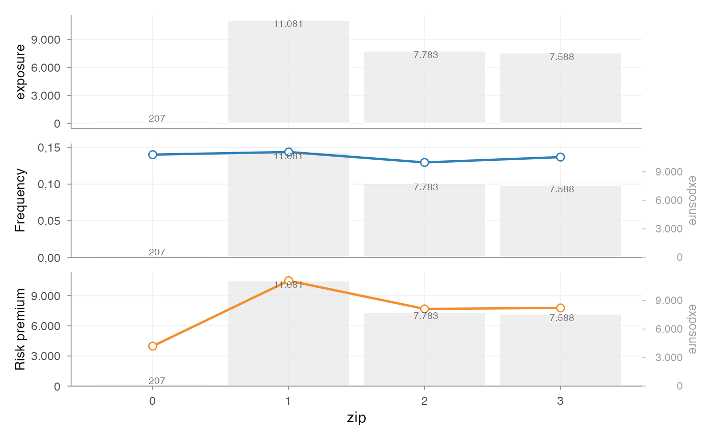
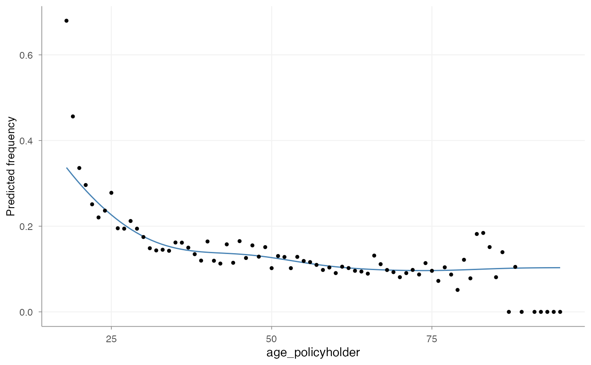
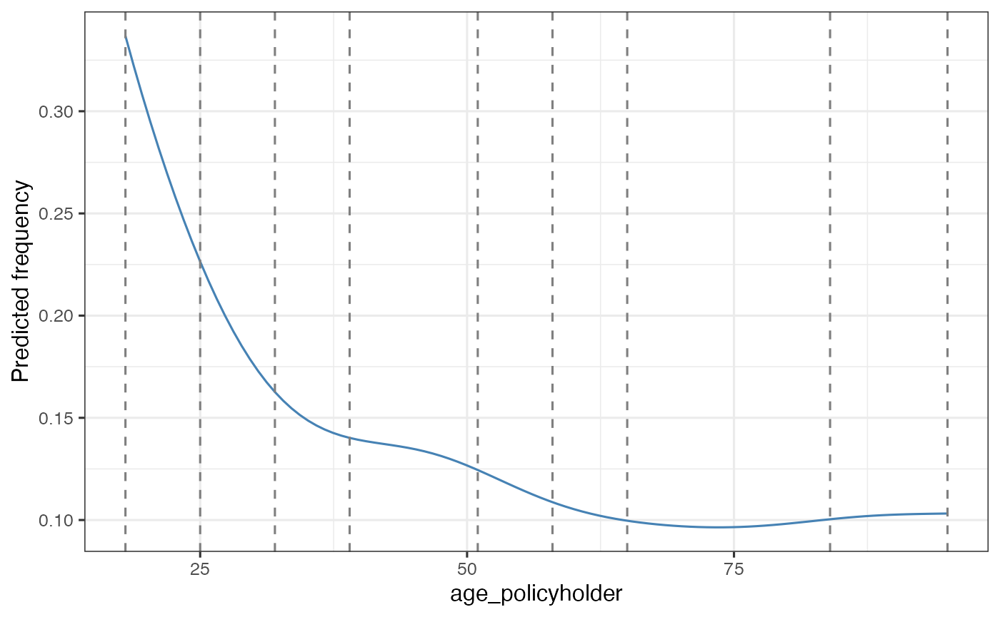
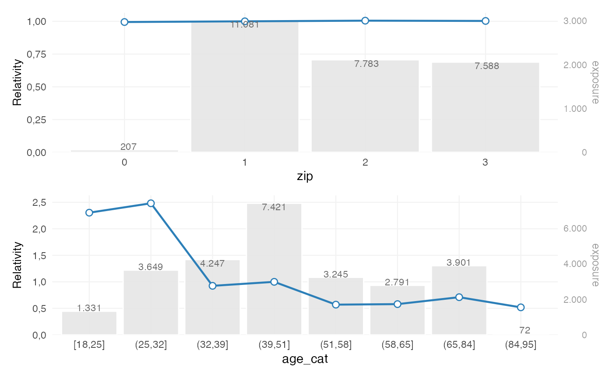
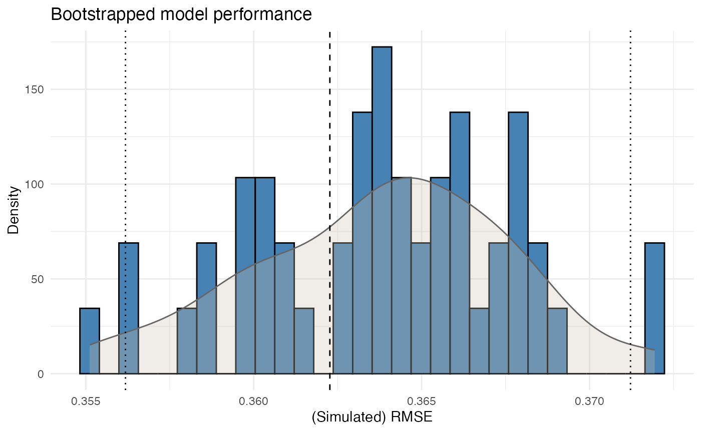

# Getting started

## Introduction

`insurancerating` provides actuarial building blocks for insurance
pricing in R.

A common GLM-based pricing exercise often combines several tasks:

1.  portfolio analysis
2.  model estimation
3.  interpretation of fitted coefficients
4.  refinement of tariff structure

This vignette illustrates one way to combine the main building blocks:

- analyse risk factors with
  [`factor_analysis()`](https://mharinga.github.io/insurancerating/reference/factor_analysis.md)
- estimate pricing models with
  [`glm()`](https://rdrr.io/r/stats/glm.html)
- interpret coefficients with
  [`rating_table()`](https://mharinga.github.io/insurancerating/reference/rating_table.md)
- assess model stability with
  [`model_performance()`](https://mharinga.github.io/insurancerating/reference/model_performance.md)
  and
  [`bootstrap_performance()`](https://mharinga.github.io/insurancerating/reference/bootstrap_performance.md)

The focus is on the transition from portfolio data to an interpretable
tariff structure.

## Data

We use the example dataset `MTPL2`, which contains a motor portfolio
with:

- number of claims (`nclaims`),
- exposure (`exposure`),
- premium (`premium`),
- claim amounts (`amount`),
- several rating factors

``` r


library(insurancerating)
library(dplyr)

head(MTPL2)
#> # A tibble: 6 × 6
#>   customer_id  area nclaims amount exposure premium
#>         <int> <int>   <int>  <int>    <dbl>   <int>
#> 1       92617     2       0      0   1           90
#> 2      120632     2       0      0   1           82
#> 3      147800     2       0      0   1           47
#> 4       29763     3       0      0   0.0630      44
#> 5       61107     1       1   6066   1           69
#> 6        4318     3       0      0   1           66
```

## Step 1 — Portfolio analysis

### Factor analysis

A pricing analysis often starts with an analysis of the portfolio.

Before fitting a model, it is necessary to understand:

- how experience differs across factor levels
- whether differences are credible
- whether exposure is sufficient
- whether the observed pattern is plausible

This is done with
[`factor_analysis()`](https://mharinga.github.io/insurancerating/reference/factor_analysis.md).

### Basic factor analysis

We start by analysing a single risk factor.

``` r


fa <- factor_analysis(
  MTPL,
  risk_factors = "zip",
  claim_count = "nclaims",
  exposure = "exposure",
  claim_amount = "amount"
)

fa
#>   zip    amount nclaims   exposure frequency average_severity risk_premium
#> 1   1 116178669    1593 11080.6274 0.1437644         72930.74    10484.846
#> 2   2  59751985    1008  7782.6301 0.1295192         59277.76     7677.608
#> 3   3  58988962    1038  7587.5644 0.1368028         56829.44     7774.427
#> 4   0    821510      29   206.8438 0.1402024         28327.93     3971.644
```

The output provides commonly used portfolio metrics such as:

- frequency = claims / exposure
- average severity = loss / claims
- risk premium = loss / exposure
- loss ratio = loss / premium
- average premium = premium / exposure

### Visualising factor behaviour

``` r


autoplot(fa, metrics = c(6, 1, 3))
```



This provides a direct view of:

- the distribution of exposure
- the variation in claim frequency
- the variation in risk premium

At this stage, the purpose is not yet to fit a model, but to understand
whether the factor behaves in a way that is suitable for pricing.

## Step 2 — Continuous variables

### Why continuous variables are treated separately

Continuous variables are typically not used directly in a tariff. In
pricing practice, they are usually:

1.  analysed as continuous variables
2.  translated into tariff classes
3.  used in a GLM as categorical rating factors

This ensures that the final tariff remains interpretable and
implementable.

### Analysing the shape with a GAM

``` r


age_freq <- risk_factor_gam(
  data = MTPL,
  risk_factor = "age_policyholder",
  claim_count = "nclaims",
  exposure = "exposure"
)

autoplot(age_freq, show_observations = TRUE)
```



This step is used to inspect:

- non-linear patterns
- local volatility
- areas with low exposure
- plausible breakpoints for tariff classes

### Constructing tariff classes

``` r


clusters <- construct_tariff_classes(age_freq)
autoplot(clusters)
```



This converts the continuous variable into risk-homogeneous classes.

The resulting classes should reflect differences in risk, while
remaining suitable for use in a tariff.

### Adding tariff classes to the data

``` r


dat <- MTPL |>
  mutate(age_cat = clusters$tariff_classes) |>
  mutate(across(where(is.character), as.factor)) |>
  mutate(across(where(is.factor), ~ biggest_reference(., exposure)))
```

[`biggest_reference()`](https://mharinga.github.io/insurancerating/reference/biggest_reference.md)
sets the reference level to the level with the highest exposure. In
pricing models, this is often the most stable and interpretable
baseline.

## Step 3 — Model estimation

### Why GLMs are used

Generalized linear models are widely used in insurance pricing because
they:

- accommodate non-normal response distributions
- produce interpretable multiplicative effects
- can be translated into tariff relativities

A common decomposition is:

- frequency –\> Poisson GLM
- severity –\> Gamma GLM

### Frequency model

``` r


mod_freq <- glm(
  nclaims ~ age_cat,
  offset = log(exposure),
  family = poisson(),
  data = dat
)
```

### Severity model

``` r


mod_sev <- glm(
  amount ~ age_cat,
  weights = nclaims,
  family = Gamma(link = "log"),
  data = dat |> filter(amount > 0)
)
```

Frequency and severity are modelled separately because they capture
different aspects of the loss process.

### Constructing a premium proxy

``` r


premium_df <- dat |>
  add_prediction(mod_freq, mod_sev) |>
  mutate(premium = pred_nclaims_mod_freq * pred_amount_mod_sev)

head(premium_df)
#>   age_policyholder nclaims  exposure amount power bm zip age_cat
#> 1               70       0 1.0000000      0   106  5   1 (65,84]
#> 2               40       0 1.0000000      0    74  3   1 (39,51]
#> 3               78       0 1.0000000      0    65  8   2 (65,84]
#> 4               49       0 1.0000000      0    64 10   1 (39,51]
#> 5               59       0 1.0000000      0    29  1   3 (58,65]
#> 6               71       0 0.4547945      0    66  6   3 (65,84]
#>   pred_nclaims_mod_freq pred_amount_mod_sev  premium
#> 1            0.10100599            67736.95 6841.837
#> 2            0.13595893            72328.67 9833.729
#> 3            0.10100599            67736.95 6841.837
#> 4            0.13595893            72328.67 9833.729
#> 5            0.09746194            57782.98 5631.642
#> 6            0.04593697            67736.95 3111.630
```

This produces a pure premium estimate, i.e. expected loss per unit of
exposure.

## Step 4 — Premium model

### Fitting a premium model

``` r


burn_unrestricted <- glm(
  premium ~ age_cat + zip,
  weights = exposure,
  family = Gamma(link = "log"),
  data = premium_df
)
```

This model combines the rating factors into a single premium structure.

In practice, this is often the model that is closest to the final tariff
logic, because it reflects the premium level rather than only individual
model components such as frequency or severity.

## Step 5 — Interpreting coefficients

### Rating table

``` r


rt <- rating_table(burn_unrestricted)
rt
#>          level risk_factor est_burn_unrestricted exposure
#> 1  (Intercept) (Intercept)          9370.4023322       NA
#> 2            0         zip             0.9946246      207
#> 3            1         zip             1.0000000    11081
#> 4            2         zip             1.0049888     7783
#> 5            3         zip             1.0028308     7588
#> 6      [18,25]     age_cat             2.3041459     1331
#> 7      (25,32]     age_cat             2.4813038     3649
#> 8      (32,39]     age_cat             0.9246871     4247
#> 9      (39,51]     age_cat             1.0000000     7421
#> 10     (51,58]     age_cat             0.5699965     3245
#> 11     (58,65]     age_cat             0.5798450     2791
#> 12     (65,84]     age_cat             0.7103948     3901
#> 13     (84,95]     age_cat             0.5190330       72
```

[`rating_table()`](https://mharinga.github.io/insurancerating/reference/rating_table.md)
expresses fitted coefficients in terms of the original factor levels,
including the reference level.

This output is commonly used to inspect tariff relativities.

### Visualising coefficients

``` r


rating_table(burn_unrestricted, 
             model_data = premium_df, 
             exposure = "exposure") |>
  autoplot()
```



This plot is typically used to assess:

- the relative size of coefficients
- the structure across levels
- the exposure behind each level
- whether additional refinement may be needed

At this stage, the relevant questions are:

- are coefficients sufficiently stable?
- do they follow the expected pattern?
- are some levels driven by limited exposure?

## Step 6 — Model evaluation

### Model performance

``` r


model_performance(mod_freq)
#> # Comparison of Model Performance Indices
#> 
#>  Model   |   AIC    |    BIC    | RMSE  
#> ---------+----------+-----------+------ 
#> mod_freq | 22949.04 | 23015.512 | 0.362
```

This provides summary measures of model fit, such as RMSE.

### Bootstrap performance

``` r


bp <- bootstrap_performance(mod_freq, dat, n_resamples = 50, show_progress = FALSE)
autoplot(bp)
```



This provides a view of predictive stability by evaluating how
performance changes across bootstrap samples.

A single fit statistic is usually not sufficient. In pricing practice,
it is also relevant to assess whether the model behaves consistently
under small data perturbations.

## Step 7 — From model to tariff

At this point, the example has produced:

- portfolio-level insight
- fitted pricing models
- interpretable factor relativities
- basic performance diagnostics

In many cases, a further step is required before the model output can be
used as a tariff.

Typical reasons include:

- irregular coefficient patterns
- monotonicity requirements
- externally imposed restrictions
- expert-driven adjustments

This can be handled with the refinement tools described in [Refinement
building
blocks](https://mharinga.github.io/insurancerating/articles/articles/refinement-workflow.md).

## Summary

A possible sequence in `insurancerating` is:

``` r


factor_analysis()             # analyse portfolio behaviour
risk_factor_gam()              # analyse continuous variables
construct_tariff_classes()    # derive tariff classes
glm()                         # estimate pricing models
rating_table()                # interpret fitted coefficients
bootstrap_performance()       # assess stability
prepare_refinement()          # refine tariff structure if needed
```

The aim is to move from raw portfolio data to a tariff structure that
is:

- interpretable
- reproducible
- and suitable for practical pricing use

## Next steps

The following vignette covers the refinement step in more detail:

- [Refinement building
  blocks](https://mharinga.github.io/insurancerating/articles/refinement-workflow.md)

For the conceptual background to exposure, risk premium, and tariff
design, see:

- [Pricing
  principles](https://mharinga.github.io/insurancerating/articles/pricing-principles.md)
