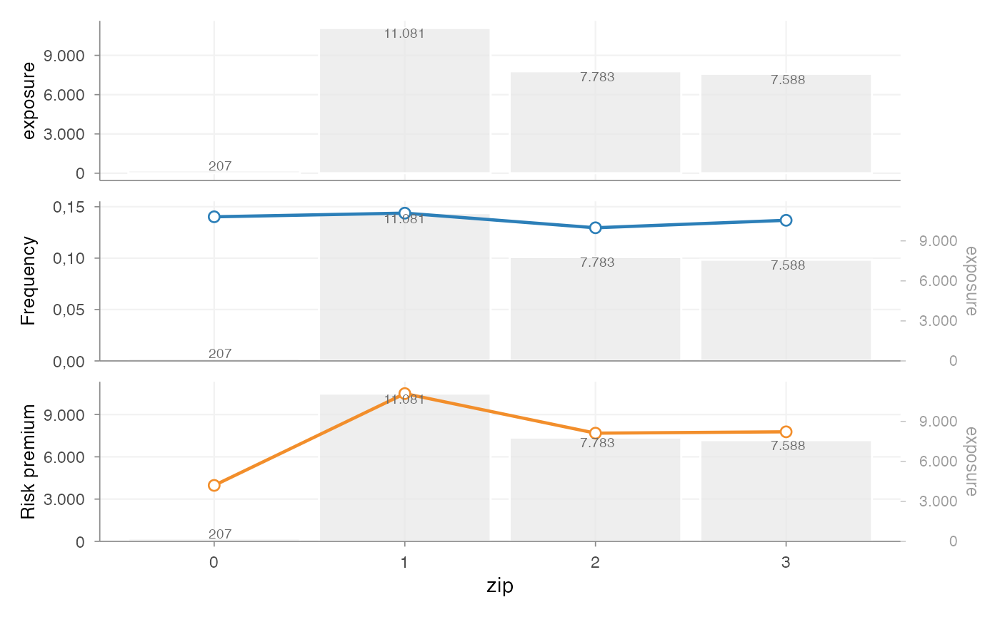
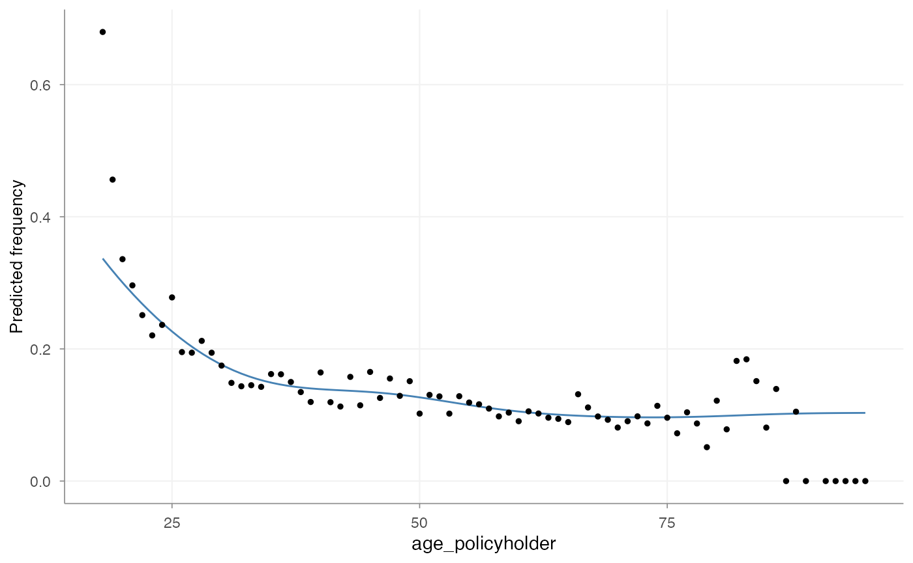
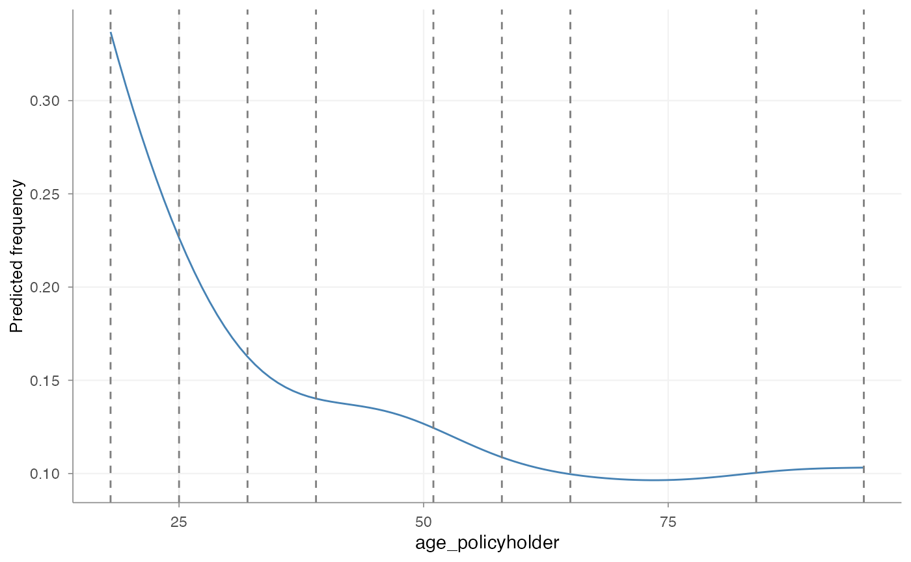
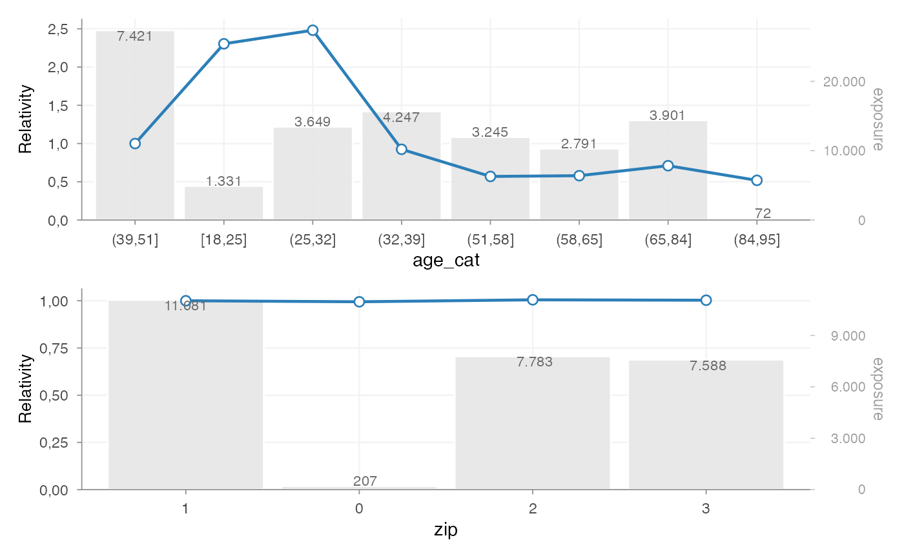

# Getting Started

## Introduction

`insurancerating` provides building blocks for common actuarial pricing
tasks in R. This vignette presents one possible workflow. It is an
illustration rather than a prescribed end-to-end pricing methodology.

The sequence is chosen to show how several package components can be
combined. Depending on the portfolio, available data, modelling
objective and applicable requirements, activities may be omitted, added,
repeated or performed in a different order. The example is not intended
to represent a canonical industry workflow or the internal process of a
particular organisation.

A GLM-based pricing exercise commonly combines several tasks:

1.  understand observed portfolio experience and rating factors
2.  construct modelling variables
3.  estimate frequency, severity and technical risk
4.  translate technical risk into a reviewable tariff structure
5.  interpret, validate and refine the resulting model

The work is often iterative. Exploratory results may lead to different
variable definitions, large-loss treatment may affect the severity
model, and tariff or implementation constraints may require the
statistical models to be revisited. The package functions can be
combined in different orders depending on the portfolio and modelling
objective.

The example illustrates how to:

- analyse risk factors with
  [`factor_analysis()`](https://mharinga.github.io/insurancerating/reference/factor_analysis.md)
- estimate pricing models with
  [`glm()`](https://rdrr.io/r/stats/glm.html)
- interpret coefficients with
  [`rating_table()`](https://mharinga.github.io/insurancerating/reference/rating_table.md)
- assess model behaviour and stability
- apply a small actuarial refinement

The focus is on the transition from observed portfolio experience to
fitted technical risk and a tariff structure that can be reviewed
actuarially.

## Portfolio and data

The examples consistently use `MTPL`, a motor portfolio with:

- number of claims (`nclaims`),
- exposure (`exposure`),
- total claim cost per portfolio record (`amount`),
- several rating factors

``` r


library(insurancerating)
library(dplyr)

head(MTPL)
#> # A tibble: 6 × 7
#>   age_policyholder nclaims exposure amount power    bm zip  
#>              <int>   <int>    <dbl>  <dbl> <int> <int> <fct>
#> 1               70       0    1          0   106     5 1    
#> 2               40       0    1          0    74     3 1    
#> 3               78       0    1          0    65     8 2    
#> 4               49       0    1          0    64    10 1    
#> 5               59       0    1          0    29     1 3    
#> 6               71       0    0.455      0    66     6 3
```

## Understanding rating factors

### Factor analysis

A pricing analysis commonly starts with a descriptive review of the
portfolio.

Before fitting a model, it is useful to assess:

- how experience differs across factor levels
- whether observed differences are supported by sufficient exposure and
  claim volume
- whether the observed pattern is plausible

This is done with
[`factor_analysis()`](https://mharinga.github.io/insurancerating/reference/factor_analysis.md).

### Basic factor analysis

We start by analysing a single risk factor.

``` r


fa <- factor_analysis(
  MTPL,
  risk_factors = "zip",
  claim_count = "nclaims",
  exposure = "exposure",
  claim_amount = "amount"
)

fa
#>   zip    amount nclaims   exposure frequency average_severity risk_premium
#> 1   1 116178669    1593 11080.6274 0.1437644         72930.74    10484.846
#> 2   2  59751985    1008  7782.6301 0.1295192         59277.76     7677.608
#> 3   3  58988962    1038  7587.5644 0.1368028         56829.44     7774.427
#> 4   0    821510      29   206.8438 0.1402024         28327.93     3971.644
```

The output provides commonly used portfolio metrics such as:

- frequency = claims / exposure
- average severity = loss / claims
- risk premium = loss / exposure

Loss ratio and average premium can also be calculated when an
earned-premium column is supplied. `MTPL` does not contain that
quantity, so they are not used in this example.

### Visualising factor behaviour

``` r


autoplot(fa, metrics = c("exposure", "frequency", "risk_premium"))
```



This provides a direct view of:

- the distribution of exposure
- the variation in claim frequency
- the variation in risk premium

These are descriptive, univariate results. They show the observed
experience and volume by level, but do not control for correlations with
other risk factors.

## Handling continuous variables

### Why continuous variables are treated separately

Continuous variables can be modelled directly. In many traditional
insurance tariffs, they are instead translated into a limited number of
segments to improve stability, interpretation and implementation. This
example uses the following sequence:

1.  analysed as continuous variables
2.  translated into tariff segments
3.  used in a GLM as categorical rating factors

Grouping makes the resulting tariff effect discrete and directly
implementable, but introduces a segmentation choice that should be
reviewed.

### Analysing the shape with a GAM

``` r


age_freq <- risk_factor_gam(
  data = MTPL,
  risk_factor = "age_policyholder",
  claim_count = "nclaims",
  exposure = "exposure"
)

autoplot(age_freq, show_observations = TRUE)
```



This step is used to inspect:

- non-linear patterns
- local volatility
- areas with low exposure
- plausible breakpoints for tariff segments

### Deriving tariff segments

``` r


age_segments <- derive_tariff_segments(age_freq)
autoplot(age_segments)
```



``` r

summary(age_segments)
#>   segment portfolio_records risk_factor_values   exposure claim_count
#> 1 [18,25]              1543                  8 1331.17534         348
#> 2 (25,32]              4254                  7 3648.72055         653
#> 3 (32,39]              4919                  7 4247.34795         615
#> 4 (39,51]              8366                 12 7421.35890        1009
#> 5 (51,58]              3594                  7 3245.45479         372
#> 6 (58,65]              3058                  7 2790.83288         272
#> 7 (65,84]              4181                 19 3900.75890         394
#> 8 (84,95]                85                 10   72.01644           5
#>    frequency
#> 1 0.26142311
#> 2 0.17896684
#> 3 0.14479624
#> 4 0.13595893
#> 5 0.11462184
#> 6 0.09746194
#> 7 0.10100599
#> 8 0.06942859
```

This derives candidate segment boundaries from the fitted continuous
effect. Exposure and claim volume have already informed the GAM
estimate. They are reported by
[`summary()`](https://rdrr.io/r/base/summary.html) for review, but are
not applied again when the fitted curve is divided into intervals. The
evolutionary tree approximates the GAM curve rather than the individual
claim outcomes. Each distinct risk-factor value on the fitted curve has
equal influence on this approximation; exposure is not applied as a
second weight.

The resulting segments should be reviewed against exposure, observed
experience, stability and practical tariff requirements before they are
used in a model.

### Adding tariff segments to the data

``` r


dat <- MTPL |>
  add_tariff_segments(age_segments, name = "age_cat") |>
  mutate(across(where(is.character), as.factor)) |>
  mutate(across(where(is.factor), ~ set_reference_level(., exposure)))
```

[`set_reference_level()`](https://mharinga.github.io/insurancerating/reference/set_reference_level.md)
sets the reference level to the level with the highest exposure. This
changes the coefficient parameterisation, not the fitted values. A
high-exposure level is often a useful baseline because its relativity is
supported by a substantial part of the portfolio.

## Estimating frequency and severity

### Why GLMs are used

Generalized linear models are widely used in insurance pricing. They
can:

- accommodate non-normal response distributions
- produce interpretable multiplicative effects
- be translated into tariff relativities

A common decomposition is:

- frequency –\> Poisson GLM
- severity –\> Gamma GLM

### Frequency model

``` r


mod_freq <- glm(
  nclaims ~ age_cat,
  offset = log(exposure),
  family = poisson(),
  data = dat
)
```

The response is the observed claim count for each policy-period. Because
`log(exposure)` is included as an offset,
`predict(mod_freq, type = "response")` returns the expected number of
claims for that record’s exposure. Dividing that prediction by exposure
gives claim frequency per exposure-year.

### Severity model

``` r


severity_data <- dat |>
  filter(nclaims > 0, amount > 0) |>
  mutate(average_claim_amount = amount / nclaims)

mod_sev <- glm(
  average_claim_amount ~ age_cat,
  weights = nclaims,
  family = Gamma(link = "log"),
  data = severity_data
)
```

`amount` is the total claim cost recorded for a portfolio row. Dividing
by `nclaims` gives average claim severity. Claim count is then used as
the model weight because a row containing several claims represents more
severity observations than a row containing one claim. Frequency and
severity are modelled separately because they describe different parts
of the loss process.

## Constructing technical risk premium

``` r


premium_df <- dat |>
  add_prediction(
    mod_freq,
    mod_sev,
    predictions = c("expected_claim_count", "expected_average_severity")
  ) |>
  mutate(
    claim_frequency = expected_claim_count / exposure,
    expected_loss = expected_claim_count * expected_average_severity,
    risk_premium = claim_frequency * expected_average_severity
  )

premium_df |>
  select(
    exposure,
    expected_claim_count,
    claim_frequency,
    expected_average_severity,
    expected_loss,
    risk_premium
  ) |>
  head()
#>    exposure expected_claim_count claim_frequency expected_average_severity
#> 1 1.0000000           0.10100599      0.10100599                  63357.63
#> 2 1.0000000           0.13595893      0.13595893                  60320.26
#> 3 1.0000000           0.10100599      0.10100599                  63357.63
#> 4 1.0000000           0.13595893      0.13595893                  60320.26
#> 5 1.0000000           0.09746194      0.09746194                  50985.39
#> 6 0.4547945           0.04593697      0.10100599                  63357.63
#>   expected_loss risk_premium
#> 1      6399.500     6399.500
#> 2      8201.078     8201.078
#> 3      6399.500     6399.500
#> 4      8201.078     8201.078
#> 5      4969.135     4969.135
#> 6      2910.457     6399.500
```

The units are now explicit:

- `expected_claim_count` is the expected number of claims for the
  observed policy exposure;
- `claim_frequency` is the expected number of claims per exposure-year;
- `expected_average_severity` is the expected amount per claim;
- `expected_loss` is the expected loss for the policy-period;
- `risk_premium` is expected loss per exposure-year.

The risk premium is a technical expected loss cost. It does not include
expense loadings, profit margins, taxes or other components of a
commercial premium.

## From technical risk to tariff

### Fitting a tariff representation

``` r


burn_unrestricted <- glm(
  risk_premium ~ age_cat + zip,
  weights = exposure,
  family = Gamma(link = "log"),
  data = premium_df
)
```

This second GLM is not statistically required after fitting frequency
and severity. Here it is used as a tariff-construction step: it
approximates the combined technical risk with a compact multiplicative
structure based on `age_cat` and `zip`. Exposure weights give more
influence to tariff cells that represent a larger part of the portfolio.

The response is a fitted technical target rather than an observed claim
outcome. The model is therefore used to obtain an interpretable and
implementable tariff representation, not as a replacement for the
underlying frequency and severity analyses.

## Interpreting model effects and observed experience

### Rating table

``` r


rt <- rating_table(burn_unrestricted) |>
  add_portfolio_experience(
    data = premium_df,
    claim_count = "nclaims",
    exposure = "exposure",
    claim_amount = "amount",
    metric = "risk_premium"
  )
rt
#>    risk_factor       level est_burn_unrestricted exposure
#> 1  (Intercept) (Intercept)          8201.0782374       NA
#> 2      age_cat     [18,25]             1.9848879     1331
#> 3      age_cat     (25,32]             2.0914417     3649
#> 4      age_cat     (32,39]             1.0312559     4247
#> 5      age_cat     (39,51]             1.0000000     7421
#> 6      age_cat     (51,58]             0.5826148     3245
#> 7      age_cat     (58,65]             0.6059124     2791
#> 8      age_cat     (65,84]             0.7803242     3901
#> 9      age_cat     (84,95]             0.6199937       72
#> 10         zip           0             1.0000000      207
#> 11         zip           1             1.0000000    11081
#> 12         zip           2             1.0000000     7783
#> 13         zip           3             1.0000000     7588
```

[`rating_table()`](https://mharinga.github.io/insurancerating/reference/rating_table.md)
expresses fitted model effects as tariff relativities for the original
factor levels, including the reference level. The attached portfolio
experience makes it possible to compare those modelled relativities with
the observed risk-premium pattern. Exposure remains important when
judging whether an apparent difference is sufficiently credible.

### Visualising coefficients

``` r


autoplot(rt, metric = "risk_premium")
```



This plot can be used to assess:

- the relative size of coefficients
- the structure across levels
- the exposure behind each level
- whether additional refinement may be needed

At this stage, the relevant questions are:

- are coefficients sufficiently stable?
- do they follow the expected pattern?
- are some levels driven by limited exposure?

## Validating the model

Validation combines statistical diagnostics with actuarial review. No
single measure determines whether a tariff model is suitable. Relevant
questions include dispersion, residual structure, out-of-sample
stability, exposure by level, plausible factor shapes and agreement with
observed experience.

### Overdispersion

``` r


check_overdispersion(mod_freq)
#> Dispersion ratio =     1.187
#> Pearson's Chi-squared = 35590.309
#> p-value =   < 0.001
#> Overdispersion detected.
```

For a Poisson frequency model, a dispersion ratio materially above one
can indicate remaining heterogeneity or an unsuitable variance
assumption. The result should be considered together with residual and
factor-level checks.

### Model performance

``` r


model_performance(mod_freq)
#> # Comparison of Model Performance Indices
#> 
#>  Model   |   AIC    |    BIC    | RMSE  
#> ---------+----------+-----------+------ 
#> mod_freq | 22949.04 | 23015.512 | 0.362
```

This reports AIC, BIC and response-scale RMSE for the expected
claim-count model. These measures are most meaningful when models use
the same response, records, weights and offsets.

### Bootstrap performance

``` r


bp <- bootstrap_performance(
  mod_freq,
  dat,
  n_resamples = 50,
  sample_fraction = 0.8,
  sampling = "bootstrap",
  show_progress = FALSE
)
autoplot(bp)
```


This refits the model on repeated bootstrap samples and evaluates RMSE
on out-of-bag records. The resulting distribution describes sensitivity
to the sampled portfolio records; it is not a prediction interval for
future claims.

A single fit statistic is not sufficient. In pricing practice, the
numerical results should be reviewed together with exposure, observed
experience, residual diagnostics and stability of effects over time. The
dedicated model validation vignette covers these checks in more detail.

## Refining the tariff

At this point, the example has produced:

- portfolio-level insight
- fitted pricing models
- interpretable factor relativities
- basic performance diagnostics

Depending on the intended tariff, a further refinement step may be
useful before implementation.

Typical reasons include:

- irregular coefficient patterns
- monotonicity requirements
- externally imposed restrictions
- expert-driven adjustments

The following small example fixes one ZIP relativity as an explicit
actuarial assumption. Other ZIP levels retain their current
relativities, and the intercept-only refit recalibrates the overall
level without re-estimating the prescribed tariff effects.

``` r


zip_restriction <- data.frame(
  zip = "3",
  relativity = 1.05
)

tariff_refinement <- prepare_refinement(
  burn_unrestricted,
  data = premium_df
) |>
  add_restriction(zip_restriction)

burn_refined <- refit(tariff_refinement, intercept_only = TRUE)
rating_table(burn_refined)
#>    risk_factor       level est_burn_refined exposure
#> 1  (Intercept) (Intercept)     8089.9224879       NA
#> 2   relativity           0        1.0000000      207
#> 3   relativity           1        1.0000000    11081
#> 4   relativity           2        1.0000000     7783
#> 5   relativity           3        1.0500000     7588
#> 6      age_cat     [18,25]        1.9848879     1331
#> 7      age_cat     (25,32]        2.0914417     3649
#> 8      age_cat     (32,39]        1.0312559     4247
#> 9      age_cat     (39,51]        1.0000000     7421
#> 10     age_cat     (51,58]        0.5826148     3245
#> 11     age_cat     (58,65]        0.6059124     2791
#> 12     age_cat     (65,84]        0.7803242     3901
#> 13     age_cat     (84,95]        0.6199937       72
```

The value `1.05` is illustrative; a production restriction requires
actuarial support and governance. Smoothing, shrinkage, rebasing and
more extensive restrictions are described in [Refinement building
blocks](https://mharinga.github.io/insurancerating/articles/refinement-workflow.md).

## Summary

A possible sequence in `insurancerating` is:

``` r


factor_analysis()             # analyse portfolio behaviour
risk_factor_gam()             # analyse continuous variables
derive_tariff_segments()      # derive tariff segments
glm()                         # estimate frequency and severity
add_prediction()              # construct technical risk premium
glm()                         # represent risk in a tariff structure
rating_table()                # interpret tariff relativities
bootstrap_performance()       # assess stability
prepare_refinement()          # prepare an actuarial refinement
refit()                       # fit the refined tariff model
```

The sequence distinguishes observed experience, fitted model effects,
candidate tariff segmentation and model diagnostics. The final modelling
choices remain dependent on the portfolio and pricing objective.

## Where to go next

- [Pricing workflow and package building
  blocks](https://mharinga.github.io/insurancerating/articles/pricing-workflow-building-blocks.md)
  maps the wider package to the actuarial tasks it supports, including
  data preparation, large-loss treatment, modelling and tariff
  construction.
- [Refinement building
  blocks](https://mharinga.github.io/insurancerating/articles/refinement-workflow.md)
  covers smoothing, restrictions, shrinkage, rebasing and audit of
  tariff changes.
- [Model
  validation](https://mharinga.github.io/insurancerating/articles/model-validation.md)
  develops the diagnostic and out-of-sample checks used only briefly
  here.
- [Large
  Portfolios](https://mharinga.github.io/insurancerating/articles/large-portfolios.md)
  shows how to reduce policy-period data to model points before fitting
  a pricing GLM.
