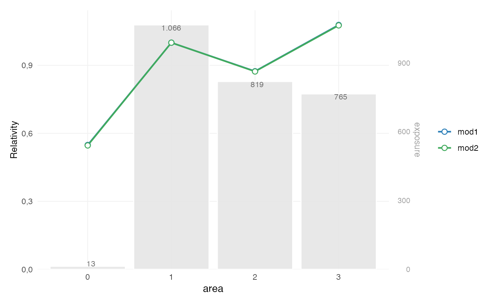
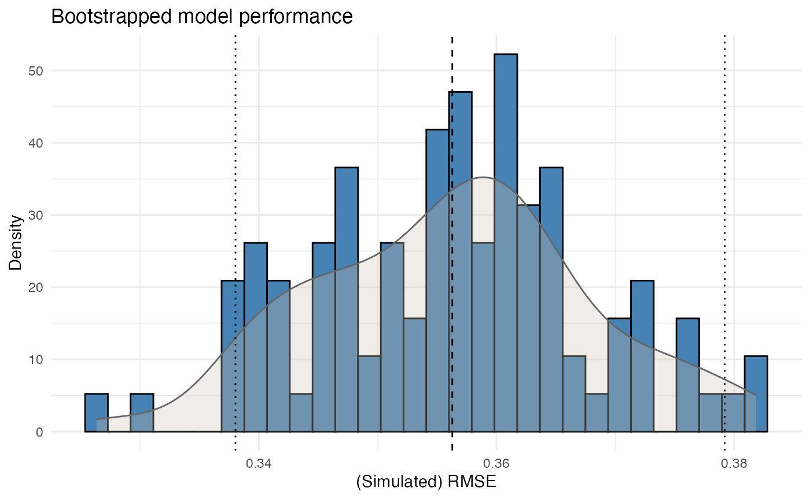
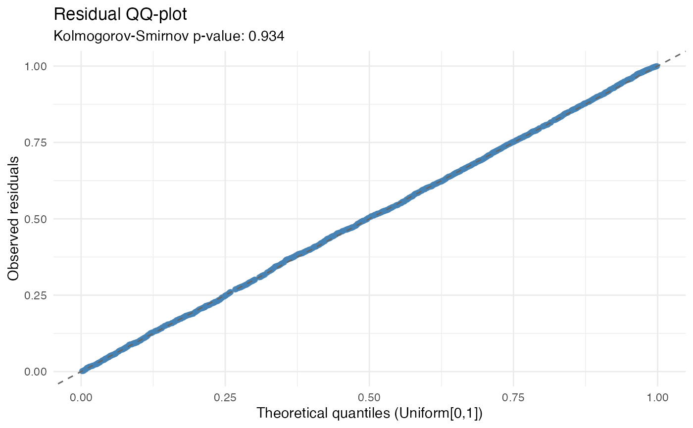

# Model validation

## Introduction

Model validation is part of the standard pricing workflow.

After model estimation and coefficient interpretation, it is necessary
to assess whether the model performs adequately and behaves in a stable
and interpretable way.

In practice, model validation typically considers several dimensions:

- comparative model performance
- coefficient structure
- predictive stability
- distributional diagnostics
- portfolio-level behaviour

`insurancerating` provides tools for each of these steps.

The purpose of validation is not only to assess statistical fit, but
also to determine whether a model is suitable for use in a pricing
context.

## Example setup

The examples below use a simple frequency modelling setup based on
`MTPL2`.

``` r

library(insurancerating)
library(dplyr)
#> 
#> Attaching package: 'dplyr'
#> The following objects are masked from 'package:stats':
#> 
#>     filter, lag
#> The following objects are masked from 'package:base':
#> 
#>     intersect, setdiff, setequal, union

df <- MTPL2 |>
  mutate(across(c(area), as.factor)) |>
  mutate(across(c(area), ~ biggest_reference(., exposure)))

mod1 <- glm(
  nclaims ~ area,
  offset = log(exposure),
  family = poisson(),
  data = df
)

mod2 <- glm(
  nclaims ~ area + premium,
  offset = log(exposure),
  family = poisson(),
  data = df
)
```

## Step 1 — Comparative model performance

A first validation step is to compare alternative model specifications.

``` r

model_performance(mod1, mod2)
#> # Comparison of Model Performance Indices
#> 
#> Model |   AIC    |   BIC    | RMSE  
#> ------+----------+----------+------ 
#>  mod1 |  2287.25 | 2311.275 | 0.356 
#>  mod2 | 2289.054 | 2319.086 | 0.356
```

This provides standard summary measures of model fit, such as RMSE.

The purpose of this step is to assess whether the addition or removal of
model terms leads to a materially different fit.

In practice, this comparison is often used to support modelling choices
before moving to tariff interpretation.

## Step 2 — Coefficient inspection

Model validation is not limited to summary fit statistics. The
coefficient structure also needs to be reviewed.

``` r

rating_table(mod1, mod2, model_data = df, exposure = "exposure") |>
  autoplot()
```



This is used to assess:

- the relative size of fitted effects
- the ordering of factor levels
- the exposure behind each level
- whether differences are plausible and stable

In pricing practice, this is a standard part of validation, because a
model with slightly better fit may still be less suitable if its
coefficient structure is difficult to interpret or unstable in
low-exposure segments.

## Step 3 — Predictive stability

Single performance measures provide only a point estimate. In many
pricing contexts, it is also relevant to assess how stable that
performance is under small variations in the data.

``` r

bootstrap_performance(mod1, df, n = 100, show_progress = FALSE) |>
  autoplot()
```



This evaluates predictive stability by repeatedly refitting the model on
bootstrap samples and storing the resulting RMSE values.

The output is used to assess:

- the variability of model performance
- whether the fitted model behaves consistently
- whether the model is highly sensitive to changes in the underlying
  sample

This is particularly relevant when portfolios contain sparse segments or
large claim volatility.

## Step 4 — Dispersion checks

For Poisson models, it is standard practice to check whether the
variance assumption is broadly appropriate.

``` r

check_overdispersion(mod1)
#> Dispersion ratio =    1.220
#> Pearson's Chi-squared = 3655.711
#> p-value =  < 0.001
#> Overdispersion detected.
```

A dispersion ratio above 1 indicates that the observed variance exceeds
the variance implied by the Poisson model.

This does not automatically invalidate the model, but it does provide an
important diagnostic signal. In pricing practice, overdispersion may
indicate:

- omitted heterogeneity
- model misspecification
- clustering in the data
- or unmodelled portfolio structure

## Step 5 — Residual diagnostics

Residual diagnostics provide an additional view of model adequacy.

``` r

check_residuals(mod1, n_simulations = 600) |>
  autoplot()
#> ✅ Residuals consistent with expected distribution (p = 0.934)
```



This step is used to assess whether the residual behaviour is broadly
consistent with the fitted model assumptions.

In GLM settings, simulation-based residual diagnostics are often more
useful than classical residual plots, because they allow the fitted
model to be evaluated relative to its own implied distribution.

The purpose of this step is not to search for perfect residual
behaviour, but to identify material deviations that may be relevant for
pricing.

## Step 6 — Portfolio-level structure

Validation is also performed at portfolio or model-point level.

``` r

grid <- rating_grid(mod1)
head(grid)
#> # A tibble: 6 × 7
#>   customer_id area  nclaims amount exposure premium count
#>         <int> <fct>   <int>  <int>    <dbl>   <int> <int>
#> 1          54 3           0      0    0.452      84     1
#> 2          60 3           0      0    0.879      65     1
#> 3         108 3           0      0    1          76     1
#> 4         174 2           0      0    1          66     1
#> 5         220 2           1     33    1          58     1
#> 6         296 3           0      0    1          65     1
```

[`rating_grid()`](https://mharinga.github.io/insurancerating/reference/rating_grid.md)
aggregates the fitted model to observed model-point combinations. This
is useful when validation requires a more structured view of:

- observed portfolio composition
- combinations of rating factors
- model-point level summaries
- compact portfolio input for further review

This step is particularly relevant when moving from model validation to
tariff review or implementation support.

## Validation in context

In practice, model validation is rarely based on a single statistic.

A standard validation workflow combines:

- comparative performance measures
- coefficient inspection
- predictive stability
- residual and dispersion diagnostics
- portfolio-level review

These steps serve different purposes:

- performance measures assess fit
- coefficient inspection assesses interpretability
- bootstrap analysis assesses stability
- diagnostics assess model adequacy
- portfolio review assesses practical usability

Taken together, they provide a structured basis for deciding whether a
model is suitable for pricing use.

## Summary

A standard validation workflow in `insurancerating` is:

``` r

model_performance(...)        # compare fitted models
rating_table(...) |> autoplot()   # inspect coefficient structure
bootstrap_performance(...)    # assess predictive stability
check_overdispersion(...)     # assess dispersion
check_residuals(...)          # inspect residual behaviour
rating_grid(...)              # review model-point structure
```

The purpose of validation is not only to assess model fit, but to
determine whether the fitted model is:

- statistically adequate
- stable under data variation
- interpretable in tariff terms
- suitable for practical pricing use

## Next steps

For the standard modelling workflow, see:

- [Getting
  started](https://mharinga.github.io/insurancerating/articles/articles/getting-started.md)

For the refinement step after validation, see:

- [Refinement
  workflow](https://mharinga.github.io/insurancerating/articles/articles/refinement-workflow.md).

For the conceptual background to exposure, risk premium, and tariff
structure, see:

- [Pricing
  principles](https://mharinga.github.io/insurancerating/articles/articles/pricing-principles.md)
