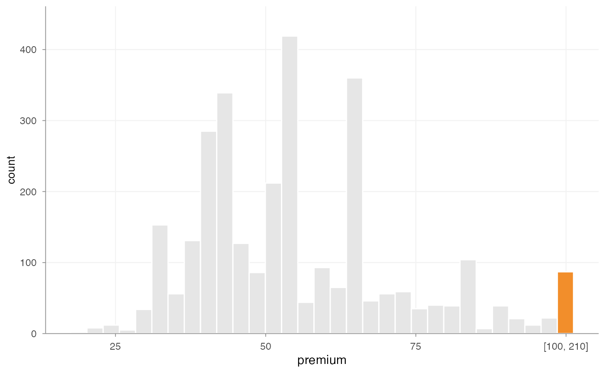
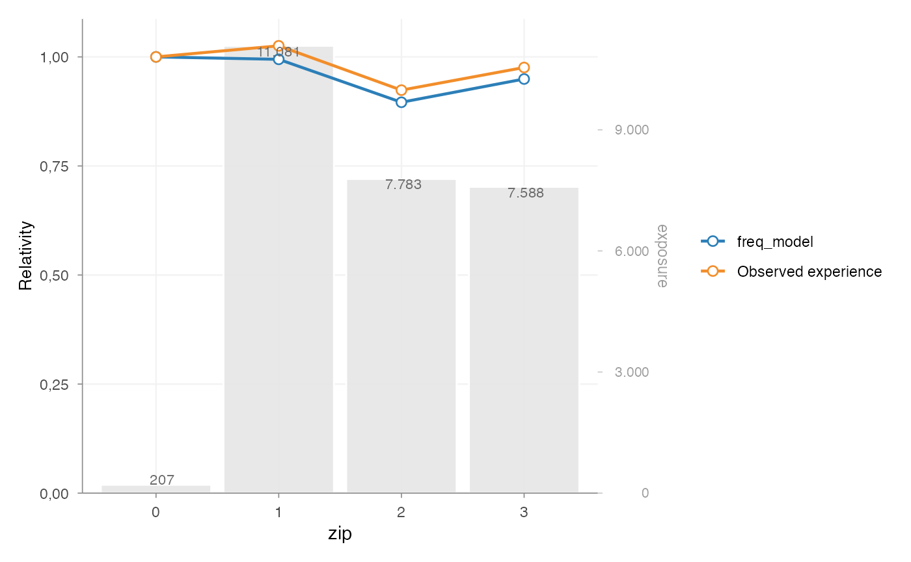

# Pricing workflow building blocks

`insurancerating` provides building blocks for common actuarial pricing
tasks in GLM-based tariff analysis. The package does not prescribe a
single pricing method. Instead, it supports practical steps that often
appear in insurance pricing work: portfolio analysis, model
interpretation, tariff refinement and model validation.

This vignette gives a compact overview of those building blocks and how
they can be combined.

``` r

library(insurancerating)
```

## 1. Start with portfolio experience

A pricing analysis often starts by checking how the observed portfolio
behaves by risk factor. This is useful before modelling, but also later
when reviewing whether fitted relativities are plausible.

[`factor_analysis()`](https://mharinga.github.io/insurancerating/reference/factor_analysis.md)
summarises exposure, claim frequency, average severity, risk premium and
related metrics by one or more risk factors.

``` r

fa <- factor_analysis(
  MTPL,
  risk_factors = "zip",
  claim_count = "nclaims",
  claim_amount = "amount",
  exposure = "exposure"
)

head(fa)
#>   zip    amount nclaims   exposure frequency average_severity risk_premium
#> 1   1 116178669    1593 11080.6274 0.1437644         72930.74    10484.846
#> 2   2  59751985    1008  7782.6301 0.1295192         59277.76     7677.608
#> 3   3  58988962    1038  7587.5644 0.1368028         56829.44     7774.427
#> 4   0    821510      29   206.8438 0.1402024         28327.93     3971.644
```

The output helps answer practical questions such as:

- where exposure is concentrated
- whether observed differences are credible or noisy
- whether a segment is driven by a small number of claims
- which risk factors may need closer modelling or refinement

For numeric variables with long or skewed tails,
[`outlier_histogram()`](https://mharinga.github.io/insurancerating/reference/outlier_histogram.md)
can help inspect extreme observations before fitting severity models or
constructing tariff segments.

``` r

outlier_histogram(
  MTPL2,
  x = "premium",
  upper = 100,
  density = FALSE
)
```



## 2. Translate continuous factors into tariff segments

Many tariffs use grouped versions of continuous variables such as age,
vehicle age or insured value.
[`risk_factor_gam()`](https://mharinga.github.io/insurancerating/reference/risk_factor_gam.md)
can be used to inspect the fitted shape of a continuous risk factor.
[`derive_tariff_segments()`](https://mharinga.github.io/insurancerating/reference/derive_tariff_segments.md)
can then derive candidate segment boundaries from that pattern.

``` r

age_gam <- risk_factor_gam(
  data = MTPL,
  claim_count = "nclaims",
  risk_factor = "age_policyholder",
  exposure = "exposure"
)

age_segments <- derive_tariff_segments(age_gam)
age_segments
#> Tariff segment boundaries:
#> [1] 18 25 32 39 51 58 65 84 95
```

The derived segments can be added back to the portfolio with
[`add_tariff_segments()`](https://mharinga.github.io/insurancerating/reference/add_tariff_segments.md).

``` r

portfolio <- MTPL |>
  add_tariff_segments(age_segments, name = "age_policyholder_segment")

head(portfolio[, c("age_policyholder", "age_policyholder_segment")])
#> # A tibble: 6 × 2
#>   age_policyholder age_policyholder_segment
#>              <int> <fct>                   
#> 1               70 (65,84]                 
#> 2               40 (39,51]                 
#> 3               78 (65,84]                 
#> 4               49 (39,51]                 
#> 5               59 (58,65]                 
#> 6               71 (65,84]
```

These functions are intended to support actuarial judgement, not replace
it. Candidate segment boundaries should still be reviewed for
credibility, stability and practical usability.

## 3. Fit and interpret a GLM

GLMs are widely used in insurance pricing because they provide an
interpretable multiplicative structure. After fitting a model,
[`rating_table()`](https://mharinga.github.io/insurancerating/reference/rating_table.md)
expresses the coefficients in tariff-table form.

``` r

portfolio$zip <- as.factor(portfolio$zip)

freq_model <- glm(
  nclaims ~ zip + age_policyholder_segment + offset(log(exposure)),
  family = poisson(),
  data = portfolio
)

rt <- rating_table(
  freq_model,
  model_data = portfolio,
  exposure = "exposure"
)

head(rt$df)
#>                risk_factor       level est_freq_model exposure
#> 1              (Intercept) (Intercept)      0.2743790       NA
#> 2                      zip           0      1.0000000      207
#> 3                      zip           1      0.9944341    11081
#> 4                      zip           2      0.8960053     7783
#> 5                      zip           3      0.9493475     7588
#> 6 age_policyholder_segment     [18,25]      1.0000000     1331
```

Observed portfolio experience from
[`factor_analysis()`](https://mharinga.github.io/insurancerating/reference/factor_analysis.md)
can be attached to the rating table with
[`add_observed_experience()`](https://mharinga.github.io/insurancerating/reference/add_observed_experience.md).
This makes the comparison between model relativities and observed
experience explicit.

``` r

zip_experience <- factor_analysis(
  portfolio,
  risk_factors = "zip",
  claim_count = "nclaims",
  exposure = "exposure"
)

rt |>
  add_observed_experience(zip_experience, metric = "frequency") |>
  autoplot(risk_factors = "zip")
```



## 4. Refine tariff effects when needed

Raw model output may be statistically valid but still unsuitable for
direct tariff use. Sparse levels, noisy estimates or non-monotonic
adjacent effects can make a tariff hard to explain or maintain.

The refinement workflow makes these adjustments explicit:

``` r

refined_model <- prepare_refinement(freq_model) |>
  add_smoothing(
    model_variable = "age_policyholder_segment",
    source_variable = "age_policyholder",
    weights = "exposure"
  ) |>
  add_restriction(restrictions) |>
  refit()
```

Common refinement tasks include:

- smoothing adjacent tariff levels
- fixing selected coefficients to actuarial or commercial assumptions
- applying sublevel relativities within a broader GLM factor level
- refitting the model while preserving the intended tariff structure

These tools are most useful when the statistical model already captures
the main risk structure and the remaining work is tariff refinement.

## 5. Validate model behaviour

Pricing models should be checked before their output is used in a
tariff. `insurancerating` contains helpers for several common checks:

- [`check_overdispersion()`](https://mharinga.github.io/insurancerating/reference/check_overdispersion.md)
  for Poisson frequency models
- [`check_residuals()`](https://mharinga.github.io/insurancerating/reference/check_residuals.md)
  for simulation-based residual diagnostics using DHARMa
- [`bootstrap_performance()`](https://mharinga.github.io/insurancerating/reference/bootstrap_performance.md)
  for predictive stability with metrics such as RMSE
- [`rating_grid()`](https://mharinga.github.io/insurancerating/reference/rating_grid.md)
  to inspect observed rating-grid combinations

For example:

``` r

check_overdispersion(freq_model)
#> Dispersion ratio =     1.185
#> Pearson's Chi-squared = 35522.367
#> p-value =   < 0.001
#> Overdispersion detected.
```

``` r

check_residuals(freq_model) |>
  autoplot()
```

Validation does not make a tariff decision by itself. It gives evidence
about model fit, stability and areas that may need further review.

## Typical workflow

One possible workflow is:

1.  Inspect the portfolio with
    [`factor_analysis()`](https://mharinga.github.io/insurancerating/reference/factor_analysis.md)
    and
    [`outlier_histogram()`](https://mharinga.github.io/insurancerating/reference/outlier_histogram.md).
2.  Analyse continuous risk factors with
    [`risk_factor_gam()`](https://mharinga.github.io/insurancerating/reference/risk_factor_gam.md).
3.  Create candidate tariff segments with
    [`derive_tariff_segments()`](https://mharinga.github.io/insurancerating/reference/derive_tariff_segments.md).
4.  Fit GLMs for frequency, severity or pure premium.
5.  Interpret coefficients with
    [`rating_table()`](https://mharinga.github.io/insurancerating/reference/rating_table.md).
6.  Compare fitted relativities with observed experience using
    [`add_observed_experience()`](https://mharinga.github.io/insurancerating/reference/add_observed_experience.md).
7.  Apply refinement where needed with
    [`prepare_refinement()`](https://mharinga.github.io/insurancerating/reference/prepare_refinement.md),
    [`add_smoothing()`](https://mharinga.github.io/insurancerating/reference/add_smoothing.md),
    [`add_restriction()`](https://mharinga.github.io/insurancerating/reference/add_restriction.md)
    or
    [`add_relativities()`](https://mharinga.github.io/insurancerating/reference/add_relativities.md).
8.  Validate the resulting model with the model-performance helpers.

The exact order and choice of functions depends on the portfolio,
product, data quality and pricing objective.

## Next steps

For a worked example, see:

- [Getting
  started](https://mharinga.github.io/insurancerating/articles/getting-started.md)

For coefficient refinement:

- [Refinement building
  blocks](https://mharinga.github.io/insurancerating/articles/refinement-workflow.md)

For validation:

- [Model
  validation](https://mharinga.github.io/insurancerating/articles/model-validation.md)
