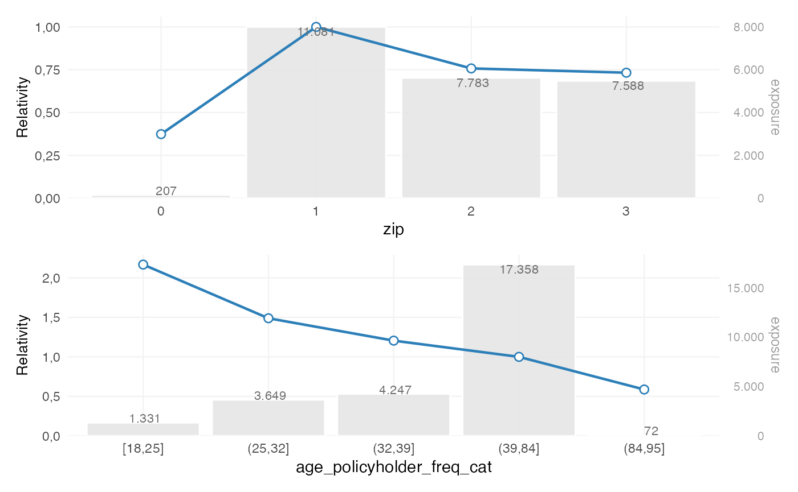
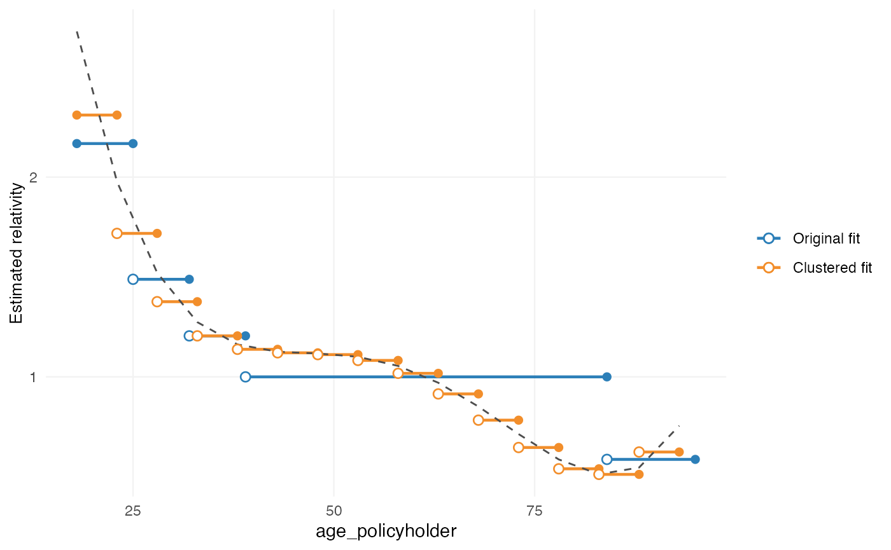
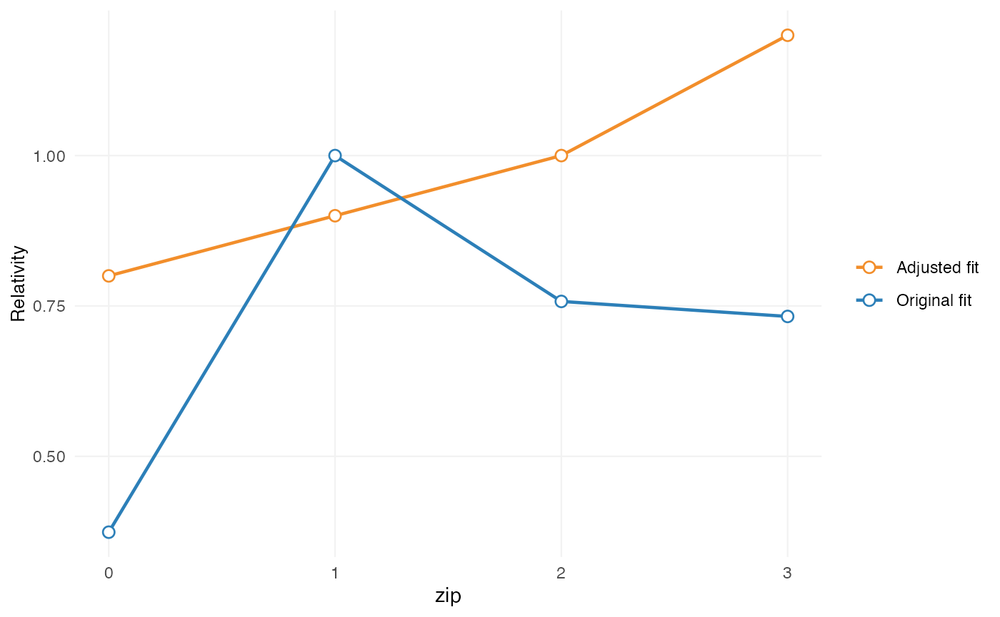
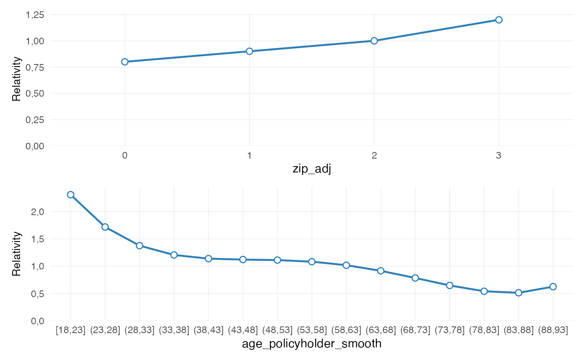

# Refinement workflow

## Introduction

In insurance pricing, model estimation is usually not the final step.

A fitted GLM may capture the structure of the portfolio well, but the
raw coefficients are not always directly suitable for implementation in
a tariff.

Common reasons include:

- irregular local variation
- lack of monotonicity
- externally imposed tariff structures
- expert judgement not directly represented in the model
- implementation constraints in policy administration systems

For this reason, pricing workflows typically distinguish between:

1.  model estimation
2.  tariff refinement
3.  final refit of the pricing structure

`insurancerating` formalises this through a staged refinement workflow:

1.  fit an unrestricted model
2.  initialise a refinement object with
    [`prepare_refinement()`](https://mharinga.github.io/insurancerating/reference/prepare_refinement.md)
3.  add one or more refinement steps
4.  inspect these steps before refit
5.  call
    [`refit()`](https://mharinga.github.io/insurancerating/reference/refit.md)
    to obtain the final fitted model

This separation makes the workflow easier to understand, reproduce, and
audit.

## When refinement is used

Refinement is used when the estimated model output is statistically
acceptable, but not yet suitable as a tariff structure.

Typical use cases include:

- smoothing a rating factor derived from a continuous variable
- imposing monotonicity
- restricting coefficients to a predefined relativity structure
- introducing expert-based relativities within existing model levels
- simplifying the final tariff for practical implementation

In most cases, refinement is applied to the **premium model**, rather
than to the separate frequency or severity models. The purpose of
refinement is not primarily to smooth intermediate model components, but
to impose structure on the final pricing signal that will be used in the
tariff.

## Example setup

The workflow below starts from a standard premium modelling setup:

- analyse a continuous variable with a GAM
- convert it to tariff classes
- fit frequency and severity models
- combine both into a premium proxy
- fit an unrestricted premium model

``` r

library(insurancerating)
library(dplyr)

age_policyholder_frequency <- riskfactor_gam(
  data = MTPL,
  nclaims = "nclaims",
  x = "age_policyholder",
  exposure = "exposure"
)

clusters_freq <- construct_tariff_classes(age_policyholder_frequency)

dat <- MTPL |>
  mutate(age_policyholder_freq_cat = clusters_freq$tariff_classes) |>
  mutate(across(where(is.character), as.factor)) |>
  mutate(across(where(is.factor), ~ biggest_reference(., exposure)))

freq <- glm(
  nclaims ~ bm + age_policyholder_freq_cat,
  offset = log(exposure),
  family = poisson(),
  data = dat
)

sev <- glm(
  amount ~ zip,
  weights = nclaims,
  family = Gamma(link = "log"),
  data = dat |> filter(amount > 0)
)

premium_df <- dat |>
  add_prediction(freq, sev) |>
  mutate(premium = pred_nclaims_freq * pred_amount_sev)

burn_unrestricted <- glm(
  premium ~ zip + bm + age_policyholder_freq_cat,
  weights = exposure,
  family = Gamma(link = "log"),
  data = premium_df
)
```

Before refinement, inspect the unrestricted coefficient structure:

``` r

rating_table(burn_unrestricted)
#>                  risk_factor       level est_burn_unrestricted
#> 1                (Intercept) (Intercept)          1.073720e+04
#> 2                        zip           1          1.000000e+00
#> 3                        zip           0          3.739250e-01
#> 4                        zip           2          7.575359e-01
#> 5                        zip           3          7.325754e-01
#> 6  age_policyholder_freq_cat     (39,84]          1.000000e+00
#> 7  age_policyholder_freq_cat     [18,25]          2.167946e+00
#> 8  age_policyholder_freq_cat     (25,32]          1.488489e+00
#> 9  age_policyholder_freq_cat     (32,39]          1.205259e+00
#> 10 age_policyholder_freq_cat     (84,95]          5.868964e-01
#> 11                        bm          bm          9.980489e-01

rating_table(burn_unrestricted, 
             model_data = premium_df, 
             exposure = "exposure") |>
  autoplot()
```



At this stage, the coefficients reflect the unrestricted model fit. In
practice, this output may already be informative, but still too
irregular or too detailed for direct tariff use.

## The refinement object

Refinement begins with:

``` r

ref <- prepare_refinement(burn_unrestricted)
ref
#> <rating_refinement>
#> Base model: glm, lm
#> Steps: 0
```

A `rating_refinement` object stores:

- the fitted base model
- the underlying model data
- the refinement steps added to the workflow

At this point, the model itself has not been refitted. The refinement
object represents a proposed tariff adjustment structure, not yet the
final fitted result.

This distinction is deliberate: refinement steps can be inspected before
they are incorporated into the final model.

## Smoothing

### Purpose

Smoothing is used when a rating factor derived from a continuous
variable contains undesirable local variation.

For example, a coefficient pattern such as:

- age 30–34 lower
- age 34–38 higher
- age 38–42 lower again

may be statistically possible, but undesirable in a tariff. Smoothing
imposes a more stable structure on the rating factor.

### Adding smoothing

``` r

ref <- ref |>
  add_smoothing(
    x_cut = "age_policyholder_freq_cat",
    x_org = "age_policyholder",
    breaks = seq(18, 95, 5),
    weights = "exposure"
  )
```

The key arguments are:

- `x_cut`: the binned factor present in the GLM
- `x_org`: the original continuous variable
- `breaks`: the preferred commercial cut points
- `smoothing`: the smoothing specification
- `weights`: optional weighting, typically exposure

### Inspecting smoothing before refit

``` r

print(ref)
#> <rating_refinement>
#> Base model: glm, lm
#> Steps: 1
#> 1. smoothing [age_policyholder_freq_cat]
autoplot(ref, variable = "age_policyholder_freq_cat")
```



This plot belongs to the **pre-refit workflow**. It shows:

- the original fitted coefficients
- the proposed smoothed structure

The purpose is to inspect the refinement step itself, before it is
incorporated into the final fitted model.

### Choosing a smoothing method

Typical smoothing choices are:

- `"spline"`: polynomial-style smoothing
- `"gam"`: flexible smooth curve
- `"mpi"`: monotone increasing
- `"mpd"`: monotone decreasing

The appropriate choice depends on the pricing context.

For example:

- age may justify a flexible smooth
- insured value or power may require a monotonic relationship
- low-exposure tails may benefit from exposure weighting

## Restrictions

### Purpose

Restrictions are used when coefficients must follow a predefined
structure.

Typical examples include:

- bonus-malus systems
- governance-approved relativities
- externally mandated tariff structures
- implementation constraints in policy systems

Restrictions differ from smoothing:

- smoothing reshapes the fitted pattern
- restriction imposes user-defined coefficients

### Adding restrictions

``` r

zip_df <- data.frame(
  zip = c(0, 1, 2, 3),
  zip_adj = c(0.8, 0.9, 1.0, 1.2)
)

ref <- ref |>
  add_restriction(restrictions = zip_df)
```

The restriction table must contain exactly two columns:

- the original factor levels
- the adjusted coefficients

### Inspecting restrictions before refit

``` r

autoplot(ref, variable = "zip")
```



This shows the proposed restricted structure relative to the original
fitted model.

## Expert-based relativities

### Purpose

In some cases, the fitted model uses a broad factor level, while
business or portfolio knowledge suggests that more granular
differentiation is required.

For example, a model may estimate one coefficient for “construction”,
while pricing practice distinguishes between:

- residential construction
- commercial construction
- civil engineering

This is particularly relevant when subgroup exposure is too limited to
estimate stable coefficients directly.

### Adding relativities

``` r

relativities_activity <- relativities_list(
  split_level(
    "construction",
    c("residential_construction", "commercial_construction"),
    c(1.00, 1.15)
  )
)

ref <- ref |>
  add_relativities(
    risk_factor = "business_activity",
    risk_factor_split = "business_activity_split",
    relativities = relativities_activity,
    exposure = "exposure",
    normalize = TRUE
  )
```

If `normalize = TRUE`, the relativities are scaled so that their
exposure-weighted average remains equal to 1 within the original level.

This preserves the original model signal while introducing finer
structure.

## Refit

### Why refit is required

Refinement steps alter part of the model structure. Once these changes
are applied, the remaining coefficients may also need to adjust.

For that reason, the workflow does not end with
[`add_smoothing()`](https://mharinga.github.io/insurancerating/reference/add_smoothing.md)
or
[`add_restriction()`](https://mharinga.github.io/insurancerating/reference/add_restriction.md).
The final step is:

``` r

burn_refined <- refit(ref)
```

This refits the model while incorporating the refinement steps.

### Inspecting the final fitted result

After refit, use
[`rating_table()`](https://mharinga.github.io/insurancerating/reference/rating_table.md):

``` r

rating_table(burn_refined)
#>                risk_factor       level est_burn_refined
#> 1              (Intercept) (Intercept)     9376.5777003
#> 2                  zip_adj           0        0.8000000
#> 3                  zip_adj           1        0.9000000
#> 4                  zip_adj           2        1.0000000
#> 5                  zip_adj           3        1.2000000
#> 6  age_policyholder_smooth     [18,23]        2.3107319
#> 7  age_policyholder_smooth     (23,28]        1.7183044
#> 8  age_policyholder_smooth     (28,33]        1.3763971
#> 9  age_policyholder_smooth     (33,38]        1.2052590
#> 10 age_policyholder_smooth     (38,43]        1.1379656
#> 11 age_policyholder_smooth     (43,48]        1.1204187
#> 12 age_policyholder_smooth     (48,53]        1.1113464
#> 13 age_policyholder_smooth     (53,58]        1.0823030
#> 14 age_policyholder_smooth     (58,63]        1.0176692
#> 15 age_policyholder_smooth     (63,68]        0.9146517
#> 16 age_policyholder_smooth     (68,73]        0.7832839
#> 17 age_policyholder_smooth     (73,78]        0.6464252
#> 18 age_policyholder_smooth     (78,83]        0.5397614
#> 19 age_policyholder_smooth     (83,88]        0.5118045
#> 20 age_policyholder_smooth     (88,93]        0.6238929
#> 21                      bm          bm        0.9976439
```

At this point, the output no longer represents proposed manual
adjustments. It represents the **final fitted coefficient structure**.

The distinction is:

- `before refit()` –\> inspect the refinement plan
- `after refit()` –\> inspect the fitted tariff structure

If smoothing, restrictions, and relativities have been applied, they are
now embedded in the fitted model output.

### Visualising the final structure

``` r

rating_table(
  burn_refined,
  model_data = premium_df,
  exposure = "exposure"
) |>
  autoplot()
#> zip_adj, age_policyholder_smooth not in model_data
```


## Model data and rating grids

After refit, model structure can be extracted with
[`model_data()`](https://mharinga.github.io/insurancerating/reference/model_data.md):

``` r

md <- model_data(burn_refined)
head(md)
#>   age_policyholder age_policyholder_freq_cat_smooth age_policyholder_smooth
#> 1               18                         2.310732                 [18,23]
#> 2               18                         2.310732                 [18,23]
#> 3               18                         2.310732                 [18,23]
#> 4               18                         2.310732                 [18,23]
#> 5               19                         2.310732                 [18,23]
#> 6               19                         2.310732                 [18,23]
#>   nclaims   exposure amount power bm zip age_policyholder_freq_cat
#> 1       1 1.00000000 261777    40  3   3                   [18,25]
#> 2       0 0.09589041      0    68  5   2                   [18,25]
#> 3       0 0.18630137      0    37  3   2                   [18,25]
#> 4       0 0.18904110      0    33  1   2                   [18,25]
#> 5       0 1.00000000      0    47  6   3                   [18,25]
#> 6       1 0.06849315   6642    68  1   3                   [18,25]
#>   pred_nclaims_freq pred_amount_sev   premium zip_adj
#> 1        0.26210740        68671.20 17999.229     1.2
#> 2        0.02502715        70854.51  1773.286     1.0
#> 3        0.04883097        70854.51  3459.894     1.0
#> 4        0.04975980        70854.51  3525.706     1.0
#> 5        0.26044415        68671.20 17885.011     1.2
#> 6        0.01802891        68671.20  1238.067     1.2
```

Observed model-point combinations can be obtained with
[`rating_grid()`](https://mharinga.github.io/insurancerating/reference/rating_grid.md):

``` r

grid <- rating_grid(burn_refined)
head(grid)
#>   zip age_policyholder_smooth bm  exposure count zip_adj
#> 1   1                 (23,28]  1 342.57808   414     1.2
#> 2   1                 (23,28]  2 145.25753   173     1.2
#> 3   1                 (23,28]  3  46.53699    53     1.2
#> 4   1                 (23,28]  4  22.31507    26     1.2
#> 5   1                 (23,28]  5  46.78630    54     1.2
#> 6   1                 (23,28]  6  65.13699    71     1.2
#>   age_policyholder_freq_cat_smooth
#> 1                         2.310732
#> 2                         2.310732
#> 3                         2.310732
#> 4                         2.310732
#> 5                         2.310732
#> 6                         2.310732
```

This is typically used for:

- tariff review
- portfolio summaries
- compact prediction input
- implementation support

## Complete example

A full refinement workflow typically looks as follows:

``` r

zip_df <- data.frame(
  zip = c(0, 1, 2, 3),
  zip_adj = c(0.8, 0.9, 1.0, 1.2)
)

burn_refined <- prepare_refinement(burn_unrestricted) |>
  add_smoothing(
    x_cut = "age_policyholder_freq_cat",
    x_org = "age_policyholder",
    breaks = seq(18, 95, 5),
    weights = "exposure"
  ) |>
  add_restriction(zip_df) |>
  refit()

rating_table(burn_refined)
#>                risk_factor       level est_burn_refined
#> 1              (Intercept) (Intercept)     9376.5777003
#> 2                  zip_adj           0        0.8000000
#> 3                  zip_adj           1        0.9000000
#> 4                  zip_adj           2        1.0000000
#> 5                  zip_adj           3        1.2000000
#> 6  age_policyholder_smooth     [18,23]        2.3107319
#> 7  age_policyholder_smooth     (23,28]        1.7183044
#> 8  age_policyholder_smooth     (28,33]        1.3763971
#> 9  age_policyholder_smooth     (33,38]        1.2052590
#> 10 age_policyholder_smooth     (38,43]        1.1379656
#> 11 age_policyholder_smooth     (43,48]        1.1204187
#> 12 age_policyholder_smooth     (48,53]        1.1113464
#> 13 age_policyholder_smooth     (53,58]        1.0823030
#> 14 age_policyholder_smooth     (58,63]        1.0176692
#> 15 age_policyholder_smooth     (63,68]        0.9146517
#> 16 age_policyholder_smooth     (68,73]        0.7832839
#> 17 age_policyholder_smooth     (73,78]        0.6464252
#> 18 age_policyholder_smooth     (78,83]        0.5397614
#> 19 age_policyholder_smooth     (83,88]        0.5118045
#> 20 age_policyholder_smooth     (88,93]        0.6238929
#> 21                      bm          bm        0.9976439

rating_table(
  burn_refined,
  model_data = premium_df,
  exposure = "exposure"
) |>
  autoplot()
#> zip_adj, age_policyholder_smooth not in model_data
```



## Legacy workflow

Legacy entry points remain available:

``` r

burn_refined_old <- burn_unrestricted |>
  smooth_coef(
    x_cut = "age_policyholder_freq_man",
    x_org = "age_policyholder",
    breaks = seq(18, 95, 5)
  ) |>
  restrict_coef(zip_df) |>
  refit_glm()
```

These are primarily maintained for backward compatibility.

For new code, the standard workflow is:

``` r
prepare_refinement() |> add_*() |> refit()
```

This makes the sequence of tariff adjustments explicit and improves
interpretability, governance, and auditability.

## Summary

The refinement workflow separates:

- model estimation
- tariff adjustments
- final fitted output

This makes it possible to move from a raw GLM to a tariff structure that
is:

- statistically grounded
- interpretable
- commercially usable
- easier to implement

## Next steps

For the underlying pricing concepts, see:

- [Pricing
  principles](https://mharinga.github.io/insurancerating/articles/articles/pricing-principles.md)

For the standard workflow from portfolio analysis to fitted tariff, see:

- [Getting
  started](https://mharinga.github.io/insurancerating/articles/articles/getting-started.md)
