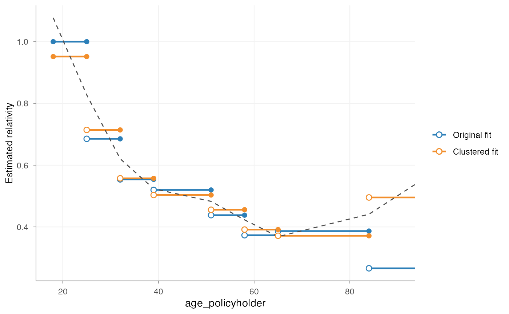
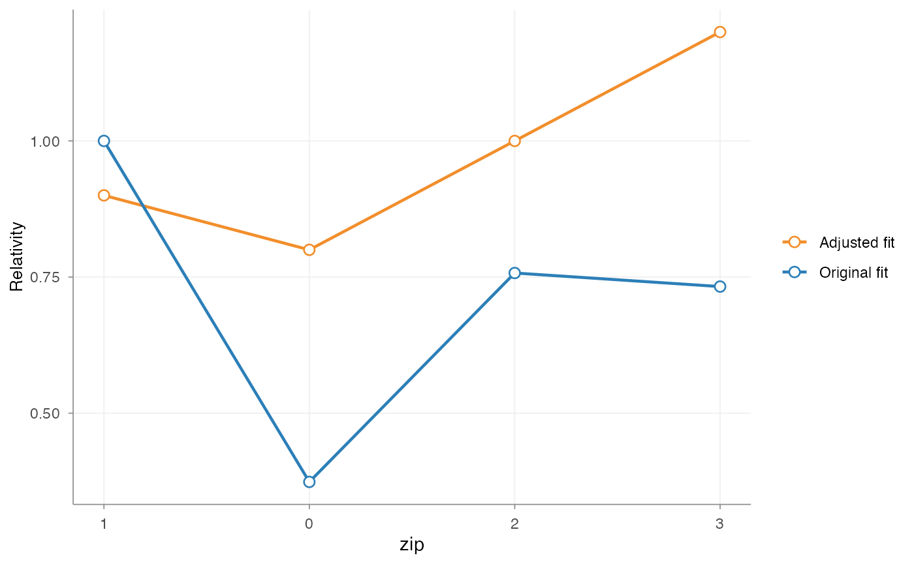

# Refinement building blocks

## Introduction

Refinement is the explicit translation from statistically estimated
model effects to the structure that will be reviewed, justified and
implemented as a tariff. It can be motivated by stability, credibility,
monotonicity, smoothness, sparse experience or an explicit
implementation constraint.

Refinement is not arbitrary editing of inconvenient coefficients. Each
adjustment should have an actuarial or operational rationale and should
be reviewed against exposure, claim volume, observed experience and
model diagnostics. Recording these decisions as ordered steps makes them
reproducible and easier to review.

This vignette starts from a fitted unrestricted GLM and focuses on what
happens next. The construction of frequency, severity and technical
risk-premium models is covered in [Getting
Started](https://mharinga.github.io/insurancerating/articles/getting-started.md).
The wider role of refinement within the package is mapped in [Pricing
workflow and package building
blocks](https://mharinga.github.io/insurancerating/articles/pricing-workflow-building-blocks.md).

The refinement architecture is:

| Stage | Meaning |
|----|----|
| Unrestricted GLM | Statistical starting point |
| [`prepare_refinement()`](https://mharinga.github.io/insurancerating/reference/prepare_refinement.md) | Create an editable specification around that model |
| [`add_smoothing()`](https://mharinga.github.io/insurancerating/reference/add_smoothing.md), [`add_restriction()`](https://mharinga.github.io/insurancerating/reference/add_restriction.md), [`add_shrinkage()`](https://mharinga.github.io/insurancerating/reference/add_shrinkage.md), [`add_relativities()`](https://mharinga.github.io/insurancerating/reference/add_relativities.md) | Record proposed actuarial adjustments |
| [`summary()`](https://rdrr.io/r/base/summary.html) and [`autoplot()`](https://ggplot2.tidyverse.org/reference/autoplot.html) | Inspect the proposal before fitting |
| [`refit()`](https://mharinga.github.io/insurancerating/reference/refit.md) | Reconstruct and fit the GLM under the stored specification |
| [`rating_table()`](https://mharinga.github.io/insurancerating/reference/rating_table.md) and [`audit_refinement()`](https://mharinga.github.io/insurancerating/reference/audit_refinement.md) | Inspect the fitted tariff and its portfolio effect |

## A compact unrestricted model

The unrestricted model is only the starting material for this vignette.
The following setup creates grouped age and bonus-malus factors and fits
a Poisson frequency GLM. The response is claim count and `log(exposure)`
is the offset.

``` r

library(insurancerating)

portfolio <- as.data.frame(MTPL)

age_breaks <- c(18, 25, 32, 39, 51, 58, 65, 84, 95)
portfolio$age_band <- cut(
  portfolio$age_policyholder,
  breaks = age_breaks,
  include.lowest = TRUE
)
portfolio$bm_group <- cut(
  portfolio$bm,
  breaks = c(0, 4, 8, Inf),
  labels = c("Low", "Medium", "High")
)
portfolio$bm_detail <- factor(as.character(portfolio$bm))
portfolio$zip <- factor(portfolio$zip)

unrestricted <- glm(
  nclaims ~ age_band + zip + bm_group + offset(log(exposure)),
  family = poisson(),
  data = portfolio
)
```

The initial tariff effects can be inspected before any actuarial
adjustment:

``` r

head(rating_table(unrestricted, exposure = FALSE))
#>   risk_factor       level est_unrestricted
#> 1 (Intercept) (Intercept)        0.2735430
#> 2    age_band     [18,25]        1.0000000
#> 3    age_band     (25,32]        0.6853582
#> 4    age_band     (32,39]        0.5540633
#> 5    age_band     (39,51]        0.5197098
#> 6    age_band     (51,58]        0.4381469
```

These are the conditional effects estimated by the unrestricted GLM. An
irregular effect is not by itself a reason to refine it: the analyst
should first consider data quality, exposure definition, model
specification, interactions and factor construction.

## Preparing the refinement

``` r

refinement <- prepare_refinement(
  unrestricted,
  data = portfolio
)

refinement
#> <rating_refinement>
#> Base model: Poisson GLM (log link)
#> Steps: 0
```

[`prepare_refinement()`](https://mharinga.github.io/insurancerating/reference/prepare_refinement.md)
creates a `rating_refinement` object containing the unrestricted model,
the corresponding retained model data and an initially empty ordered
step specification. It does not refit the GLM and does not change its
coefficients or fitted values.

This distinction is central to the API:

- `unrestricted` is a fitted statistical model;
- `refinement` is an editable proposal for the tariff structure;
- the model returned later by
  [`refit()`](https://mharinga.github.io/insurancerating/reference/refit.md)
  is the fitted outcome under that proposal.

Keep the refinement object when iterating. A model returned by
[`refit()`](https://mharinga.github.io/insurancerating/reference/refit.md)
is a fitted result, not an editable specification. Calling
[`prepare_refinement()`](https://mharinga.github.io/insurancerating/reference/prepare_refinement.md)
on that fitted result deliberately starts a new workflow and does not
reconstruct the earlier steps.

## Smoothing an ordered effect

Raw level effects for a grouped continuous variable may contain local
movement that is weakly supported or unstable over time. Smoothing
replaces that local pattern with an explicitly structured curve. It is
most relevant when a gradual underlying relationship is plausible and
neighbouring tariff levels should be interpreted coherently.

``` r

refinement <- refinement |>
  add_smoothing(
    model_variable = "age_band",
    source_variable = "age_policyholder",
    breaks = age_breaks,
    smoothing = "spline",
    k = 5,
    weights = "exposure",
    effect_strength = 1.1
  )
```

The arguments distinguish two variables:

- `model_variable` is the grouped factor included in the unrestricted
  GLM;
- `source_variable` is the underlying numeric portfolio variable used to
  estimate the smooth relationship.

`breaks` define the intervals in the resulting tariff factor. Exposure
weights give levels with more portfolio support more influence. With a
spline method, `k` controls the available curve flexibility; it is a
basis dimension rather than a fixed number of fitted degrees of freedom.

`effect_strength` controls the overall spread of the smoothed
relativities on the ordinary relativity scale. The default value 1
retains the fitted smoothing, values between 0 and 1 flatten the
complete effect, and values above 1 make the complete effect steeper.
The value 1.1 used here increases every vertical deviation from the
exposure-weighted mean by 10%. That mean therefore remains unchanged.

This parameter changes the strength of the complete smoothed effect; it
does not selectively alter only older ages, high insured values or
another local part of the curve. Use interval boundaries and control
points in
[`edit_smoothing()`](https://mharinga.github.io/insurancerating/reference/edit_smoothing.md)
for a local adjustment. Monotonic ordering and curvature are retained on
the relativity scale. An increasing concave curve therefore remains
increasing and concave, while the complete rise becomes steeper when
`effect_strength` is above 1. Very large values are rejected if they
would produce a zero or negative relativity.

The default unconstrained spline is suitable when the shape should
remain data-led. Increasing or decreasing shape constraints are
available when a directional assumption has a defensible actuarial
basis. The function reference for
[`add_smoothing()`](https://mharinga.github.io/insurancerating/reference/add_smoothing.md)
describes the full set of methods and their curvature interpretation.

### Inspecting the proposal

``` r

summary(refinement)
#> Refinement specification
#> 
#> Package: insurancerating 0.8.1.9000
#> Created: 2026-08-10 15:10:05 CEST
#> Observations: 30,000
#> Family: poisson (log link)
#> Base formula:
#>   nclaims ~ age_band + zip + bm_group + offset(log(exposure))
#> Offset: log(exposure)
#> 
#> Refinement steps: 1
#>   1. Smoothing: age_band from age_policyholder (method: spline, k: 5, effect strength: 1.1)
#>      8 intervals over 18 to 95

autoplot(
  refinement,
  variable = "age_band",
  x_max = 90
)
```



This is a **pre-refit** plot. It compares the original fitted effect
with the proposed smooth structure. The GLM has not yet been estimated
under that structure.

If the curve needs adjustment, retain the specification and use
[`edit_smoothing()`](https://mharinga.github.io/insurancerating/reference/edit_smoothing.md)
before refitting. This preserves the rest of the ordered workflow rather
than starting again from the fitted result.

## Restricting selected levels

[`add_restriction()`](https://mharinga.github.io/insurancerating/reference/add_restriction.md)
fixes tariff levels at supplied relativities. A restriction may
represent an implementation rule, a supported external assumption or a
deliberate response to an unstable local estimate. It differs from
smoothing: smoothing estimates a structured pattern, whereas a
restriction explicitly prescribes selected values.

``` r

zip_restrictions <- data.frame(
  zip = c("0", "3"),
  zip_restricted = c(0.95, 1.10)
)

refinement <- refinement |>
  add_restriction(zip_restrictions)
```

Only ZIP levels 0 and 3 are supplied here. The other observed ZIP levels
are fixed at their current effective relativities. Consequently, a
partial restriction changes the selected values but still produces a
complete fixed structure for that risk factor.

Repeated calls for the same restricted variable update matching levels
and retain earlier restrictions for levels not supplied again. New
levels may be added when they represent explicit tariff assumptions; new
risk factors require the corresponding portfolio column and an explicit
opt-in. These behaviours are documented in the
[`add_restriction()`](https://mharinga.github.io/insurancerating/reference/add_restriction.md)
reference.

A new fixed tariff factor can also replace an existing standalone model
term. For example, `add_restriction(..., replaces = "postal_area")`
records that the new classification substitutes for `postal_area` during
[`refit()`](https://mharinga.github.io/insurancerating/reference/refit.md),
rather than adding a second multiplicative effect. The replacement is
shown in the refinement summary and audit. Interactions and transformed
terms must be revised explicitly in the model specification because
removing them is not an unambiguous level restriction.

``` r

autoplot(refinement, variable = "zip")
```



Again, the plot shows the proposed restriction before
[`refit()`](https://mharinga.github.io/insurancerating/reference/refit.md).

## Shrinking a categorical effect

[`add_shrinkage()`](https://mharinga.github.io/insurancerating/reference/add_shrinkage.md)
reduces the differences between the current relativities of one
categorical risk factor. It is useful when the direction and ordering of
an estimated effect are considered informative, but the spread between
levels is larger than is supported by the available experience or the
intended tariff. Unlike a restriction, shrinkage does not prescribe
individual level values.

``` r

refinement <- refinement |>
  add_shrinkage(
    model_variable = "bm_group",
    credibility = 0.9,
    weights = "exposure"
  )
```

`credibility` is the weight assigned to the current logarithmic effect.
A value of 0.9 retains 90 percent of each level’s deviation from the
common centre; a value of 1 leaves the effect unchanged, while a value
of 0 removes differences between levels. This is a user-selected
refinement parameter, not an automatically estimated Buhlmann or
Buhlmann-Straub credibility factor.

The common centre is determined using the selected weighting basis.
Exposure weights are appropriate here because `bm_group` is part of a
frequency model. For a severity model, claim count may be a more
relevant basis. Use `weights = "equal"` when every factor level should
receive equal weight rather than representing the observed portfolio
mix.

After shrinkage, the relativities are normalised so their
exposure-weighted arithmetic mean remains equal to its value before
shrinkage. The operation therefore reduces tariff differentiation
without intentionally changing the weighted level of this risk factor.
The later refit can still recalibrate the intercept or other free model
effects.

``` r

autoplot(refinement, variable = "bm_group")
```


This remains a pre-refit comparison: it shows the current estimated
effect and the proposed shrunken structure stored in the refinement
specification.

## Adding differentiation within model levels

[`add_relativities()`](https://mharinga.github.io/insurancerating/reference/add_relativities.md)
addresses a different problem. An unrestricted GLM may use a broad
factor because its detailed levels are individually too sparse for
stable direct estimation. The refinement can retain the broad parent
effect while introducing documented differentiation between selected
sublevels.

The example splits the broad bonus-malus groups `Low` and `Medium` into
their observed detailed values:

``` r

bm_relativities <- relativities(
  split_level(
    "Low",
    new_levels = c("1", "2", "3", "4"),
    relativities = c(0.95, 0.98, 1.02, 1.05)
  ),
  split_level(
    "Medium",
    new_levels = c("5", "6", "7", "8"),
    relativities = c(0.96, 0.99, 1.02, 1.05)
  )
)

refinement <- refinement |>
  add_relativities(
    model_variable = "bm_group",
    split_variable = "bm_detail",
    relativities = bm_relativities,
    exposure = "exposure",
    normalize = TRUE,
    output_variable = "bm_tariff_segment"
  )
```

`model_variable` supplies the parent GLM effect. `split_variable`
identifies the detailed portfolio levels within each parent.
`output_variable` names the resulting hybrid tariff factor; unsplit
parent levels retain their existing model effect.

With `normalize = TRUE`, the sublevel relativities are normalised within
each parent so their exposure-weighted average equals one. The split
therefore redistributes the parent effect without changing its
exposure-weighted level. Because shrinkage was added first, these
sublevel effects use the shrunken `bm_group` relativities as their
parent values. With `normalize = FALSE`, the supplied relativities are
applied directly.

This operation is not equivalent to restriction or smoothing:

- smoothing regularises an ordered effect already represented by the
  model;
- restriction fixes selected tariff values;
- shrinkage reduces differences between categorical levels while
  retaining their ordering;
- additional relativities introduce finer differentiation inside a
  broader model level.

Step order matters. A restriction or shrinkage step added before
[`add_relativities()`](https://mharinga.github.io/insurancerating/reference/add_relativities.md)
changes the parent coefficient used as the basis for the split. A later
restriction can instead adjust selected levels of the derived
`output_variable`.

## Combining and reviewing refinements

The four operations now form one ordered specification:

``` r

summary(refinement)
#> Refinement specification
#> 
#> Package: insurancerating 0.8.1.9000
#> Created: 2026-08-10 15:10:05 CEST
#> Observations: 30,000
#> Family: poisson (log link)
#> Base formula:
#>   nclaims ~ age_band + zip + bm_group + offset(log(exposure))
#> Offset: log(exposure)
#> 
#> Refinement steps: 4
#>   1. Smoothing: age_band from age_policyholder (method: spline, k: 5, effect strength: 1.1)
#>      8 intervals over 18 to 95
#>   2. Restriction: zip -> zip_restricted (4 levels)
#>      0 = 0.9500000; 1 = 0.9954865; 2 = 0.8971513; 3 = 1.1000000
#>   3. Shrinkage: bm_group (credibility: 0.9, weights: exposure, weighted mean preserved)
#>      credibility = 0.9; weights = exposure; weighted mean preserved
#>   4. Relativities: bm_group split by bm_detail -> bm_tariff_segment (normalised: yes)
#>      2 parent levels split: Low, Medium
```

The summary records the base formula, package version, data size and
each refinement in evaluation order. It describes what will be applied;
it does not report a fitted refined model because
[`refit()`](https://mharinga.github.io/insurancerating/reference/refit.md)
has not yet been called.

The variable-specific
[`autoplot()`](https://ggplot2.tidyverse.org/reference/autoplot.html)
calls above evaluate the stored steps in their recorded order. They
therefore inspect the intended tariff after any preceding adjustments
without silently changing the GLM. The `step` argument can be used when
an earlier stage of a longer specification needs to be reviewed
separately.

[`add_rebasing()`](https://mharinga.github.io/insurancerating/reference/add_rebasing.md)
can be inserted when required to change which resulting level is
displayed as one without changing ratios between levels. Rebasing
changes the representation of an effect, whereas shrinkage changes its
degree of differentiation.

## Refitting the model

``` r

refined_model <- refit(
  refinement,
  intercept_only = TRUE
)
#> Warning in update_formula_remove(formula, old_term): Column 'bm_group' must be in model call.
```

[`refit()`](https://mharinga.github.io/insurancerating/reference/refit.md)
applies the stored steps in order, constructs the required tariff
variables and offsets, updates the formula and calls
[`glm()`](https://rdrr.io/r/stats/glm.html) with the original model
family. It does more than copy proposed relativities into an existing
coefficient vector.

The treatment of the remaining model effects depends on
`intercept_only`:

- with `intercept_only = TRUE`, unaffected existing effects are fixed as
  offsets and only the intercept is estimated. Their relative
  differences are preserved while the overall level is recalibrated;
- with `intercept_only = FALSE`, remaining free terms are estimated
  again. Their coefficients may change as the GLM finds a new joint
  optimum conditional on the fixed refinement steps.

An intercept-only refit is often appropriate for a controlled adjustment
to an accepted tariff structure. Re-estimating the remaining free
effects is more appropriate when the refinement is part of substantive
model development and dependence between factors should be reconsidered.

The prescribed smoothing, restrictions and sublevel relativities remain
explicit assumptions. Refitting does not turn them into unrestricted
statistical estimates.

## Inspecting the fitted result

After
[`refit()`](https://mharinga.github.io/insurancerating/reference/refit.md),
the result is a fitted GLM and can be reviewed with the normal
interpretation tools:

``` r

head(rating_table(refined_model, exposure = FALSE))
#>      risk_factor       level est_refined_model
#> 1    (Intercept) (Intercept)         0.2614623
#> 2 zip_restricted           0         0.9500000
#> 3 zip_restricted           1         0.9954865
#> 4 zip_restricted           2         0.8971513
#> 5 zip_restricted           3         1.1000000
#> 6       bm_group         Low         1.0001880
```

This is the **post-refit** result. It is distinct from the preview shown
by `autoplot(refinement)`:

- before
  [`refit()`](https://mharinga.github.io/insurancerating/reference/refit.md):
  proposed tariff adjustments;
- after
  [`refit()`](https://mharinga.github.io/insurancerating/reference/refit.md):
  fitted model under those adjustments.

Printing `refined_model` also reports the original and refitted
formulas, the model family, refit mode and stored refinement steps
before showing the regular GLM output.

## Auditing the portfolio effect

Individual coefficient changes are difficult to interpret independently
of the intercept, other model terms and portfolio mix.
[`audit_refinement()`](https://mharinga.github.io/insurancerating/reference/audit_refinement.md)
therefore compares predictions from the unrestricted and refined models
on the same observed portfolio combinations.

``` r

refinement_audit <- audit_refinement(
  refined_model,
  exposure = "exposure",
  metric = "frequency"
)

summary(refinement_audit)
#> Refinement audit
#> 
#> Package: insurancerating 0.8.1.9000
#> Prepared: 2026-08-10 15:10:05 CEST
#> Refitted: 2026-08-10 15:10:07 CEST
#> Audited: 2026-08-10 15:10:07 CEST
#> Measure: frequency (per_exposure)
#> Exposure: exposure
#> 
#> Original formula:
#>   nclaims ~ age_band + zip + bm_group + offset(log(exposure))
#> Refitted formula:
#>   nclaims ~ offset(log(bm_group_rel) + log(bm_group_shrunk) + log(zip_restricted) + 
#>       log(age_band_smooth) + log(exposure))
#> 
#> Refinement steps: 4
#>   1. Smoothing: age_band from age_policyholder (method: spline, k: 5, effect strength: 1.1)
#>      8 intervals over 18 to 95
#>   2. Restriction: zip -> zip_restricted (4 levels)
#>      0 = 0.9500000; 1 = 0.9954865; 2 = 0.8971513; 3 = 1.1000000
#>   3. Shrinkage: bm_group (credibility: 0.9, weights: exposure, weighted mean preserved)
#>      credibility = 0.9; weights = exposure; weighted mean preserved
#>   4. Relativities: bm_group split by bm_detail -> bm_tariff_segment (normalised: yes)
#>      2 parent levels split: Low, Medium
#> 
#> Portfolio effect
#>   Before: 0.137596
#>   After:  0.137596
#>   Change: 5.4956e-15 (3.994e-12%)
#> 
#> Largest level changes (10 of 24)
#>              risk_factor   level     before      after       change
#>  age_policyholder_smooth (84,95] 0.06942859 0.12932481  0.059896219
#>           zip_restricted       3 0.13680279 0.15148247  0.014679675
#>           zip_restricted       0 0.14020239 0.12715764 -0.013044745
#>        bm_tariff_segment       4 0.13883017 0.15097196  0.012141792
#>        bm_tariff_segment       8 0.14270460 0.15509924  0.012394638
#>  age_policyholder_smooth (65,84] 0.10100599 0.09317761 -0.007828374
#>  age_policyholder_smooth (25,32] 0.17896684 0.19132120  0.012354352
#>        bm_tariff_segment       7 0.14278504 0.15173842  0.008953378
#>        bm_tariff_segment       3 0.13764208 0.14523090  0.007588820
#>           zip_restricted       2 0.12951920 0.12409779 -0.005421411
#>  change_ratio
#>    0.86270247
#>    0.10730537
#>   -0.09304225
#>    0.08745788
#>    0.08685521
#>   -0.07750406
#>    0.06903151
#>    0.06270530
#>    0.05513445
#>   -0.04185797
```

The audit reports the portfolio-level frequency before and after
refinement and the corresponding changes by final risk-factor level.
These are predictions from the complete model for the observed portfolio
mix, not isolated coefficient differences.

The refinement and audit objects record package version, timestamps,
formulas and ordered steps. This supports reproducibility, peer review
and documentation of actuarial judgement. Organisational approval,
source-data versioning and formal governance remain outside the package
and should be handled by the user’s normal processes.

## When to revisit the model

Refinement is not a substitute for correcting a poor model. If an
implausible effect is caused by incorrect data, exposure errors, missing
interactions, an inappropriate response definition or poor factor
construction, the model or data preparation should be revisited first.
Refinement is most defensible when the statistical model captures the
main risk structure and the remaining adjustment has a clear tariff
rationale.

## Iterating without losing the specification

Retain both the editable specification and the fitted result:

``` r

refined_model <- refit(refinement)

refinement <- refinement |>
  edit_smoothing(
    model_variable = "age_band",
    effect_strength = 1.2
  )

updated_model <- refit(refinement)
```

The update replaces the stored value 1.1 with 1.2 and recalculates the
smoothing specification from its underlying curve. It does not multiply
both values. When a local interval is edited without supplying
`effect_strength`, the previously stored value is retained and applied
to the complete edited curve.

Calling
[`add_smoothing()`](https://mharinga.github.io/insurancerating/reference/add_smoothing.md),
[`add_restriction()`](https://mharinga.github.io/insurancerating/reference/add_restriction.md)
or another refinement function directly on `refined_model` is
deliberately not supported. Further adjustments belong on the retained
`rating_refinement` object so their ordering and origin remain visible.

## Summary

The specialist workflow is:

1.  start from an unrestricted fitted model;
2.  create one persistent specification with
    [`prepare_refinement()`](https://mharinga.github.io/insurancerating/reference/prepare_refinement.md);
3.  add smoothing, restrictions, shrinkage or sublevel relativities with
    an explicit rationale;
4.  inspect the proposal with
    [`summary()`](https://rdrr.io/r/base/summary.html) and
    [`autoplot()`](https://ggplot2.tidyverse.org/reference/autoplot.html);
5.  use
    [`refit()`](https://mharinga.github.io/insurancerating/reference/refit.md)
    to fit the model under that specification;
6.  inspect the final tariff with
    [`rating_table()`](https://mharinga.github.io/insurancerating/reference/rating_table.md)
    and its portfolio effect with
    [`audit_refinement()`](https://mharinga.github.io/insurancerating/reference/audit_refinement.md).

This separates estimated effects, proposed actuarial adjustments and
final fitted output without treating refinement as an automatic approval
of the result.

## Where to go next

- [Getting
  Started](https://mharinga.github.io/insurancerating/articles/getting-started.md)
  constructs the initial pricing model used as the starting point for
  refinement.
- [Pricing workflow and package building
  blocks](https://mharinga.github.io/insurancerating/articles/pricing-workflow-building-blocks.md)
  places refinement within the wider package architecture.
- [Model
  validation](https://mharinga.github.io/insurancerating/articles/model-validation.md)
  develops the diagnostics used to assess unrestricted and refined
  models.
